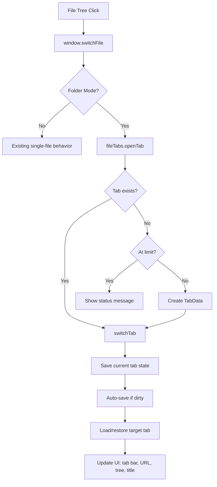
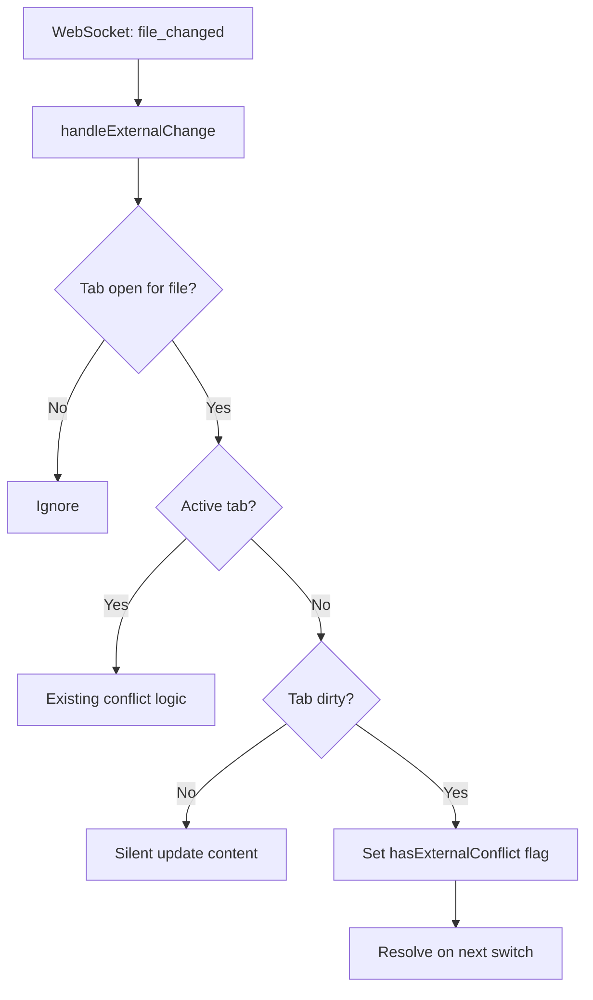

# Feature Plan: Multiple File Tabs

## Overview

Add a horizontal file tab bar to the markdown-os editor that appears in folder mode. Users can open multiple markdown files as tabs, switch between them, and close them independently. Each tab maintains its own content, dirty state, scroll positions, and edit/preview mode. The backend already supports multi-file operations — this is a purely frontend feature.

**Key Features:**
- Horizontal scrollable tab bar showing open file tabs (folder mode only)
- Per-tab state: content, dirty flag, edit/preview mode, scroll positions
- Open tabs from the file tree, switch between them, close with X button
- Unsaved changes handling: auto-save on switch, 3-button modal on close
- WebSocket external change routing to the correct tab (active or background)
- Lazy loading: content fetched on first tab activation
- Duplicate filename disambiguation (shows parent folder prefix)
- 15-tab limit with user feedback

**Includes**: Close-dirty-tab modal (3-button: Save & Close, Discard & Close, Cancel)

## Current Behavior

### Single-Editor Architecture
- One `#markdown-editor` textarea and one `#markdown-preview` div
- `editorState` in `editor.js` (lines 4-12) tracks a single file:
  - `currentFilePath` — one active file
  - `lastSavedContent` — one file's saved content
  - `saveTimeout` — one debounce timer
  - `isEditMode` — global edit/preview toggle
- Clicking a file in the tree calls `window.switchFile(path)` which replaces the editor content entirely
- `switchFile()` (line 414) saves unsaved changes, loads new content, switches to preview mode

### Backend (Already Multi-File Capable)
- `DirectoryHandler` caches `FileHandler` instances per file (`directory_handler.py` line 117-135)
- `GET /api/content?file=<path>` loads specific files (server.py line 403-429)
- `POST /api/save` with `{ content, file }` saves specific files (server.py line 456-483)
- WebSocket broadcasts `{ type: "file_changed", file: path, content }` per-file (server.py line 671-685)
- Watchdog monitors all .md files recursively in folder mode (server.py line 291-299)

### Key Components
- **editor.js** (lines 4-12): `editorState` with single-file state
- **editor.js** (lines 414-470): `switchFile()` — loads a file into the single editor
- **editor.js** (lines 281-333): `saveContent()` — saves current editor content
- **editor.js** (lines 348-363): `onEditorInput()` — triggers debounced autosave
- **editor.js** (lines 365-412): `handleExternalChange()` — handles WebSocket file changes
- **editor.js** (lines 230-279): `switchToTab()` — toggles Edit/Preview mode
- **file-tree.js** (lines 222-230): File click handler calls `window.switchFile(path)`
- **file-tree.js** (lines 112-117): `setCurrentFile()` — updates tree highlight and URL
- **websocket.js** (lines 24-69): Dispatches `markdown-os:file-changed` custom events
- **index.html** (lines 107-195): `.tab-nav` grid with Edit/Preview toggle, file path, theme/save controls
- **index.html** (lines 197-207): `#editor-container` and `#preview-container` as sibling `.view` sections

## User Story / Value Proposition

### Problem
Users working on documentation projects need to reference and edit multiple files. Currently, switching files discards the editing context — scroll position, edit/preview mode, and unsaved changes must all be managed manually. There's no visual indicator of which files are open or dirty.

### User Benefit
File tabs provide the familiar multi-document UX from IDEs and browsers. Users can keep multiple files open, switch between them instantly with preserved state, and see at a glance which files have unsaved changes.

### Use Cases
1. **Cross-referencing docs**: User edits a README while referencing an API spec in another tab
2. **Iterative editing**: User works across 3-4 related files, switching rapidly between them
3. **Quick inspection**: User opens a file to glance at it, then closes the tab and returns to their main file
4. **Dirty state awareness**: User sees which files have unsaved changes via the dot indicator

## Proposed Behavior

### Tab Bar
- Appears between the Edit/Preview toolbar and the editor area, only in folder mode
- Horizontal, scrollable when many tabs are open
- Each tab shows: filename, dirty indicator (dot), close button (X)
- Active tab has an accent-colored bottom border
- Close button appears on hover/active; dirty dot always visible when dirty

### Tab Operations
- **Open**: Clicking a file in the tree opens a new tab (or switches to it if already open)
- **Switch**: Clicking a tab saves current state, auto-saves if dirty, restores the target tab's content/scroll/mode
- **Close**: Clicking X prompts if dirty (3-button modal: Save & Close / Discard & Close / Cancel), then removes tab

### Per-Tab State
Each tab independently tracks:
- Editor content and last-saved content (dirty detection)
- Edit vs Preview mode
- Editor and preview scroll positions
- Autosave debounce timer
- External conflict flag (for deferred conflict resolution)

### Duplicate Filenames
If `docs/readme.md` and `api/readme.md` are both open, tabs show `docs/readme.md` and `api/readme.md` instead of just `readme.md`.

### External Changes
- **Active tab**: Existing conflict/reload behavior (silent reload if clean, conflict dialog if dirty)
- **Background tab, clean**: Silently update content
- **Background tab, dirty**: Mark as conflicted; show conflict dialog when user switches to it

### Single-File Mode
Completely unaffected. Tab bar stays hidden. All existing behavior preserved.

## Proposed Solution

### Architecture Overview





### Implementation Plan

### 1. Add Tab Bar HTML and Close-Dirty-Tab Modal

**File**: `markdown_os/static/index.html`

**Changes**:
- Add `<div id="file-tabs-bar">` between `.tab-nav` (line 195) and `#editor-container` (line 197)
- Add `tabs.js` script tag between `file-tree.js` and `editor.js` (after line 234)
- Add 3-button close-dirty-tab modal after the conflict modal (line 228)

**Tab bar HTML**:
```html
<div id="file-tabs-bar" class="file-tabs-bar hidden" role="tablist" aria-label="Open files"></div>
```

**Close-dirty-tab modal** (follows existing conflict modal pattern):
```html
<div id="close-tab-overlay" class="modal-overlay hidden"></div>
<div id="close-tab-modal" class="modal hidden" role="dialog" aria-modal="true">
  <div class="modal-content">
    <h3 class="modal-title">Unsaved Changes</h3>
    <p id="close-tab-message" class="modal-message"></p>
    <div class="modal-actions">
      <button id="close-tab-save" class="btn btn-primary" type="button">Save & Close</button>
      <button id="close-tab-discard" class="btn btn-secondary" type="button">Discard & Close</button>
      <button id="close-tab-cancel" class="btn btn-tertiary" type="button">Cancel</button>
    </div>
    <p class="modal-hint">Press ESC or click outside to cancel</p>
  </div>
</div>
```

**Tab JS element** (dynamically generated per tab):
```html
<button class="file-tab active" role="tab" data-path="docs/guide.md" title="docs/guide.md">
  <span class="file-tab-name">guide.md</span>
  <span class="file-tab-dirty hidden">&bull;</span>
  <span class="file-tab-close" title="Close tab">&times;</span>
</button>
```

**Rationale**: Tab bar is positioned to visually connect file navigation (above) with the editor content (below). Modal reuses the existing pattern for consistency. Tabs are buttons with `role="tab"` for accessibility.

---

### 2. Add Tab Bar CSS

**File**: `markdown_os/static/css/styles.css`

**Changes**:
- Add CSS variables for tab colors in both `:root` (light) and `[data-theme="dark"]` sections
- Add `.file-tabs-bar` container styles (flex, scroll, border)
- Add `.file-tab` styles (sizing, colors, active state with accent bottom border)
- Add `.file-tab-dirty` styles (amber dot, hidden by default)
- Add `.file-tab-close` styles (hidden by default, shown on hover, danger color on hover)
- Add `.mermaid-container { position: relative }` already exists — no collision

**Code Location**: After `.tab-nav` styles (~line 498), before `.view` styles

**CSS variables** (added to both themes):
```
--file-tab-hover-bg, --file-tab-text, --file-tab-active-text
--file-tab-dirty (amber/yellow), --file-tab-close-hover-bg, --file-tab-border
```

**Key styles**:
- Tab bar: `display: flex; overflow-x: auto; min-height: 36px; border-bottom: 1px solid`
- Tab: `max-width: 180px; text-overflow: ellipsis; border-bottom: 2px solid transparent`
- Active tab: `border-bottom-color: var(--accent); font-weight: 500`
- Close button: `opacity: 0` default → `opacity: 0.6` on tab hover → `opacity: 1` on close hover

**Rationale**: Scrollable tab bar handles many tabs. Accent bottom border clearly marks the active tab. Close button only appears on hover to reduce visual clutter.

---

### 3. Create Tab Management Module

**File**: `markdown_os/static/js/tabs.js` (**NEW**)

**Purpose**: All tab state management, tab bar rendering, and tab lifecycle logic. Encapsulated in an IIFE to avoid global scope pollution.

**State**:
```javascript
const MAX_OPEN_TABS = 15;
const tabsState = {
  tabs: new Map(),         // Map<filePath, TabData>
  tabOrder: [],            // string[] — display order
  activeTabPath: null,     // string | null
  enabled: false,          // true only in folder mode
};
```

**TabData shape**:
```javascript
{
  filePath: string,
  content: string,           // current editor content
  lastSavedContent: string,  // content as last saved/loaded from disk
  isDirty: boolean,
  isEditMode: boolean,       // per-tab edit vs preview mode
  editorScrollTop: number,
  previewScrollTop: number,
  isLoaded: boolean,         // false until first activation (lazy loading)
  saveTimeout: number|null,  // per-tab autosave debounce timer
  isSaving: boolean,
  hasExternalConflict: boolean, // set when background tab has dirty conflict
}
```

**Key functions**:

| Function | Description |
|----------|-------------|
| `openTab(filePath)` | Opens new tab or switches to existing. Enforces 15-tab limit. Returns `boolean`. |
| `switchTab(filePath)` | Saves current state → auto-saves old tab if dirty → loads/restores target → updates UI. |
| `closeTab(filePath)` | If dirty: shows 3-button modal. Removes tab, switches to neighbor or empty state. |
| `saveCurrentTabState()` | Captures `editor.value`, `scrollTop` values, dirty flag from DOM into active TabData. |
| `restoreTabToEditor(filePath)` | Sets `editor.value`, applies edit/preview mode, restores scrolls, calls `renderMarkdown()`. |
| `loadTabContent(filePath)` | Fetches `/api/content?file=path`, updates TabData. Marks `isLoaded = true`. |
| `saveTabContent(filePath)` | POST `/api/save` with tab's content/file. Updates `lastSavedContent`, `isDirty`. |
| `queueTabAutosave(filePath)` | Per-tab 1s debounce. Clears old timer, sets new one calling `saveTabContent`. |
| `updateTabDirtyState(filePath)` | Compares content to lastSavedContent, updates `isDirty`, re-renders dirty indicator. |
| `renderTabBar()` | Rebuilds `#file-tabs-bar` DOM from `tabOrder`. Calls `handleDuplicateNames()`. |
| `handleDuplicateNames()` | Detects same-filename tabs, returns `Map<filePath, displayName>` with parent prefix. |
| `handleExternalChange(detail)` | Routes to active tab (existing logic) or background tab (silent update or conflict flag). |
| `showCloseDirtyTabDialog(fileName)` | 3-button modal. Returns `"save" | "discard" | "cancel"`. Uses same pattern as conflict dialog. |
| `init(mode)` | Sets `enabled = (mode === "folder")`. Shows tab bar if enabled. |

**Global API**: `window.fileTabs = { openTab, switchTab, closeTab, isEnabled, getActiveTabPath, getTabData, handleExternalChange, saveCurrentTabState, queueTabAutosave, updateTabDirtyState, init }`

**Rationale**: Separate file keeps tab logic isolated from the existing editor code. The IIFE pattern matches other modules in the project. Lazy loading avoids fetching content for tabs the user never activates.

---

### 4. Modify Editor Integration

**File**: `markdown_os/static/js/editor.js`

**Changes**: In folder mode, delegate file-specific operations to `tabs.js`. File mode stays unchanged.

**Delegation pattern** (added at the top of each function):
```javascript
if (editorState.mode === "folder" && window.fileTabs?.isEnabled()) {
  // delegate to tabs.js
  return;
}
// original single-file behavior below
```

| Function | Modification |
|----------|-------------|
| `switchFile(filePath)` (~line 414) | Delegate to `fileTabs.openTab(filePath)` in folder mode |
| `onEditorInput()` (~line 348) | Update active tab's content + dirty state, call `fileTabs.queueTabAutosave()` |
| `handleExternalChange(detail)` (~line 365) | Delegate to `fileTabs.handleExternalChange(detail)` |
| `saveContent()` (~line 281) | Delegate to `fileTabs.saveTabContent(activeTabPath)` |
| `switchToTab(tabName)` (~line 230) | Also persist `isEditMode` on active TabData after toggling |
| DOMContentLoaded (~line 636) | Call `fileTabs.init(mode)` in folder mode; skip `loadContent()` |

**Rationale**: Minimal changes to editor.js — just add delegation guards at the top of existing functions. All new logic lives in tabs.js. File mode is completely unaffected.

---

### Edge Cases & Handling

#### Case 1: Duplicate Filenames
- **Scenario**: `docs/notes.md` and `archive/notes.md` both open
- **Expected behavior**: Tabs show `docs/notes.md` and `archive/notes.md` (parent folder prefix)
- **Implementation**: `handleDuplicateNames()` counts basename occurrences and adds path prefix for duplicates

#### Case 2: Tab Limit Reached
- **Scenario**: User tries to open 16th tab
- **Expected behavior**: Status message "Close a tab to open more files", no tab created
- **Implementation**: `openTab()` checks `tabsState.tabs.size >= MAX_OPEN_TABS` and returns early

#### Case 3: File Deleted While Tab Open
- **Scenario**: File open in background tab is deleted on disk
- **Expected behavior**: Tab stays open with last content. Save shows "File not found" error. User can copy content.
- **Implementation**: `saveTabContent()` catches 404/400 and shows error status

#### Case 4: Last Tab Closed
- **Scenario**: User closes the only remaining tab
- **Expected behavior**: Editor cleared, "Select a file" status, tab bar visible but empty
- **Implementation**: `closeTab()` detects empty `tabOrder` and calls empty state handler

#### Case 5: Browser Refresh
- **Scenario**: 3 tabs open, page refreshes
- **Expected behavior**: Only active file restored via `?file=` URL param. Other tabs lost. (No localStorage persistence.)
- **Implementation**: Existing URL parameter handling in `file-tree.js` DOMContentLoaded opens the one file.

#### Case 6: Per-Tab Edit/Preview Mode
- **Scenario**: Tab A in Edit mode, Tab B in Preview mode
- **Expected behavior**: Switching restores each tab's mode
- **Implementation**: `TabData.isEditMode` stored on save, `switchToTab()` called on restore

#### Case 7: External Conflict on Background Dirty Tab
- **Scenario**: User has unsaved edits in background Tab B; file changes on disk
- **Expected behavior**: Tab B gets `hasExternalConflict = true`. When user switches to Tab B, conflict dialog appears.
- **Implementation**: `handleExternalChange()` sets flag; `switchTab()` checks flag before restoring.

#### Case 8: Auto-save on Tab Switch
- **Scenario**: User edits Tab A, switches to Tab B before 1s debounce fires
- **Expected behavior**: Tab A is saved immediately on switch (not debounced)
- **Implementation**: `switchTab()` calls `saveTabContent(oldPath)` directly if dirty, clearing the pending timer.

#### Case 9: Single-File Mode
- **Scenario**: `uv run markdown-os open ./single.md`
- **Expected behavior**: No tab bar, no tab system, all existing behavior unchanged
- **Implementation**: `tabsState.enabled = false`, tab bar has `.hidden` class, no delegation occurs.

---

## Files to Modify

| File | Changes |
|------|---------|
| `markdown_os/static/index.html` | • Add `#file-tabs-bar` div between `.tab-nav` and `#editor-container`<br>• Add close-dirty-tab modal (overlay + 3-button dialog)<br>• Add `tabs.js` script tag between `file-tree.js` and `editor.js` |
| `markdown_os/static/css/styles.css` | • Add CSS variables for tab colors (light + dark themes)<br>• Add `.file-tabs-bar` container styles (flex, overflow-x, border)<br>• Add `.file-tab` styles (sizing, active accent border, transitions)<br>• Add `.file-tab-dirty` amber dot styles<br>• Add `.file-tab-close` hover-reveal styles |
| `markdown_os/static/js/tabs.js` | • **NEW FILE**: `tabsState`, `TabData`, all tab lifecycle functions, tab bar rendering, per-tab autosave, external change routing, close-dirty-tab modal, `window.fileTabs` API |
| `markdown_os/static/js/editor.js` | • Add folder-mode delegation guards in `switchFile()`, `onEditorInput()`, `handleExternalChange()`, `saveContent()`, `switchToTab()`<br>• Update DOMContentLoaded to init tab system in folder mode |

---

## Testing Strategy

### Manual Tests

**Tab Bar Visibility**
1. Open single file (`uv run markdown-os open ./file.md`) → tab bar NOT visible ✓
2. Open directory (`uv run markdown-os open ./workspace/`) → tab bar visible (empty) ✓

**Opening & Switching Tabs**
1. Click file in tree → tab appears, content loads ✓
2. Click second file → second tab appears, first remains ✓
3. Click first tab → switches back, content preserved ✓
4. Click file already open as tab → switches to it (no duplicate) ✓

**Content & State Preservation**
1. Type text in Tab A → switch to Tab B → switch back → text preserved ✓
2. Tab A in Edit mode, Tab B in Preview mode → switching restores correct mode ✓
3. Scroll down in Tab A preview → switch away → switch back → scroll position restored ✓

**Dirty Indicator & Auto-save**
1. Edit text → dirty dot appears on tab ✓
2. Wait 1s (autosave) → dirty dot disappears ✓
3. Edit text → switch to another tab → auto-saves immediately → dirty dot gone ✓

**Closing Tabs**
1. Close clean tab → closes immediately ✓
2. Close dirty tab → 3-button modal appears ✓
3. Modal: Save & Close → saves, closes ✓
4. Modal: Discard & Close → closes without saving ✓
5. Modal: Cancel → tab stays open ✓
6. Close active tab with others open → switches to adjacent tab ✓
7. Close last tab → empty state ("Select a file") ✓

**External Changes**
1. Active tab, no edits → external file change → content reloads silently ✓
2. Active tab, with edits → external change → conflict dialog ✓
3. Background tab, no edits → external change → content updated silently ✓
4. Background tab, with edits → external change → conflict shown on next switch ✓

**Edge Cases**
1. Open 15 tabs → try to open 16th → status message, no tab created ✓
2. Open `docs/notes.md` and `archive/notes.md` → tabs show full path prefix ✓
3. URL `?file=` updates on tab switch ✓
4. File tree highlight tracks active tab ✓

### Automated Tests
- Run `uv run pytest` — all existing backend tests should pass (no backend changes)

---

## Implementation Checklist

### Phase 1: Tab Bar Structure (HTML + CSS)
- [ ] Add `#file-tabs-bar` div to `index.html`
- [ ] Add close-dirty-tab modal to `index.html`
- [ ] Add `tabs.js` script tag in correct load order
- [ ] Add CSS variables for tab colors (light + dark)
- [ ] Add `.file-tabs-bar`, `.file-tab`, `.file-tab-dirty`, `.file-tab-close` styles

### Phase 2: Core Tab Logic (`tabs.js`)
- [ ] Create `tabs.js` with `tabsState` and `createTabData()`
- [ ] Implement `renderTabBar()` with click handlers
- [ ] Implement `handleDuplicateNames()` for filename disambiguation
- [ ] Implement `openTab()` with limit enforcement
- [ ] Implement `switchTab()` with save/restore cycle
- [ ] Implement `closeTab()` with dirty check
- [ ] Implement `saveCurrentTabState()` and `restoreTabToEditor()`
- [ ] Implement `loadTabContent()` (lazy fetch from API)
- [ ] Implement `saveTabContent()` and `queueTabAutosave()`
- [ ] Implement `updateTabDirtyState()`
- [ ] Implement `showCloseDirtyTabDialog()` (3-button modal)
- [ ] Implement `handleExternalChange()` for background tabs
- [ ] Expose `window.fileTabs` API

### Phase 3: Editor Integration (`editor.js`)
- [ ] Add delegation guard in `switchFile()`
- [ ] Add delegation guard in `onEditorInput()`
- [ ] Add delegation guard in `handleExternalChange()`
- [ ] Add delegation guard in `saveContent()`
- [ ] Persist `isEditMode` on active TabData in `switchToTab()`
- [ ] Update DOMContentLoaded to init tab system in folder mode

### Phase 4: Testing & Polish
- [ ] Test all manual scenarios above
- [ ] Run `uv run pytest` to verify no regression
- [ ] Test dark/light theme switching with tabs open
- [ ] Cross-browser test (Chrome, Firefox, Safari)

---

## Success Criteria

### Core Functionality
- File tabs appear and function correctly in folder mode
- Users can open, switch, and close tabs with state preservation
- Per-tab edit/preview mode, scroll positions, and content are maintained
- Auto-save works per-tab (1s debounce while editing, immediate on switch)
- External file changes route correctly to active vs background tabs

### User Experience
- Tab bar is visually clean and consistent with existing UI
- Dirty indicator is immediately visible
- Close button appears only on hover (unobtrusive)
- 3-button close-dirty-tab modal matches existing conflict dialog UX
- Duplicate filenames are disambiguated with parent folder prefix
- Tab limit gives clear feedback instead of failing silently

### Performance
- No lag when switching tabs (content swap, not re-fetch for loaded tabs)
- Lazy loading prevents unnecessary network requests
- Per-tab autosave prevents unnecessary saves for background tabs
- No memory leaks (timers cleared on close, no orphaned state)

### Code Quality
- All new logic isolated in `tabs.js` — minimal changes to existing files
- Editor.js modifications are small delegation guards
- File mode completely unaffected (zero regression risk)
- Follows existing patterns (IIFE module, CSS variables, modal pattern)

---

## Decisions / Open Questions

### Q1: Close-dirty-tab dialog style ✅
**Decision**: Three-button modal (Save & Close / Discard & Close / Cancel), matching the existing conflict dialog pattern.

### Q2: Tab state persistence across refresh ✅
**Decision**: No persistence. Only the active file is restored via the `?file=` URL parameter. Simpler implementation, avoids stale state.

### Q3: Mode scope ✅
**Decision**: Folder mode only. Single-file mode stays completely unchanged.

---

## Future Considerations

**Not in scope, but worth noting:**

1. **Tab reordering**: Drag-and-drop to reorder tabs
2. **Tab persistence**: Save open tab list to localStorage for session recovery
3. **Tab groups**: Color-coded tab groups for organizing related files
4. **Split view**: Side-by-side editing of two tabs
5. **Middle-click to close**: Browser-convention shortcut
6. **Right-click tab context menu**: Close others, close to the right, copy path
7. **Pin tabs**: Prevent accidental close of important files

---

## References

- **Current editor state**: `markdown_os/static/js/editor.js` (lines 4-12)
- **File switching**: `markdown_os/static/js/editor.js` (lines 414-470)
- **Autosave**: `markdown_os/static/js/editor.js` (lines 335-363)
- **Conflict dialog**: `markdown_os/static/js/editor.js` (lines 172-228)
- **External change handler**: `markdown_os/static/js/editor.js` (lines 365-412)
- **File tree click handler**: `markdown_os/static/js/file-tree.js` (lines 222-230)
- **File tree state**: `markdown_os/static/js/file-tree.js` (lines 4-10)
- **WebSocket events**: `markdown_os/static/js/websocket.js` (lines 24-69)
- **Tab bar HTML location**: `markdown_os/static/index.html` (lines 195-197)
- **Modal pattern**: `markdown_os/static/index.html` (lines 211-228)
- **Tab nav CSS**: `markdown_os/static/css/styles.css` (lines 418-498)
- **Directory handler**: `markdown_os/directory_handler.py` (lines 117-135)
- **Server folder-mode routes**: `markdown_os/server.py` (lines 378-483)
- **Roadmap**: `docs/roadmap.md` (line 57, item #5)
