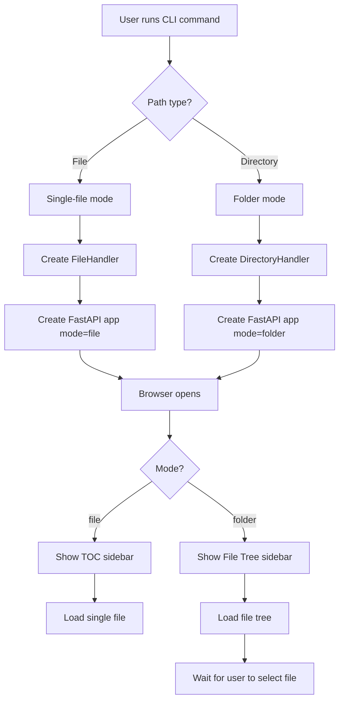
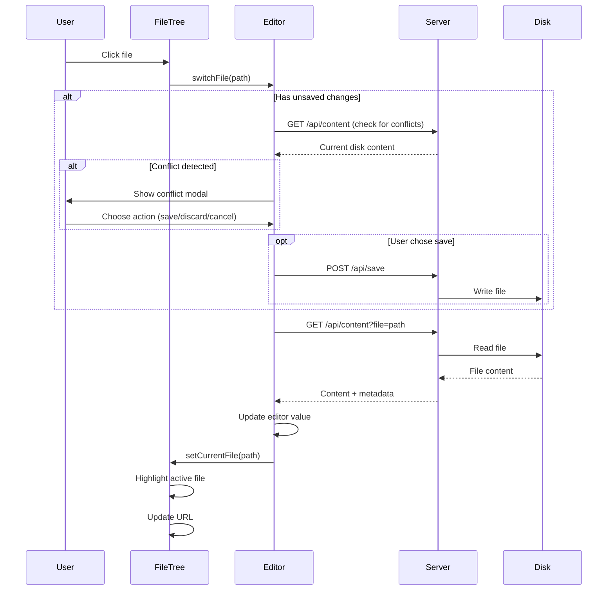

# Plan: File Tree Browser

**Status:** Draft
**Created:** 2026-02-15
**Feature:** #11 - File Tree Browser

---

## Overview

Transform Markdown-OS from a single-file editor to a multi-file workspace by adding a collapsible left sidebar that displays a recursive file tree of markdown files. Users can open a folder and navigate between `.md` files without leaving the application.

**Includes**:
- Recursive file tree navigation with nested folders
- Collapsible/expandable folder UI
- Search/filter functionality for files
- Auto-save when switching between files
- URL-based file routing
- Current file path display in top bar
- Backward compatibility with single-file mode

### Key Features
- **Recursive File Tree**: Navigate nested directory structures with expandable/collapsible folders
- **Dual Mode Support**: Both `markdown-os open file.md` (single-file) and `markdown-os open folder/` (multi-file) commands work
- **Search & Filter**: Quickly find files by name within the tree
- **Auto-Save on Switch**: Content is saved automatically before switching to another file
- **URL Integration**: Current file reflected in URL query parameter for bookmarking and sharing
- **Visual Context**: Current file path displayed in top bar for orientation

---

## Current Behavior

### Single-File Architecture
1. CLI validates a single markdown file path (`.md` or `.markdown` extension only)
2. `FileHandler` is created for that single file with POSIX file locking
3. FastAPI server starts with routes:
   - `GET /` → serves `index.html`
   - `GET /api/content` → returns markdown content + metadata for the file
   - `POST /api/save` → saves content to the file
   - `WebSocket /ws` → notifies about external file changes
4. Watchdog monitors the file's parent directory (non-recursive) for external changes
5. Browser opens automatically at `http://localhost:8000`

### Frontend Structure
- **Layout**: Left sidebar (Table of Contents), Main content area (Edit/Preview tabs)
- **Top bar**: Tab navigation (Edit | Preview), Theme toggle, Save status
- **No file switching**: Only one file can be edited per server instance

### File Handling
- `FileHandler` manages one file with exclusive/shared locks
- Lock files created at `<filename>.md.lock`
- Atomic writes using temp files + `os.replace()`
- External change detection via Watchdog with 0.2s throttling

## Proposed Behavior

### Multi-File Workspace Flow

**Opening a Folder:**
1. User runs `markdown-os open ./my-notes/` (note: folder path, not file)
2. CLI detects path is a directory (not a file)
3. Server starts in "folder mode" with directory handler
4. Browser opens at `http://localhost:8000` (no file loaded yet)
5. Left sidebar shows file tree with all `.md` files in recursive structure
6. User clicks a file in the tree → file loads into editor

**Opening a Specific File (Backward Compatible):**
1. User runs `markdown-os open ./my-notes/todo.md`
2. CLI detects path is a file (existing behavior)
3. Server starts in "single-file mode" with file handler
4. Browser opens at `http://localhost:8000` with that file loaded
5. Left sidebar shows TOC (existing behavior)
6. **No file tree navigation** (single-file mode)

**Switching Between Files:**
1. User is editing `notes/todo.md` in Preview mode
2. User clicks `notes/journal.md` in the file tree
3. System checks for unsaved changes
4. If unsaved changes exist → auto-save current file
5. If external conflict detected → show conflict modal
6. Load new file content via `/api/content?file=notes/journal.md`
7. Update URL to `?file=notes/journal.md`
8. Update top bar to show "notes/journal.md"
9. Render new file in preview

**File Tree Interaction:**
1. Folders have collapse/expand icons (▶ closed, ▼ open)
2. Click folder icon → toggle collapsed state
3. Click file name → switch to that file
4. Currently open file is highlighted in the tree
5. Search box at top of tree filters visible files

---

## User Story / Value Proposition

**Problem**:
Currently, Markdown-OS can only edit one file at a time. To work with multiple markdown files (e.g., a documentation folder, notes collection, or blog posts), users must:
1. Close the current file
2. Open a new file via CLI
3. Lose context and interrupt their workflow

This makes Markdown-OS impractical for real-world note-taking, documentation authoring, and knowledge management where users need to reference and edit multiple files.

**User benefit**:
- **Seamless multi-file editing** - Navigate entire documentation folders without leaving the browser
- **Faster workflow** - No CLI commands needed to switch files
- **Better context** - See all available files at a glance in the tree
- **Familiar UX** - File tree navigation matches VS Code, Obsidian, Typora, and other editors

**Use cases**:
1. **Documentation authoring** - Navigate between README, API docs, guides, and tutorials in a project
2. **Personal knowledge base** - Browse daily notes, project notes, and reference materials
3. **Blog/content creation** - Switch between draft posts, published posts, and templates
4. **Meeting notes** - Access today's notes, past meetings, and agenda templates

---

## Implementation Plan

### 1. Add Directory Path Validation to CLI

**File**: `markdown_os/cli.py`

**Changes**:
- Add `_validate_markdown_directory()` function to check if path is a directory containing `.md` files
- Modify `_validate_markdown_file()` to be used for single-file mode only
- Update `open_markdown_file()` command to accept both files and directories
- Add logic to determine mode (file vs folder) and create appropriate handler

**Code Location**: After line 58 (after `_validate_markdown_file`)

**Example Code**:
```python
def _validate_markdown_directory(dirpath: Path) -> Path:
    """
    Validate and normalize a directory path from CLI input.

    Args:
    - dirpath (Path): Directory path supplied by the user.

    Returns:
    - Path: Fully resolved directory path when validation passes.
    """
    resolved_path = dirpath.expanduser().resolve()

    if not resolved_path.exists():
        raise typer.BadParameter(f"Path does not exist: {resolved_path}")

    if not resolved_path.is_dir():
        raise typer.BadParameter(f"Path is not a directory: {resolved_path}")

    # Check if directory contains any markdown files (recursively)
    md_files = list(resolved_path.rglob("*.md")) + list(resolved_path.rglob("*.markdown"))
    if not md_files:
        raise typer.BadParameter(
            f"Directory contains no markdown files (.md, .markdown): {resolved_path}"
        )

    return resolved_path


def _validate_path(filepath: Path) -> tuple[Path, str]:
    """
    Validate path as either a markdown file or directory.

    Args:
    - filepath (Path): Path supplied by the user.

    Returns:
    - tuple[Path, str]: (resolved_path, mode) where mode is "file" or "folder"
    """
    resolved_path = filepath.expanduser().resolve()

    if not resolved_path.exists():
        raise typer.BadParameter(f"Path does not exist: {resolved_path}")

    if resolved_path.is_file():
        if resolved_path.suffix.lower() not in {".md", ".markdown"}:
            raise typer.BadParameter("Only markdown files are supported (.md, .markdown).")
        return (resolved_path, "file")

    if resolved_path.is_dir():
        md_files = list(resolved_path.rglob("*.md")) + list(resolved_path.rglob("*.markdown"))
        if not md_files:
            raise typer.BadParameter(
                f"Directory contains no markdown files: {resolved_path}"
            )
        return (resolved_path, "folder")

    raise typer.BadParameter(f"Path is neither a file nor directory: {resolved_path}")
```

**Changes to `open_markdown_file()` function** (line 151-190):
```python
@app.command("open")
def open_markdown_file(
    filepath: Path = typer.Argument(..., help="Path to a .md file or directory."),
    host: Annotated[str, typer.Option("--host", help="Host interface to bind.")] = "127.0.0.1",
    port: Annotated[int, typer.Option("--port", help="Preferred start port; auto-increments when occupied.")] = 8000,
) -> None:
    """
    Start a local web editor for a markdown file or directory of files.

    Args:
    - filepath (Path): Markdown file or directory path to open in the editor.
    - host (str): Host interface used by the FastAPI/Uvicorn server.
    - port (int): Preferred start port for auto-increment probing.

    Returns:
    - None: Function starts a blocking uvicorn server until interrupted.
    """
    resolved_path, mode = _validate_path(filepath)
    selected_port = find_available_port(host=host, start_port=port)
    editor_url = f"http://{host}:{selected_port}"

    if mode == "file":
        typer.echo(f"Opening file {resolved_path} at {editor_url}")
        _open_browser(editor_url)
        file_handler = FileHandler(resolved_path)
        application = create_app(file_handler, mode="file")
    else:  # folder mode
        typer.echo(f"Opening folder {resolved_path} at {editor_url}")
        _open_browser(editor_url)
        from markdown_os.directory_handler import DirectoryHandler
        directory_handler = DirectoryHandler(resolved_path)
        application = create_app(directory_handler, mode="folder")

    uvicorn.run(application, host=host, port=selected_port)
```

**Rationale**:
- Keep backward compatibility by supporting both file and folder paths
- Validate directory contains markdown files to give helpful error messages
- Return mode indicator so server knows how to configure itself

---

### 2. Create DirectoryHandler Class

**File**: `markdown_os/directory_handler.py` (new file)

**Changes**:
- Create new `DirectoryHandler` class to manage multiple markdown files
- Implement `list_files()` method to recursively find all `.md` files
- Implement `get_file_tree()` method to return nested folder structure
- Implement `get_file_handler(relative_path)` method to create FileHandler on-demand
- Cache FileHandler instances to avoid recreating locks

**Example Code**:
```python
"""Directory and file tree management for Markdown-OS."""

from __future__ import annotations

import os
from pathlib import Path
from typing import Any

from markdown_os.file_handler import FileHandler


class DirectoryHandler:
    """Manage multiple markdown files within a directory."""

    def __init__(self, directory: Path) -> None:
        """
        Create a directory handler for a folder containing markdown files.

        Args:
        - directory (Path): Root directory path containing markdown files.

        Returns:
        - None: Initializes directory path and file handler cache.
        """
        self._directory = directory.expanduser().resolve()
        self._file_handlers: dict[str, FileHandler] = {}

    @property
    def directory(self) -> Path:
        """
        Expose the root directory path.

        Returns:
        - Path: The resolved directory path.
        """
        return self._directory

    def list_files(self, extensions: set[str] | None = None) -> list[Path]:
        """
        List all markdown files in the directory recursively.

        Args:
        - extensions (set[str] | None): File extensions to include (default: {".md", ".markdown"})

        Returns:
        - list[Path]: Sorted list of markdown file paths relative to root directory.
        """
        if extensions is None:
            extensions = {".md", ".markdown"}

        files: list[Path] = []
        for ext in extensions:
            files.extend(self._directory.rglob(f"*{ext}"))

        # Return paths relative to directory root, sorted alphabetically
        relative_files = [f.relative_to(self._directory) for f in files]
        return sorted(relative_files)

    def get_file_tree(self) -> dict[str, Any]:
        """
        Build a nested tree structure of files and folders.

        Returns:
        - dict: Nested dictionary representing folder structure.
                Format: {"type": "folder", "name": "root", "children": [...]}
        """
        files = self.list_files()

        root: dict[str, Any] = {
            "type": "folder",
            "name": self._directory.name or ".",
            "path": "",
            "children": []
        }

        for file_path in files:
            parts = file_path.parts
            current_node = root

            # Navigate/create folder nodes
            for i, part in enumerate(parts[:-1]):
                # Find existing folder node or create new one
                folder_path = str(Path(*parts[:i+1]))
                existing = next(
                    (child for child in current_node["children"]
                     if child["type"] == "folder" and child["name"] == part),
                    None
                )

                if existing:
                    current_node = existing
                else:
                    new_folder = {
                        "type": "folder",
                        "name": part,
                        "path": folder_path,
                        "children": []
                    }
                    current_node["children"].append(new_folder)
                    current_node = new_folder

            # Add file node
            file_node = {
                "type": "file",
                "name": parts[-1],
                "path": str(file_path)
            }
            current_node["children"].append(file_node)

        return root

    def get_file_handler(self, relative_path: str) -> FileHandler:
        """
        Get or create a FileHandler for a specific markdown file.

        Args:
        - relative_path (str): File path relative to the root directory.

        Returns:
        - FileHandler: File handler instance for the specified file.
        """
        # Normalize path separators
        normalized_path = os.path.normpath(relative_path)

        # Check cache
        if normalized_path in self._file_handlers:
            return self._file_handlers[normalized_path]

        # Create new file handler
        absolute_path = self._directory / normalized_path

        if not absolute_path.exists():
            raise FileNotFoundError(f"File does not exist: {absolute_path}")

        if absolute_path.suffix.lower() not in {".md", ".markdown"}:
            raise ValueError(f"Not a markdown file: {absolute_path}")

        handler = FileHandler(absolute_path)
        self._file_handlers[normalized_path] = handler
        return handler

    def validate_file_path(self, relative_path: str) -> bool:
        """
        Check if a relative path points to a valid markdown file in the directory.

        Args:
        - relative_path (str): File path relative to the root directory.

        Returns:
        - bool: True if file exists and is a markdown file within the directory.
        """
        try:
            absolute_path = (self._directory / relative_path).resolve()

            # Security check: ensure path is within directory
            if not str(absolute_path).startswith(str(self._directory)):
                return False

            if not absolute_path.exists() or not absolute_path.is_file():
                return False

            if absolute_path.suffix.lower() not in {".md", ".markdown"}:
                return False

            return True
        except (ValueError, OSError):
            return False
```

**Rationale**:
- Separate concerns: DirectoryHandler manages file discovery, FileHandler manages individual file I/O
- Cache FileHandler instances to avoid recreating locks for frequently accessed files
- Security: Validate paths are within directory to prevent directory traversal attacks
- Tree structure makes frontend rendering easier (recursive components)

---

### 3. Update Server to Support Both Modes

**File**: `markdown_os/server.py`

**Changes**:
- Add `mode` parameter to `create_app()` function
- Store mode in `app.state.mode`
- Add new route `GET /api/file-tree` for folder mode
- Modify `GET /api/content` to accept `?file=path` query parameter in folder mode
- Modify `POST /api/save` to accept `file` in request body for folder mode
- Update Watchdog observer to monitor entire directory in folder mode
- Update WebSocket notifications to include file path

**Code Location**: Line 222-233 (modify `create_app` signature)

**Example Code**:
```python
def create_app(handler: FileHandler | DirectoryHandler, mode: str = "file") -> FastAPI:
    """
    Create the FastAPI application for the markdown editor.

    Args:
    - handler: Either FileHandler (single-file mode) or DirectoryHandler (folder mode)
    - mode (str): "file" or "folder" mode indicator

    Returns:
    - FastAPI: Configured application with routes, static assets, and websocket support.
    """
    # ... existing code ...

    app.state.handler = handler
    app.state.mode = mode
    app.state.current_file = None  # For folder mode: track currently edited file

    # ... existing lifespan and routes ...

    @app.get("/api/mode")
    async def get_mode() -> dict[str, str]:
        """Return the current mode (file or folder)."""
        return {"mode": app.state.mode}

    @app.get("/api/file-tree")
    async def get_file_tree() -> dict[str, Any]:
        """
        Return the directory file tree structure (folder mode only).

        Returns:
        - dict: Nested tree of folders and files.
        """
        if app.state.mode != "folder":
            raise HTTPException(status_code=400, detail="File tree only available in folder mode")

        from markdown_os.directory_handler import DirectoryHandler
        if not isinstance(app.state.handler, DirectoryHandler):
            raise HTTPException(status_code=500, detail="Invalid handler type")

        return app.state.handler.get_file_tree()

    @app.get("/api/content")
    async def get_content(file: str | None = None) -> dict[str, object]:
        """
        Return markdown content and metadata.

        Args:
        - file (str | None): File path (required in folder mode, ignored in file mode)

        Returns:
        - dict: Markdown content plus metadata.
        """
        if app.state.mode == "file":
            # Existing single-file behavior
            from markdown_os.file_handler import FileHandler
            if not isinstance(app.state.handler, FileHandler):
                raise HTTPException(status_code=500, detail="Invalid handler type")

            try:
                content = app.state.handler.read()
                metadata = app.state.handler.get_metadata()
            except FileReadError as exc:
                raise HTTPException(
                    status_code=_status_for_read_error(exc),
                    detail=str(exc),
                ) from exc

            return {"content": content, "metadata": metadata}

        else:  # folder mode
            if not file:
                raise HTTPException(status_code=400, detail="Missing 'file' query parameter")

            from markdown_os.directory_handler import DirectoryHandler
            if not isinstance(app.state.handler, DirectoryHandler):
                raise HTTPException(status_code=500, detail="Invalid handler type")

            # Validate file path
            if not app.state.handler.validate_file_path(file):
                raise HTTPException(status_code=400, detail=f"Invalid file path: {file}")

            try:
                file_handler = app.state.handler.get_file_handler(file)
                content = file_handler.read()
                metadata = file_handler.get_metadata()
                metadata["relative_path"] = file
            except FileReadError as exc:
                raise HTTPException(
                    status_code=_status_for_read_error(exc),
                    detail=str(exc),
                ) from exc
            except FileNotFoundError as exc:
                raise HTTPException(status_code=404, detail=str(exc)) from exc

            app.state.current_file = file
            return {"content": content, "metadata": metadata}

    @app.post("/api/save")
    async def save_content(payload: SaveRequest) -> dict[str, object]:
        """
        Persist markdown content to disk.

        Args:
        - payload (SaveRequest): Request body with content and optional file path.

        Returns:
        - dict: Save confirmation and metadata.
        """
        if app.state.mode == "file":
            # Existing single-file behavior
            from markdown_os.file_handler import FileHandler
            if not isinstance(app.state.handler, FileHandler):
                raise HTTPException(status_code=500, detail="Invalid handler type")

            try:
                app.state.handler.write(payload.content)
                app.state.last_internal_write_at = time.monotonic()
                metadata = app.state.handler.get_metadata()
            except FileWriteError as exc:
                raise HTTPException(status_code=500, detail=str(exc)) from exc
            except FileReadError as exc:
                raise HTTPException(status_code=500, detail=str(exc)) from exc

            return {"status": "saved", "metadata": metadata}

        else:  # folder mode
            file_path = getattr(payload, "file", None)
            if not file_path:
                raise HTTPException(status_code=400, detail="Missing 'file' in request body")

            from markdown_os.directory_handler import DirectoryHandler
            if not isinstance(app.state.handler, DirectoryHandler):
                raise HTTPException(status_code=500, detail="Invalid handler type")

            # Validate file path
            if not app.state.handler.validate_file_path(file_path):
                raise HTTPException(status_code=400, detail=f"Invalid file path: {file_path}")

            try:
                file_handler = app.state.handler.get_file_handler(file_path)
                file_handler.write(payload.content)
                app.state.last_internal_write_at = time.monotonic()
                metadata = file_handler.get_metadata()
                metadata["relative_path"] = file_path
            except FileWriteError as exc:
                raise HTTPException(status_code=500, detail=str(exc)) from exc
            except FileReadError as exc:
                raise HTTPException(status_code=500, detail=str(exc)) from exc
            except FileNotFoundError as exc:
                raise HTTPException(status_code=404, detail=str(exc)) from exc

            return {"status": "saved", "metadata": metadata}

    return app
```

**Update SaveRequest model** (line 21-24):
```python
class SaveRequest(BaseModel):
    """Body payload for save operations."""

    content: str
    file: str | None = None  # File path for folder mode
```

**Rationale**:
- Single `create_app()` function handles both modes with conditional logic
- Query parameters for GET, request body for POST (RESTful design)
- Mode is determined at app creation time (passed from CLI)
- Security: Validate all file paths to prevent directory traversal

---

### 4. Add File Tree Sidebar UI

**File**: `markdown_os/static/index.html`

**Changes**:
- Update left sidebar to show file tree instead of TOC in folder mode
- Add search input for filtering files
- Add collapse/expand folder icons
- Add file path display to top bar
- Keep TOC sidebar for single-file mode

**Code Location**: Lines 49-52 (replace `#toc-sidebar`)

**Example Code**:
```html
<!-- Left Sidebar (context-aware: TOC in file mode, File Tree in folder mode) -->
<aside id="sidebar">
  <!-- File Tree (folder mode only) -->
  <div id="file-tree-container" class="hidden">
    <div class="sidebar-header">
      <h3>Files</h3>
      <input
        type="text"
        id="file-tree-search"
        placeholder="Search files..."
        class="file-tree-search"
        aria-label="Search files"
      />
    </div>
    <nav id="file-tree" role="tree"></nav>
  </div>

  <!-- Table of Contents (file mode only) -->
  <div id="toc-container">
    <h3>Contents</h3>
    <nav id="toc" role="navigation"></nav>
  </div>
</aside>

<main id="main-content">
  <div class="tab-nav">
    <div class="tab-group">
      <button id="edit-tab" class="tab-button" type="button">Edit</button>
      <button id="preview-tab" class="tab-button active" type="button">Preview</button>
    </div>

    <!-- Center: Current file path (folder mode only) -->
    <div id="current-file-path" class="current-file-path hidden">
      <span id="current-file-text"></span>
    </div>

    <div class="tab-controls">
      <button id="theme-toggle" class="theme-toggle" type="button" aria-label="Toggle theme">
        <!-- ... existing theme toggle icons ... -->
      </button>
      <span id="save-status" aria-live="polite">Idle</span>
    </div>
  </div>

  <!-- ... existing editor and preview containers ... -->
</main>
```

**Rationale**:
- Reuse sidebar space for either TOC or file tree depending on mode
- Search input allows quick file filtering
- File path in center of top bar provides context without cluttering

---

### 5. Implement File Tree JavaScript

**File**: `markdown_os/static/js/file-tree.js` (new file)

**Changes**:
- Create new JavaScript module for file tree rendering and interaction
- Implement `loadFileTree()` to fetch and render tree structure
- Implement `renderTree()` to recursively build folder/file DOM nodes
- Implement `handleFileClick()` to switch files
- Implement `handleFolderToggle()` to collapse/expand folders
- Implement `filterTree()` for search functionality
- Store collapsed state in memory (no persistence needed per requirements)

**Example Code**:
```javascript
(() => {
  const fileTreeState = {
    currentFile: null,
    collapsedFolders: new Set(),
    fileTreeData: null,
  };

  async function loadFileTree() {
    try {
      const response = await fetch("/api/file-tree");
      if (!response.ok) {
        throw new Error(`Failed to load file tree (${response.status})`);
      }

      const treeData = await response.json();
      fileTreeState.fileTreeData = treeData;
      renderTree(treeData);
    } catch (error) {
      console.error("Failed to load file tree", error);
    }
  }

  function renderTree(node, parentElement = null) {
    const container = parentElement || document.getElementById("file-tree");
    if (!container) return;

    if (!parentElement) {
      container.innerHTML = "";
    }

    const ul = document.createElement("ul");
    ul.className = parentElement ? "tree-children" : "tree-root";

    for (const child of node.children || []) {
      const li = document.createElement("li");
      li.className = child.type === "folder" ? "tree-folder" : "tree-file";

      if (child.type === "folder") {
        const isCollapsed = fileTreeState.collapsedFolders.has(child.path);

        const folderHeader = document.createElement("div");
        folderHeader.className = "tree-folder-header";

        const icon = document.createElement("span");
        icon.className = "folder-icon";
        icon.textContent = isCollapsed ? "▶" : "▼";
        icon.setAttribute("data-path", child.path);

        const name = document.createElement("span");
        name.className = "folder-name";
        name.textContent = child.name;

        folderHeader.appendChild(icon);
        folderHeader.appendChild(name);

        folderHeader.addEventListener("click", (e) => {
          e.stopPropagation();
          handleFolderToggle(child.path);
        });

        li.appendChild(folderHeader);

        if (!isCollapsed && child.children && child.children.length > 0) {
          renderTree(child, li);
        }
      } else {
        // File node
        const fileLink = document.createElement("a");
        fileLink.className = "tree-file-link";
        fileLink.href = "#";
        fileLink.textContent = child.name;
        fileLink.setAttribute("data-path", child.path);

        if (child.path === fileTreeState.currentFile) {
          fileLink.classList.add("active");
        }

        fileLink.addEventListener("click", (e) => {
          e.preventDefault();
          handleFileClick(child.path);
        });

        li.appendChild(fileLink);
      }

      ul.appendChild(li);
    }

    if (parentElement) {
      parentElement.appendChild(ul);
    } else {
      container.appendChild(ul);
    }
  }

  function handleFolderToggle(folderPath) {
    if (fileTreeState.collapsedFolders.has(folderPath)) {
      fileTreeState.collapsedFolders.delete(folderPath);
    } else {
      fileTreeState.collapsedFolders.add(folderPath);
    }

    renderTree(fileTreeState.fileTreeData);
  }

  async function handleFileClick(filePath) {
    if (filePath === fileTreeState.currentFile) {
      return; // Already viewing this file
    }

    // Use editor.js switchFile() function to handle save/load
    if (window.switchFile) {
      await window.switchFile(filePath);
    }
  }

  function filterTree() {
    const searchInput = document.getElementById("file-tree-search");
    if (!searchInput) return;

    const query = searchInput.value.toLowerCase().trim();

    if (!query) {
      // Show all files
      const allItems = document.querySelectorAll(".tree-file, .tree-folder");
      allItems.forEach(item => item.style.display = "");
      return;
    }

    // Filter files by name
    const fileLinks = document.querySelectorAll(".tree-file-link");
    fileLinks.forEach(link => {
      const fileName = link.textContent.toLowerCase();
      const li = link.closest(".tree-file");

      if (fileName.includes(query)) {
        li.style.display = "";
      } else {
        li.style.display = "none";
      }
    });

    // Show folders that contain visible files
    const folders = document.querySelectorAll(".tree-folder");
    folders.forEach(folder => {
      const visibleChildren = folder.querySelectorAll(
        ".tree-file:not([style*='display: none'])"
      );
      folder.style.display = visibleChildren.length > 0 ? "" : "none";
    });
  }

  function setCurrentFile(filePath) {
    fileTreeState.currentFile = filePath;

    // Update active state in tree
    const allLinks = document.querySelectorAll(".tree-file-link");
    allLinks.forEach(link => {
      if (link.getAttribute("data-path") === filePath) {
        link.classList.add("active");
      } else {
        link.classList.remove("active");
      }
    });

    // Update file path display in top bar
    const filePathElement = document.getElementById("current-file-text");
    if (filePathElement) {
      filePathElement.textContent = filePath || "";
    }

    // Update URL
    if (filePath) {
      const url = new URL(window.location);
      url.searchParams.set("file", filePath);
      window.history.replaceState({}, "", url);
    }
  }

  function initFileTree() {
    const searchInput = document.getElementById("file-tree-search");
    if (searchInput) {
      searchInput.addEventListener("input", filterTree);
    }
  }

  // Expose functions globally for editor.js to use
  window.fileTree = {
    loadFileTree,
    setCurrentFile,
    initFileTree,
  };

  // Initialize on DOMContentLoaded
  document.addEventListener("DOMContentLoaded", () => {
    // Check if we're in folder mode
    fetch("/api/mode")
      .then(res => res.json())
      .then(data => {
        if (data.mode === "folder") {
          // Show file tree, hide TOC
          document.getElementById("file-tree-container")?.classList.remove("hidden");
          document.getElementById("toc-container")?.classList.add("hidden");
          document.getElementById("current-file-path")?.classList.remove("hidden");

          initFileTree();
          loadFileTree();

          // Load initial file from URL if present
          const urlParams = new URLSearchParams(window.location.search);
          const initialFile = urlParams.get("file");
          if (initialFile) {
            handleFileClick(initialFile);
          }
        }
      })
      .catch(err => {
        console.error("Failed to determine mode", err);
      });
  });
})();
```

**Rationale**:
- Recursive rendering matches tree structure from backend
- Collapsed state stored in memory (Set for O(1) lookups)
- Search filters both files and folders dynamically
- Active file highlighting provides visual feedback
- URL updates enable bookmarking specific files

---

### 6. Update Editor.js for File Switching

**File**: `markdown_os/static/js/editor.js`

**Changes**:
- Add `currentFilePath` to editor state
- Create `switchFile(filePath)` function to handle file switching
- Modify `loadContent()` to accept optional file parameter
- Modify `saveContent()` to include file path in folder mode
- Update conflict detection to be file-aware

**Code Location**: Lines 4-9 (update `editorState`)

**Example Code**:
```javascript
const editorState = {
  saveTimeout: null,
  lastSavedContent: "",
  isSaving: false,
  isEditMode: false,
  currentFilePath: null,  // Add this
  mode: "file",  // Add this: "file" or "folder"
};

// Add this function after loadContent() (around line 70)
async function switchFile(filePath) {
  const editor = document.getElementById("markdown-editor");
  if (!editor) {
    return false;
  }

  // Check for unsaved changes
  const hasUnsavedChanges = editor.value !== editorState.lastSavedContent;
  if (hasUnsavedChanges) {
    const hasConflict = await checkForExternalChanges();
    if (hasConflict) {
      const choice = await showConflictDialog();
      if (choice === "save") {
        const saved = await saveContent();
        if (!saved) {
          return false;
        }
      } else if (choice === "discard") {
        // Continue without saving
      } else {
        return false; // Cancel
      }
    } else {
      const saved = await saveContent();
      if (!saved) {
        return false;
      }
    }
  }

  // Load new file
  const loaded = await loadContent(filePath);
  if (loaded) {
    editorState.currentFilePath = filePath;

    // Update UI
    if (window.fileTree) {
      window.fileTree.setCurrentFile(filePath);
    }

    // Switch to preview mode after loading new file
    await switchToTab("preview");
  }

  return loaded;
}

// Modify loadContent to accept filePath parameter
async function loadContent(filePath = null) {
  const editor = document.getElementById("markdown-editor");
  if (!editor) {
    return false;
  }

  setLoadingState(true);
  try {
    let url = "/api/content";
    if (editorState.mode === "folder" && filePath) {
      url += `?file=${encodeURIComponent(filePath)}`;
    } else if (editorState.mode === "folder" && editorState.currentFilePath) {
      url += `?file=${encodeURIComponent(editorState.currentFilePath)}`;
    }

    const response = await fetch(url);
    if (!response.ok) {
      throw new Error(`Failed to load content (${response.status})`);
    }

    const payload = await response.json();
    const initialContent = payload.content || "";
    editor.value = initialContent;
    editorState.lastSavedContent = initialContent;

    if (payload.metadata && payload.metadata.relative_path) {
      editorState.currentFilePath = payload.metadata.relative_path;
    }

    setSaveStatus("Loaded", "saved");
    return true;
  } catch (error) {
    console.error("Failed to load markdown content.", error);
    setSaveStatus("Load failed", "error");
    return false;
  } finally {
    setLoadingState(false);
  }
}

// Modify saveContent to include filePath
async function saveContent() {
  const editor = document.getElementById("markdown-editor");
  if (!editor || editorState.isSaving) {
    return false;
  }

  editorState.isSaving = true;
  const content = editor.value;
  setSaveStatus("Saving...", "saving");

  try {
    const payload = { content };
    if (editorState.mode === "folder" && editorState.currentFilePath) {
      payload.file = editorState.currentFilePath;
    }

    const response = await fetch("/api/save", {
      method: "POST",
      headers: {
        "Content-Type": "application/json",
      },
      body: JSON.stringify(payload),
    });

    if (!response.ok) {
      throw new Error(`Save failed (${response.status})`);
    }

    editorState.lastSavedContent = content;
    setSaveStatus("Saved", "saved");
    return true;
  } catch (error) {
    console.error("Failed to save markdown content.", error);
    setSaveStatus("Save failed", "error");
    return false;
  } finally {
    editorState.isSaving = false;
  }
}

// Add mode detection in DOMContentLoaded
document.addEventListener("DOMContentLoaded", async () => {
  // Detect mode
  try {
    const modeResponse = await fetch("/api/mode");
    if (modeResponse.ok) {
      const modeData = await modeResponse.json();
      editorState.mode = modeData.mode;
    }
  } catch (error) {
    console.error("Failed to detect mode", error);
  }

  bindEvents();

  if (editorState.mode === "file") {
    await loadContent();
  } else {
    // In folder mode, wait for file tree to trigger initial file load
    // Or load from URL parameter if present
    const urlParams = new URLSearchParams(window.location.search);
    const initialFile = urlParams.get("file");
    if (initialFile) {
      await loadContent(initialFile);
    }
  }

  await switchToTab("preview");
});

// Expose switchFile globally for file-tree.js
window.switchFile = switchFile;
```

**Rationale**:
- Separate `switchFile()` function handles the full workflow: save → load → update UI
- Mode detection at startup configures behavior correctly
- File path tracked in state and passed to API calls
- Auto-save before switch prevents data loss

---

### 7. Add Styling for File Tree

**File**: `markdown_os/static/css/styles.css`

**Changes**:
- Add styles for file tree container, folders, files
- Add styles for search input
- Add styles for current file path in top bar
- Add collapse/expand animations
- Ensure dark mode compatibility

**Code Location**: After line 196 (after existing `#toc` styles)

**Example Code**:
```css
/* File Tree Styles */
#file-tree-container {
  display: flex;
  flex-direction: column;
  height: 100%;
}

.sidebar-header {
  margin-bottom: 12px;
}

.sidebar-header h3 {
  margin: 2px 0 10px;
  font-size: 14px;
  color: var(--text-muted);
  letter-spacing: 0.02em;
}

.file-tree-search {
  width: 100%;
  padding: 6px 10px;
  font-size: 13px;
  border: 1px solid var(--border);
  border-radius: 6px;
  background: var(--panel-bg);
  color: var(--text);
  outline: none;
}

.file-tree-search:focus {
  border-color: var(--accent);
  background: var(--editor-bg);
}

.file-tree-search::placeholder {
  color: var(--text-muted);
}

#file-tree {
  flex: 1;
  overflow-y: auto;
  overflow-x: hidden;
}

.tree-root,
.tree-children {
  list-style: none;
  margin: 0;
  padding-left: 0;
}

.tree-children {
  padding-left: 16px;
  margin-top: 2px;
}

.tree-folder,
.tree-file {
  margin: 2px 0;
}

.tree-folder-header {
  display: flex;
  align-items: center;
  gap: 6px;
  padding: 4px 6px;
  border-radius: 4px;
  cursor: pointer;
  user-select: none;
  transition: background-color 0.15s ease;
}

.tree-folder-header:hover {
  background: var(--accent-soft);
}

.folder-icon {
  font-size: 10px;
  color: var(--text-muted);
  width: 12px;
  display: inline-block;
  transition: transform 0.15s ease;
}

.folder-name {
  font-size: 13px;
  color: var(--text);
  font-weight: 500;
}

.tree-file-link {
  display: block;
  padding: 4px 6px 4px 24px;
  font-size: 13px;
  color: var(--text-muted);
  text-decoration: none;
  border-radius: 4px;
  transition:
    color 0.15s ease,
    background-color 0.15s ease;
}

.tree-file-link:hover {
  color: var(--accent);
  background: var(--accent-soft);
}

.tree-file-link.active {
  color: var(--accent);
  background: var(--accent-soft);
  font-weight: 600;
}

/* Current File Path Display */
.current-file-path {
  flex: 1;
  display: flex;
  align-items: center;
  justify-content: center;
  font-size: 12px;
  color: var(--text-muted);
  padding: 0 12px;
}

#current-file-text {
  max-width: 400px;
  overflow: hidden;
  text-overflow: ellipsis;
  white-space: nowrap;
}

/* Adjust tab-nav layout for centered file path */
.tab-nav {
  display: grid;
  grid-template-columns: auto 1fr auto;
  align-items: center;
  gap: 12px;
}

/* Responsive adjustments */
@media (max-width: 980px) {
  .current-file-path {
    display: none;
  }

  .tab-nav {
    grid-template-columns: auto auto;
  }
}
```

**Rationale**:
- Tree indentation shows hierarchy clearly
- Folder icons rotate on expand/collapse (visual feedback)
- Active file highlighted with accent color
- Search input styled consistently with existing UI
- Responsive design hides file path on small screens

---

### 8. Load file-tree.js in HTML

**File**: `markdown_os/static/index.html`

**Changes**:
- Add `<script>` tag to load `file-tree.js` before `editor.js`

**Code Location**: Line 144 (before `<script src="/static/js/editor.js"></script>`)

**Example Code**:
```html
<script src="/static/js/theme.js"></script>
<script src="/static/js/websocket.js"></script>
<script src="/static/js/markdown.js"></script>
<script src="/static/js/toc.js"></script>
<script src="/static/js/file-tree.js"></script>
<script src="/static/js/editor.js"></script>
```

**Rationale**: Load `file-tree.js` before `editor.js` so `window.fileTree` is available when editor initializes.

---

## Architecture / Flow Diagram

### Mode Detection and Initialization



### File Switching Flow



---

## Edge Cases to Handle

#### Case 1: Empty Directory
- **Scenario**: User runs `markdown-os open empty_folder/` where folder contains no `.md` files
- **Expected behavior**: CLI shows error: "Directory contains no markdown files"
- **Implementation note**: `_validate_path()` checks for markdown files and raises `typer.BadParameter` if none found

#### Case 2: Switching Files with Unsaved Changes
- **Scenario**: User edits `file1.md`, makes changes, clicks `file2.md` in tree without saving
- **Expected behavior**: Auto-save `file1.md` before loading `file2.md`
- **Implementation note**: `switchFile()` calls `saveContent()` before `loadContent()`

#### Case 3: External File Change While Editing
- **Scenario**: User edits `file1.md`, external process modifies `file1.md`
- **Expected behavior**: WebSocket notification triggers conflict detection, show modal
- **Implementation note**: Existing conflict resolution modal handles this (already implemented)

#### Case 4: File Deleted Externally
- **Scenario**: User has `file1.md` open, external process deletes the file
- **Expected behavior**: Show error "File no longer exists" when trying to save
- **Implementation note**: FileHandler.write() raises FileWriteError, editor.js shows error in save status

#### Case 5: Invalid File Path in URL
- **Scenario**: User bookmarks `?file=nonexistent.md` or `?file=../etc/passwd`
- **Expected behavior**: Show error "Invalid file path" or 404
- **Implementation note**: `DirectoryHandler.validate_file_path()` checks file exists and is within directory

#### Case 6: Large Directory (1000+ Files)
- **Scenario**: User opens folder with many markdown files
- **Expected behavior**: Tree renders but may be slow; search helps narrow down
- **Implementation note**: Consider pagination or lazy loading in future enhancement (not in MVP)

#### Case 7: Single-File Mode vs Folder Mode UI
- **Scenario**: User switches between `markdown-os open file.md` and `markdown-os open folder/`
- **Expected behavior**: UI adapts - file mode shows TOC, folder mode shows tree
- **Implementation note**: JavaScript checks `/api/mode` on load and shows/hides appropriate sidebar

#### Case 8: File Path with Special Characters
- **Scenario**: File named `my file (draft).md` or `файл.md`
- **Expected behavior**: Works correctly with URL encoding
- **Implementation note**: Use `encodeURIComponent()` in JavaScript, Path normalization in Python

#### Case 9: Deeply Nested Folders
- **Scenario**: File tree has 10+ levels of nesting
- **Expected behavior**: Tree renders with proper indentation, scrollable
- **Implementation note**: Recursive rendering handles arbitrary depth, CSS adds left padding per level

#### Case 10: User Opens Same Folder Multiple Times
- **Scenario**: User runs `markdown-os open folder/` twice (two terminal windows)
- **Expected behavior**: Two separate server instances on different ports (auto-increment)
- **Implementation note**: Existing port auto-increment logic handles this (line 81-100 in cli.py)

---

## Testing Considerations

**Manual Tests**:

**Basic Flow:**
1. Run `markdown-os open ./test-folder/` → should show file tree in left sidebar
2. Click file in tree → should load file content in editor
3. Switch to Edit tab, make changes → should see "Unsaved changes" status
4. Click another file → should auto-save first file, load second file
5. Check URL → should show `?file=path/to/file.md`
6. Reload page with URL → should load the same file
7. Run `markdown-os open ./test-folder/single.md` → should show TOC sidebar (not file tree)

**Folder Navigation:**
8. Click folder icon → should collapse folder and hide children
9. Click collapsed folder icon → should expand folder and show children
10. Type in search box → should filter files by name
11. Clear search → should show all files again

**File Switching with Conflicts:**
12. Open file A, make changes (don't save manually)
13. Externally modify file A
14. Click file B → should show conflict modal with 3 options
15. Choose "Save My Changes" → should overwrite disk with editor content
16. Choose "Discard My Changes" → should reload from disk, switch to file B
17. Choose "Cancel" → should stay on file A

**Edge Cases:**
18. Open empty directory → should show CLI error
19. Open directory with only `.txt` files → should show CLI error
20. Open deeply nested folder structure → should render tree correctly
21. File with special characters in name → should load and save correctly
22. Delete currently open file externally → should show error on next save attempt

**Automated Tests** (for future implementation):
- `tests/test_directory_handler.py`:
  - `test_list_files_recursive()`
  - `test_get_file_tree_structure()`
  - `test_get_file_handler_caching()`
  - `test_validate_file_path_security()`
- `tests/test_server_folder_mode.py`:
  - `test_file_tree_endpoint()`
  - `test_get_content_with_file_param()`
  - `test_save_with_file_param()`
  - `test_mode_endpoint()`
- `tests/test_cli_folder_mode.py`:
  - `test_validate_directory_path()`
  - `test_validate_path_file_or_folder()`
  - `test_open_folder_command()`

---

## Files to Modify

| File | Changes |
|------|---------|
| `markdown_os/cli.py` | • Add `_validate_path()` to detect file vs folder<br>• Update `open_markdown_file()` to handle both modes<br>• Pass mode to `create_app()` |
| `markdown_os/directory_handler.py` | • **NEW FILE**: Create DirectoryHandler class<br>• Implement `list_files()`, `get_file_tree()`, `get_file_handler()`<br>• Add path validation for security |
| `markdown_os/server.py` | • Add `mode` parameter to `create_app()`<br>• Add `GET /api/mode` endpoint<br>• Add `GET /api/file-tree` endpoint<br>• Update `GET /api/content` to accept `?file=` param<br>• Update `POST /api/save` to accept `file` in body<br>• Update SaveRequest model |
| `markdown_os/static/index.html` | • Update sidebar to be context-aware (file tree or TOC)<br>• Add search input for file tree<br>• Add current file path display in top bar<br>• Load `file-tree.js` script |
| `markdown_os/static/js/file-tree.js` | • **NEW FILE**: Create file tree module<br>• Implement `loadFileTree()`, `renderTree()`, `handleFileClick()`<br>• Implement folder collapse/expand<br>• Implement search filtering |
| `markdown_os/static/js/editor.js` | • Add `currentFilePath` and `mode` to state<br>• Create `switchFile(filePath)` function<br>• Update `loadContent()` to accept file parameter<br>• Update `saveContent()` to include file path<br>• Add mode detection on init |
| `markdown_os/static/css/styles.css` | • Add file tree styles (folders, files, icons)<br>• Add search input styles<br>• Add current file path styles<br>• Update tab-nav layout for centered path |

---

## Decisions / Open Questions

### Q1: Should we cache file tree or re-fetch on every refresh? ✅
**Decision**: Re-fetch on page load, cache in memory during session.

**Rationale**:
- File tree can change if user adds/removes files externally
- Re-fetching ensures UI is up-to-date
- Caching during session avoids unnecessary API calls when switching files
- User can refresh page to see new files

### Q2: How to handle file tree updates when files are added/deleted externally? ❓
**Options**:
- **Option A**: No live updates - user must refresh page to see new files
- **Option B**: Extend Watchdog to monitor directory changes and send tree updates via WebSocket

**Decision**: Option A for MVP - refresh page to see new files.

**Rationale**:
- Simpler implementation, fewer edge cases
- File tree changes are less frequent than file content changes
- Can add live updates as future enhancement

### Q3: Should folders be expanded or collapsed by default? ✅
**Decision**: All folders expanded by default.

**Rationale**:
- Shows full structure immediately
- User can see all files without clicking
- User can collapse folders they don't need

### Q4: Should we persist collapsed folder state? ✅
**Decision**: No persistence (per user requirements).

**Rationale**:
- User explicitly requested no persistence
- Simpler implementation
- Fresh state on each page load

### Q5: What if directory has both nested and flat markdown files? ✅
**Decision**: Show both in tree - files at root appear at top level, nested files under folders.

**Rationale**:
- Most intuitive representation of actual directory structure
- Mirrors file system layout

### Q6: Should we support opening multiple folders? ❓
**Options**:
- **Option A**: Single root folder only (current plan)
- **Option B**: Multiple root folders (workspace concept)

**Decision**: Option A for MVP - single folder only.

**Rationale**:
- Simpler architecture
- Matches most common use case (one project/notes folder)
- Can add multi-folder workspaces as future enhancement

### Q7: Should file tree show non-markdown files? ✅
**Decision**: No - only `.md` and `.markdown` files shown (per user requirements).

**Rationale**:
- Cleaner UI, less clutter
- User explicitly requested markdown files only
- Editor can't handle non-markdown files anyway

---

## Implementation Checklist

### Phase 1: Backend - CLI and Handlers
- [ ] Add `_validate_path()` function to cli.py
- [ ] Update `open_markdown_file()` command to detect file vs folder mode
- [ ] Create `directory_handler.py` with DirectoryHandler class
- [ ] Implement `list_files()` method
- [ ] Implement `get_file_tree()` method with recursive tree building
- [ ] Implement `get_file_handler()` with caching
- [ ] Implement `validate_file_path()` with security checks
- [ ] Test DirectoryHandler manually with various folder structures

### Phase 2: Backend - API Endpoints
- [ ] Add `mode` parameter to `create_app()` in server.py
- [ ] Store mode and handler type in `app.state`
- [ ] Create `GET /api/mode` endpoint
- [ ] Create `GET /api/file-tree` endpoint
- [ ] Update `GET /api/content` to handle `?file=` parameter
- [ ] Update `POST /api/save` to handle `file` in request body
- [ ] Update `SaveRequest` model
- [ ] Test all endpoints with httpx.AsyncClient

### Phase 3: Frontend - File Tree UI
- [ ] Update `index.html` to add file tree container
- [ ] Add search input for file tree
- [ ] Add current file path display in top bar
- [ ] Create `file-tree.js` module
- [ ] Implement `loadFileTree()` function
- [ ] Implement `renderTree()` with recursive rendering
- [ ] Implement folder collapse/expand
- [ ] Implement file click handler
- [ ] Implement search filtering
- [ ] Add `<script>` tag to load file-tree.js

### Phase 4: Frontend - Editor Integration
- [ ] Add `currentFilePath` and `mode` to editorState
- [ ] Implement `switchFile(filePath)` function
- [ ] Update `loadContent()` to accept file parameter
- [ ] Update `saveContent()` to include file in request
- [ ] Add mode detection on DOMContentLoaded
- [ ] Expose `switchFile` globally for file-tree.js
- [ ] Test file switching with save/conflict scenarios

### Phase 5: Frontend - Styling
- [ ] Add file tree CSS (folders, files, icons)
- [ ] Style search input
- [ ] Style current file path display
- [ ] Update tab-nav grid layout
- [ ] Ensure dark mode compatibility
- [ ] Test responsive layout on mobile

### Phase 6: Testing & Refinement
- [ ] Test single-file mode (backward compatibility)
- [ ] Test folder mode with various directory structures
- [ ] Test file switching with auto-save
- [ ] Test conflict detection when switching files
- [ ] Test search/filter functionality
- [ ] Test folder collapse/expand
- [ ] Test URL-based file loading
- [ ] Test edge cases (empty dir, deleted files, invalid paths)
- [ ] Fix any bugs discovered during testing

### Phase 7: Documentation
- [ ] Update CLAUDE.md with folder mode behavior
- [ ] Update README.md with new commands
- [ ] Add examples of folder mode usage
- [ ] Document file tree keyboard shortcuts (if added)

---

## Estimated Timeline

- **Phase 1: Backend - CLI and Handlers**: 2-3 hours (DirectoryHandler is the main complexity)
- **Phase 2: Backend - API Endpoints**: 2 hours (mostly modifying existing routes)
- **Phase 3: Frontend - File Tree UI**: 3-4 hours (recursive rendering, search, collapse logic)
- **Phase 4: Frontend - Editor Integration**: 2 hours (file switching, mode detection)
- **Phase 5: Frontend - Styling**: 1-2 hours (CSS for tree, search, path display)
- **Phase 6: Testing & Refinement**: 2-3 hours (manual testing, bug fixes)
- **Phase 7: Documentation**: 1 hour (update docs)

**Total**: ~13-17 hours

---

## Success Criteria

### Core Functionality
✅ CLI accepts both file and folder paths
✅ Folder mode shows file tree in left sidebar
✅ File tree displays all markdown files in recursive structure
✅ Clicking a file loads it into the editor
✅ Currently open file is highlighted in the tree
✅ Auto-save works before switching files
✅ URL updates to reflect current file
✅ Current file path appears in top bar
✅ Single-file mode still works (backward compatible)

### File Tree Features
✅ Folders can be collapsed/expanded
✅ Search filters files by name
✅ Tree structure matches directory hierarchy
✅ Empty folders are not shown (only folders with markdown files)

### Data Safety
✅ No data loss when switching files
✅ Conflict detection works when switching files
✅ File paths are validated (no directory traversal attacks)
✅ FileHandler caching prevents lock conflicts

### UX / Polish
✅ File tree styling matches existing design
✅ Dark mode works correctly
✅ Loading states show when switching files
✅ Active file visually distinct in tree
✅ Responsive design works on mobile

---

## Rollout Considerations

**Breaking Changes**:
- None - single-file mode remains fully functional
- CLI command signature unchanged: `markdown-os open <path>`

**Migration Notes**:
- Existing single-file workflows continue to work unchanged
- Users can adopt folder mode incrementally

**Documentation Updates**:
- Update README.md with folder mode examples
- Update CLAUDE.md with new architecture details
- Add screenshot of file tree UI to docs (if applicable)

---

## Future Enhancements (Not in MVP)

These features are out of scope for the initial implementation but could be added later:

1. **File Operations**: Create, rename, delete files from UI
2. **Live File Tree Updates**: WebSocket notifications when files added/removed
3. **File Tree Sorting**: Sort by name, date modified, size
4. **Drag & Drop**: Reorder files or move between folders
5. **Recent Files**: Quick access to recently opened files
6. **Workspace Persistence**: Remember last opened folder and file
7. **Multi-Folder Workspaces**: Open multiple root folders
8. **File Preview on Hover**: Show first few lines of file on hover
9. **Keyboard Navigation**: Arrow keys to navigate tree, Enter to open
10. **Tree State Persistence**: Remember collapsed folders across sessions
