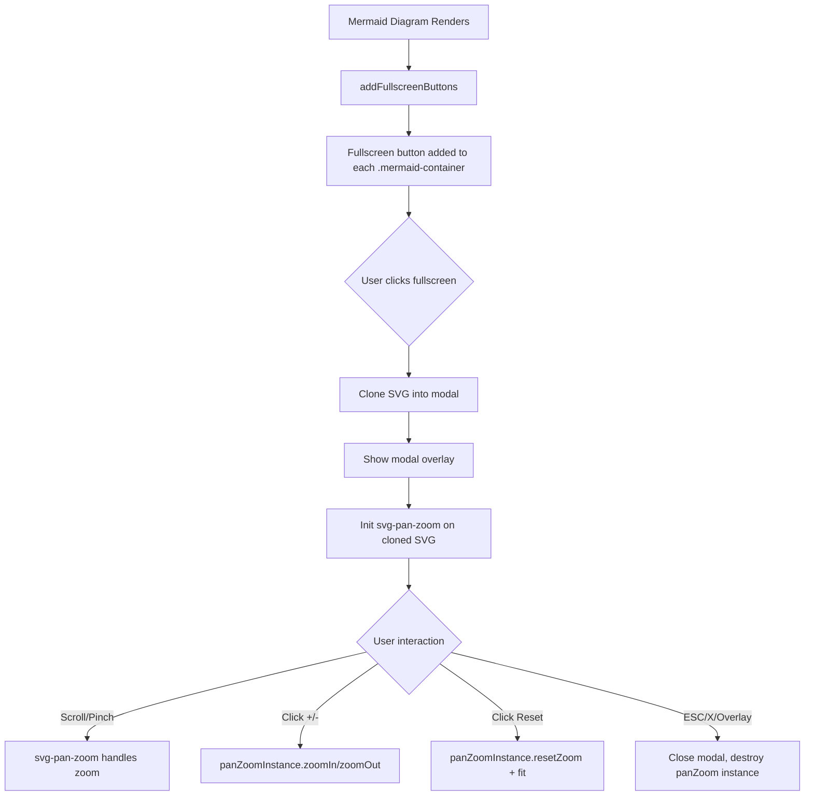

# Feature Plan: Fullscreen Mermaid Diagrams

## Overview

Add a fullscreen button to each rendered Mermaid diagram that opens it in a centered modal overlay with dedicated zoom controls. The modal provides +/− zoom buttons alongside the existing mouse/trackpad pan and scroll-to-zoom behavior powered by svg-pan-zoom.

**Key Features:**
- Fullscreen button on every rendered Mermaid diagram
- Modal overlay displaying the diagram at full viewport size
- +/− zoom buttons for precise zoom control
- Mouse/trackpad pan and scroll-to-zoom via existing svg-pan-zoom library
- Reset zoom button to return to fit-to-screen
- Close via button, ESC key, or clicking the overlay backdrop
- Theme-aware: inherits current light/dark theme

## Current Behavior

### Mermaid Rendering Pipeline
- `markdown.js` detects `code.language-mermaid` blocks in the preview
- Creates wrapper structure: `.mermaid-container > .mermaid > <svg>`
- Original diagram source stored in `data-original-content` attribute
- `mermaid.run()` renders all diagrams at once
- Theme is applied via `ensureMermaidInitialized()` (lines 289-306 of `markdown.js`)

### Current svg-pan-zoom Usage
- **Library**: svg-pan-zoom v3.6.1 loaded via CDN (`index.html` line 57)
- **Applied in**: `applyZoomToDiagrams()` (lines 403-421 of `markdown.js`)
- **Configuration**:
  - `controlIconsEnabled: true` — built-in zoom control icons
  - `zoomScaleSensitivity: 0.4`
  - `minZoom: 0.5`, `maxZoom: 20`
- **Guard**: SVG elements get `data-panzoom-initialized="true"` to prevent re-init
- Called after initial render (line 572) and after theme re-render (line 396)

### Current DOM Structure
```html
<div class="mermaid-container">
  <div class="mermaid" data-original-content="graph TD; ...">
    <svg data-panzoom-initialized="true">...</svg>
  </div>
</div>
```

### Current CSS
- `.mermaid-container`: border, 10px radius, 10px padding, 16px vertical margin, `overflow: auto`, theme-aware background (`--mermaid-bg`)

### Existing Modal Pattern
- Conflict dialog uses `.modal-overlay` + `.modal` pattern (`index.html` lines 211-228)
- Overlay: `position: fixed; inset: 0; z-index: 1200; backdrop-filter: blur(2px)`
- Modal: `position: fixed; top: 50%; left: 50%; transform: translate(-50%, -50%); z-index: 1201`
- Fade-in animations (`modal-fade-in`, `overlay-fade-in` at 0.2s)
- ESC key + click-outside-to-close + focus management

## User Story / Value Proposition

### Problem
Complex Mermaid diagrams (large flowcharts, sequence diagrams, entity-relationship diagrams) are difficult to read inside the constrained preview area. The existing inline pan/zoom helps, but users still struggle with large diagrams because the container is small and surrounded by other content. There's no way to focus on a diagram at full viewport size.

### User Benefit
Users can explore complex diagrams in a distraction-free fullscreen modal with intuitive zoom controls. Mouse/trackpad gestures work naturally, and explicit +/− buttons provide precision. This is especially valuable for documentation-heavy projects with architecture or flowchart diagrams.

### Use Cases
1. **Architecture review**: User opens a large system diagram fullscreen to trace data flows across many nodes
2. **Presentation prep**: User zooms into specific sections of a diagram to verify labels and connections
3. **Complex ERD navigation**: User pans across a wide entity-relationship diagram, zooming into individual tables
4. **Quick inspection**: User clicks fullscreen, glances at diagram details, hits ESC to return

## Proposed Behavior

### Fullscreen Button
- A small expand/fullscreen icon button appears in the top-right corner of each `.mermaid-container`
- Button is semi-transparent by default, fully opaque on hover
- Clicking it opens the diagram in a fullscreen modal

### Modal Behavior
- **Overlay**: Blurred backdrop (matching existing modal pattern), click to dismiss
- **Content**: The Mermaid SVG is cloned into the modal at full viewport dimensions
- **Zoom controls**: Toolbar with +, −, and reset (fit-to-screen) buttons
- **Pan/zoom**: svg-pan-zoom initialized on the modal SVG with same settings
- **Close**: X button in top-right, ESC key, or click overlay
- **Theme**: Inherits current theme (dark/light background and diagram colors)

### Interaction Details
1. User clicks fullscreen button on a diagram
2. Modal overlay fades in with the diagram centered and fit-to-viewport
3. svg-pan-zoom is initialized on the modal's SVG clone
4. User can:
   - Scroll to zoom in/out (mouse wheel / trackpad pinch)
   - Click and drag to pan
   - Click +/− buttons for incremental zoom
   - Click reset button to fit diagram back to viewport
5. User presses ESC, clicks X, or clicks overlay to close
6. Modal fades out, focus returns to previous element

## Proposed Solution

### Architecture Overview



### Implementation Plan

### 1. Add Fullscreen Modal HTML

**File**: `markdown_os/static/index.html`

**Changes**:
- Add modal markup for the fullscreen diagram viewer after the existing conflict modal

**Code Location**: After line 228 (after conflict modal closing `</div>`)

**Example Code**:
```html
<div id="mermaid-fullscreen-overlay" class="modal-overlay hidden"></div>
<div id="mermaid-fullscreen-modal" class="mermaid-fullscreen-modal hidden" role="dialog" aria-modal="true" aria-label="Fullscreen diagram viewer">
  <div class="mermaid-fullscreen-toolbar">
    <button id="mermaid-zoom-in" class="mermaid-fullscreen-btn" type="button" title="Zoom in">+</button>
    <button id="mermaid-zoom-out" class="mermaid-fullscreen-btn" type="button" title="Zoom out">−</button>
    <button id="mermaid-zoom-reset" class="mermaid-fullscreen-btn" type="button" title="Reset zoom">⊡</button>
    <button id="mermaid-fullscreen-close" class="mermaid-fullscreen-btn mermaid-fullscreen-close-btn" type="button" title="Close (ESC)">✕</button>
  </div>
  <div id="mermaid-fullscreen-content" class="mermaid-fullscreen-content"></div>
</div>
```

**Rationale**: Reuses the existing overlay/modal pattern. Toolbar is inside the modal for consistent positioning. Buttons are simple text characters for zero-dependency icons.

---

### 2. Add Fullscreen Modal CSS

**File**: `markdown_os/static/css/styles.css`

**Changes**:
- Add styles for the fullscreen modal, toolbar, zoom buttons, and the inline fullscreen trigger button
- Follow existing modal pattern for overlay and animations

**Code Location**: After the existing `.modal` styles (after line ~1063)

**Example Code**:
```css
/* Mermaid fullscreen trigger button */
.mermaid-container {
  position: relative;
}

.mermaid-fullscreen-trigger {
  position: absolute;
  top: 8px;
  right: 8px;
  width: 28px;
  height: 28px;
  border: 1px solid var(--border);
  border-radius: 6px;
  background: var(--bg-primary);
  color: var(--text-secondary);
  cursor: pointer;
  display: flex;
  align-items: center;
  justify-content: center;
  font-size: 14px;
  opacity: 0.6;
  transition: opacity 0.15s ease;
  z-index: 2;
}

.mermaid-fullscreen-trigger:hover {
  opacity: 1;
}

/* Mermaid fullscreen modal */
.mermaid-fullscreen-modal {
  position: fixed;
  inset: 20px;
  border-radius: 12px;
  border: 1px solid var(--border);
  background: var(--mermaid-bg);
  box-shadow: var(--modal-shadow);
  z-index: 1201;
  display: flex;
  flex-direction: column;
  overflow: hidden;
}

.mermaid-fullscreen-modal:not(.hidden) {
  animation: modal-fade-in 0.2s ease;
}

.mermaid-fullscreen-toolbar {
  display: flex;
  gap: 6px;
  padding: 10px 12px;
  border-bottom: 1px solid var(--border);
  background: var(--bg-primary);
  justify-content: flex-end;
}

.mermaid-fullscreen-btn {
  width: 32px;
  height: 32px;
  border: 1px solid var(--border);
  border-radius: 6px;
  background: var(--bg-secondary);
  color: var(--text-primary);
  cursor: pointer;
  display: flex;
  align-items: center;
  justify-content: center;
  font-size: 16px;
  transition: background 0.15s ease;
}

.mermaid-fullscreen-btn:hover {
  background: var(--bg-hover);
}

.mermaid-fullscreen-close-btn {
  margin-left: 8px;
}

.mermaid-fullscreen-content {
  flex: 1;
  display: flex;
  align-items: center;
  justify-content: center;
  overflow: hidden;
  padding: 16px;
}

.mermaid-fullscreen-content svg {
  max-width: 100%;
  max-height: 100%;
}
```

**Rationale**:
- `inset: 20px` gives a near-fullscreen modal with a small margin (cleaner than true fullscreen)
- Toolbar at top with buttons right-aligned keeps controls accessible
- Close button visually separated from zoom controls via `margin-left`
- Reuses existing CSS variables (`--border`, `--bg-primary`, `--mermaid-bg`, etc.) for theme compatibility
- Reuses existing `modal-fade-in` animation

---

### 3. Add Fullscreen JavaScript Logic

**File**: `markdown_os/static/js/markdown.js`

**Changes**:
- Add `addFullscreenButtons()` function to inject trigger buttons into each `.mermaid-container`
- Add `openMermaidFullscreen()` to handle cloning SVG, showing modal, initializing svg-pan-zoom
- Add `closeMermaidFullscreen()` to clean up and dismiss
- Wire up event listeners (zoom buttons, close, ESC, overlay click)

**Code Location**: After `applyZoomToDiagrams()` (~line 421)

**Example Code**:
```javascript
// --- Mermaid Fullscreen ---

const fullscreenState = {
  panZoomInstance: null,
  previousFocus: null,
};

function addFullscreenButtons() {
  document.querySelectorAll(".mermaid-container").forEach((container) => {
    if (container.querySelector(".mermaid-fullscreen-trigger")) {
      return; // already has button
    }

    const button = document.createElement("button");
    button.className = "mermaid-fullscreen-trigger";
    button.type = "button";
    button.title = "View fullscreen";
    button.textContent = "⛶";
    button.addEventListener("click", () => {
      const svg = container.querySelector("svg");
      if (svg) {
        openMermaidFullscreen(svg);
      }
    });

    container.appendChild(button);
  });
}

function openMermaidFullscreen(sourceSvg) {
  const overlay = document.getElementById("mermaid-fullscreen-overlay");
  const modal = document.getElementById("mermaid-fullscreen-modal");
  const content = document.getElementById("mermaid-fullscreen-content");
  if (!overlay || !modal || !content) return;

  fullscreenState.previousFocus = document.activeElement;

  // Clone the SVG
  const svgClone = sourceSvg.cloneNode(true);
  svgClone.removeAttribute("data-panzoom-initialized");
  svgClone.removeAttribute("style");
  svgClone.setAttribute("width", "100%");
  svgClone.setAttribute("height", "100%");

  content.innerHTML = "";
  content.appendChild(svgClone);

  // Show modal
  overlay.classList.remove("hidden");
  modal.classList.remove("hidden");

  // Initialize svg-pan-zoom on clone
  if (window.svgPanZoom) {
    fullscreenState.panZoomInstance = window.svgPanZoom(svgClone, {
      controlIconsEnabled: false,
      zoomScaleSensitivity: 0.4,
      minZoom: 0.2,
      maxZoom: 40,
      fit: true,
      center: true,
    });
  }

  // Focus close button for keyboard accessibility
  document.getElementById("mermaid-fullscreen-close")?.focus();
}

function closeMermaidFullscreen() {
  const overlay = document.getElementById("mermaid-fullscreen-overlay");
  const modal = document.getElementById("mermaid-fullscreen-modal");
  const content = document.getElementById("mermaid-fullscreen-content");
  if (!overlay || !modal) return;

  // Destroy pan-zoom instance
  if (fullscreenState.panZoomInstance) {
    fullscreenState.panZoomInstance.destroy();
    fullscreenState.panZoomInstance = null;
  }

  // Hide modal
  overlay.classList.add("hidden");
  modal.classList.add("hidden");

  // Clear content
  if (content) content.innerHTML = "";

  // Restore focus
  if (fullscreenState.previousFocus?.focus) {
    fullscreenState.previousFocus.focus();
  }
  fullscreenState.previousFocus = null;
}

function initMermaidFullscreenListeners() {
  // Zoom buttons
  document.getElementById("mermaid-zoom-in")?.addEventListener("click", () => {
    fullscreenState.panZoomInstance?.zoomIn();
  });

  document.getElementById("mermaid-zoom-out")?.addEventListener("click", () => {
    fullscreenState.panZoomInstance?.zoomOut();
  });

  document.getElementById("mermaid-zoom-reset")?.addEventListener("click", () => {
    fullscreenState.panZoomInstance?.resetZoom();
    fullscreenState.panZoomInstance?.resetPan();
    fullscreenState.panZoomInstance?.fit();
    fullscreenState.panZoomInstance?.center();
  });

  // Close button
  document.getElementById("mermaid-fullscreen-close")?.addEventListener("click", () => {
    closeMermaidFullscreen();
  });

  // Overlay click
  document.getElementById("mermaid-fullscreen-overlay")?.addEventListener("click", () => {
    closeMermaidFullscreen();
  });

  // ESC key
  document.addEventListener("keydown", (event) => {
    if (event.key === "Escape") {
      const modal = document.getElementById("mermaid-fullscreen-modal");
      if (modal && !modal.classList.contains("hidden")) {
        closeMermaidFullscreen();
      }
    }
  });
}
```

**Rationale**:
- SVG is cloned so the inline diagram remains intact
- `data-panzoom-initialized` removed from clone to allow fresh initialization
- `controlIconsEnabled: false` since we provide our own +/− buttons
- `fit: true, center: true` ensures diagram starts at a comfortable zoom level
- Wider zoom range (`minZoom: 0.2`, `maxZoom: 40`) for fullscreen exploration
- Follows existing modal pattern for close behavior (ESC, overlay click, button)
- Focus management matches the conflict dialog pattern
- `destroy()` called on close to prevent memory leaks

---

### 4. Wire into Rendering Pipeline

**File**: `markdown_os/static/js/markdown.js`

**Changes**:
- Call `addFullscreenButtons()` after `applyZoomToDiagrams()` in `renderMarkdown()`
- Call `addFullscreenButtons()` after theme re-render in `rerenderMermaidDiagramsForTheme()`
- Call `initMermaidFullscreenListeners()` on page load

**Code Location**:
- `renderMarkdown()` (~line 572): after `applyZoomToDiagrams()`
- `rerenderMermaidDiagramsForTheme()` (~line 396): after `applyZoomToDiagrams()`
- Bottom of file, in the DOMContentLoaded or init section

**Example Code**:
```javascript
// In renderMarkdown():
async function renderMarkdown(content) {
  // ... existing code ...
  await renderMermaidDiagrams();
  applyZoomToDiagrams();
  addFullscreenButtons();    // <-- NEW
  // ... rest ...
}

// In rerenderMermaidDiagramsForTheme():
async function rerenderMermaidDiagramsForTheme() {
  // ... existing code ...
  applyZoomToDiagrams();
  addFullscreenButtons();    // <-- NEW
  // ... rest ...
}

// At bottom of file (or in existing init block):
initMermaidFullscreenListeners();
```

**Rationale**:
- Fullscreen buttons must be added after diagrams are rendered and pan/zoom is applied
- Theme re-renders replace the DOM, so buttons need to be re-added
- Listeners are initialized once (they target static modal elements, not per-diagram)

---

### Edge Cases & Handling

#### Case 1: Multiple Diagrams on Page
- **Scenario**: Document has 5+ Mermaid diagrams
- **Expected behavior**: Each gets its own fullscreen button; only the clicked one opens in modal
- **Implementation note**: `addFullscreenButtons()` iterates all `.mermaid-container` elements; guard prevents duplicate buttons

#### Case 2: Theme Change While Fullscreen is Open
- **Scenario**: User toggles theme while viewing diagram fullscreen
- **Expected behavior**: Close the modal (diagram will re-render with new theme; user can reopen)
- **Implementation note**: The `markdown-os:theme-changed` event triggers `rerenderMermaidDiagramsForTheme()` which replaces diagram DOM. Simplest to close modal on theme change rather than update in-place.

#### Case 3: Diagram Render Error
- **Scenario**: Mermaid syntax is invalid, container shows error message instead of SVG
- **Expected behavior**: No fullscreen button appears (no SVG to display)
- **Implementation note**: `addFullscreenButtons()` checks for `svg` inside container before adding button

#### Case 4: Very Large Diagram
- **Scenario**: Diagram has 100+ nodes, SVG is very wide/tall
- **Expected behavior**: Opens fit-to-viewport with `fit: true, center: true`; user zooms into regions
- **Implementation note**: `minZoom: 0.2` allows zooming out far enough to see the entire diagram

#### Case 5: Small/Trivial Diagram
- **Scenario**: Diagram has 2-3 nodes and is already fully visible inline
- **Expected behavior**: Fullscreen button still appears; user can choose to use it or not
- **Implementation note**: No size threshold — always show the button for consistency

#### Case 6: Rapid Open/Close
- **Scenario**: User opens and closes fullscreen quickly in succession
- **Expected behavior**: No stale instances or visual artifacts
- **Implementation note**: `closeMermaidFullscreen()` always destroys `panZoomInstance` and clears content before any new open can occur

#### Case 7: Keyboard Navigation
- **Scenario**: User tabs to fullscreen button and presses Enter
- **Expected behavior**: Modal opens, focus moves to close button; ESC closes and returns focus
- **Implementation note**: Standard button semantics + focus management handle this

---

## Files to Modify

| File | Changes |
|------|---------|
| `markdown_os/static/index.html` | • Add fullscreen modal HTML (overlay, modal, toolbar with +/−/reset/close buttons, content area) |
| `markdown_os/static/css/styles.css` | • Add `.mermaid-container { position: relative }` override<br>• Add `.mermaid-fullscreen-trigger` button styles<br>• Add `.mermaid-fullscreen-modal` layout and positioning<br>• Add `.mermaid-fullscreen-toolbar` and button styles<br>• Add `.mermaid-fullscreen-content` flex container |
| `markdown_os/static/js/markdown.js` | • Add `fullscreenState` object<br>• Add `addFullscreenButtons()` function<br>• Add `openMermaidFullscreen()` function<br>• Add `closeMermaidFullscreen()` function<br>• Add `initMermaidFullscreenListeners()` function<br>• Call `addFullscreenButtons()` in `renderMarkdown()` and `rerenderMermaidDiagramsForTheme()`<br>• Call `initMermaidFullscreenListeners()` on init |

---

## Testing Strategy

### Manual Tests

**Basic Fullscreen**
1. Open a document with a Mermaid diagram
2. Verify fullscreen button appears in top-right of diagram container
3. Click the fullscreen button
4. Verify modal opens with diagram centered and fit-to-viewport
5. Verify overlay backdrop is visible behind modal

**Zoom Controls**
1. Open diagram fullscreen
2. Click + button → diagram zooms in
3. Click − button → diagram zooms out
4. Click reset button → diagram returns to fit-to-viewport
5. Scroll wheel up → zoom in
6. Scroll wheel down → zoom out
7. Click and drag → pan the diagram

**Trackpad Gestures**
1. Open diagram fullscreen
2. Pinch to zoom in/out → works smoothly
3. Two-finger drag → pans the diagram

**Close Behavior**
1. Open fullscreen → press ESC → modal closes
2. Open fullscreen → click X button → modal closes
3. Open fullscreen → click overlay backdrop → modal closes
4. After closing, verify focus returns to the page

**Theme Compatibility**
1. Switch to dark theme → open diagram fullscreen → verify dark background and diagram colors
2. Switch to light theme → open diagram fullscreen → verify light background
3. Open fullscreen → toggle theme → verify modal closes cleanly

**Multiple Diagrams**
1. Open document with 3 Mermaid diagrams
2. Verify each has its own fullscreen button
3. Click fullscreen on second diagram → shows second diagram in modal
4. Close → click fullscreen on third diagram → shows third diagram

**Error Diagrams**
1. Create a document with invalid Mermaid syntax
2. Verify no fullscreen button appears on the error block

**Re-render After Edit**
1. Edit mode: modify a Mermaid diagram
2. Switch to preview
3. Verify fullscreen button appears on the re-rendered diagram
4. Click it → works correctly

---

## Implementation Checklist

### Phase 1: Modal Structure
- [ ] Add fullscreen modal HTML to `index.html`
- [ ] Add CSS for fullscreen modal, toolbar, and buttons
- [ ] Add CSS for inline fullscreen trigger button on `.mermaid-container`

### Phase 2: Core JavaScript
- [ ] Add `fullscreenState` object
- [ ] Implement `addFullscreenButtons()` — inject trigger buttons into containers
- [ ] Implement `openMermaidFullscreen()` — clone SVG, show modal, init svg-pan-zoom
- [ ] Implement `closeMermaidFullscreen()` — destroy instance, hide modal, restore focus
- [ ] Implement `initMermaidFullscreenListeners()` — wire up zoom/close/ESC/overlay

### Phase 3: Integration
- [ ] Call `addFullscreenButtons()` in `renderMarkdown()` after `applyZoomToDiagrams()`
- [ ] Call `addFullscreenButtons()` in `rerenderMermaidDiagramsForTheme()` after `applyZoomToDiagrams()`
- [ ] Call `initMermaidFullscreenListeners()` on page load
- [ ] Handle theme change while fullscreen is open (close modal)

### Phase 4: Testing & Polish
- [ ] Test all manual test scenarios
- [ ] Test edge cases (multiple diagrams, errors, rapid open/close)
- [ ] Verify keyboard accessibility (tab to button, ESC to close)
- [ ] Test in dark and light themes
- [ ] Cross-browser testing (Chrome, Firefox, Safari)

---

## Success Criteria

### Core Functionality
- Fullscreen button appears on every successfully rendered Mermaid diagram
- Clicking opens a modal with the diagram at full viewport size
- +/− buttons zoom in and out incrementally
- Reset button fits and centers the diagram
- Mouse scroll and trackpad gestures zoom and pan naturally
- Click-drag pans the diagram
- Modal closes via ESC, X button, or overlay click

### User Experience
- Fullscreen button is unobtrusive (semi-transparent, small)
- Modal opens and closes with smooth animation
- Diagram starts fit-to-viewport (readable without immediate zooming)
- Focus management: close returns focus to previous element
- Works identically in dark and light themes

### Performance
- No lag opening the modal (SVG clone is fast)
- Smooth zoom/pan at 60fps
- No memory leaks (svg-pan-zoom destroyed on close)
- No impact on initial page load or markdown rendering

### Code Quality
- Follows existing modal pattern (overlay + positioned element)
- Reuses CSS variables for theme compatibility
- Guard against duplicate buttons on re-render
- Clean separation: HTML structure, CSS styles, JS logic

