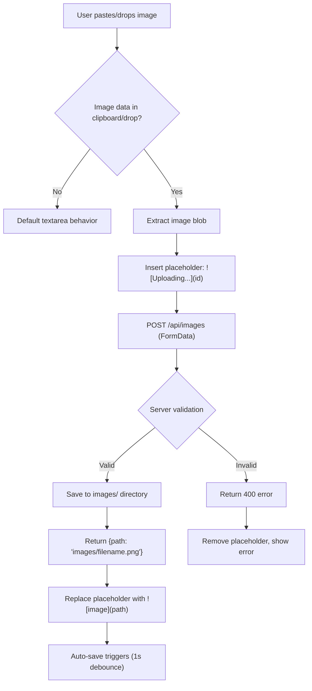
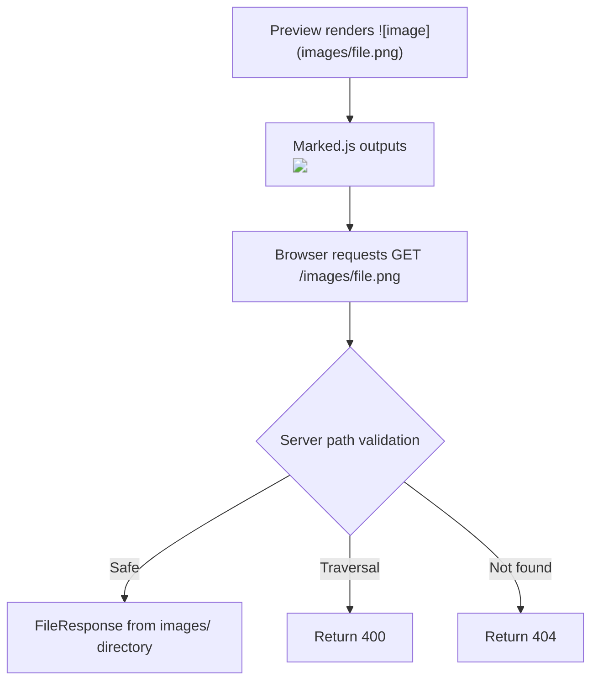

# Plan: Image Paste Support

## Overview

Allow users to paste images directly from the clipboard into the editor. The pasted image is uploaded to the server, saved to an `images/` directory next to the markdown file, and a markdown image reference (``) is inserted at the cursor position.

**Includes**: Clipboard paste handling, drag-and-drop support, image upload API endpoint, local image storage, image serving endpoint, visual upload feedback, markdown syntax insertion

### Key Features
- **Clipboard paste**: Paste screenshots or copied images with Ctrl+V / Cmd+V in the editor
- **Drag and drop**: Drop image files onto the editor textarea
- **Auto-naming**: Images are saved with timestamped filenames to avoid collisions
- **Relative paths**: Inserted markdown uses relative paths (`images/filename.png`) for portability
- **Upload feedback**: Visual indicator shows upload progress and status
- **Original format preservation**: PNG for clipboard screenshots, original format for file pastes

---

## Current Behavior

1. User writes markdown in the `#markdown-editor` textarea
2. The textarea handles `input` events for auto-save (1s debounce)
3. No clipboard `paste` event listener exists on the textarea
4. No drag-and-drop handling exists on the textarea
5. Pasting an image from clipboard does nothing (textarea ignores non-text paste data)
6. Images referenced in markdown (e.g., ``) render as `` tags via Marked.js
7. Relative image paths in markdown don't resolve because there is no image-serving endpoint
8. The server has no endpoint for file uploads and no concept of an images/assets directory

## Proposed Behavior

1. User copies a screenshot or image to clipboard
2. User pastes into the editor textarea (Ctrl+V / Cmd+V)
3. **New**: `paste` event listener detects image data in `clipboardData.items`
4. **New**: A placeholder `` is inserted at the cursor position
5. **New**: Image binary data is sent via `POST /api/images` as `multipart/form-data`
6. **New**: Server creates `images/` directory next to the markdown file (if it doesn't exist)
7. **New**: Server saves image with a timestamped filename (e.g., `paste-20260215-143022.png`)
8. **New**: Server returns the relative path in JSON: `{"path": "images/paste-20260215-143022.png"}`
9. **New**: Frontend replaces the placeholder with ``
10. Auto-save triggers as usual (the inserted text fires the `input` event)
11. **New**: `GET /images/{filename}` serves images from the sibling `images/` directory
12. Preview mode renders the `` tag, and the image loads via the new serving endpoint

---

## User Story / Value Proposition

**Problem**: Adding images to markdown documents requires a multi-step manual workflow: save the image file somewhere, figure out the relative path, and type the markdown syntax. This friction discourages image usage, even though images greatly improve documentation quality.

**User benefit**: Paste a screenshot and it appears in the document. No file management, no path calculation, no syntax to remember. The experience matches what users expect from modern editors like Notion, Obsidian, and Typora.

**Use cases**:
1. A developer pastes a terminal screenshot into a bug report markdown file
2. A designer drags mockup images onto the editor to embed them in a spec document
3. A student pastes a diagram from a drawing tool into their lecture notes
4. A writer copies an image from a web page and pastes it into a blog draft

---

## Implementation Plan

### 1. Add Image Upload API Endpoint

**File**: `markdown_os/server.py`

**Changes**:
- Add `POST /api/images` endpoint that accepts `multipart/form-data` with an image file
- Create `images/` directory next to the markdown file if it doesn't exist
- Save the uploaded file with a timestamped filename
- Return the relative path to the saved image
- Add path validation to prevent directory traversal attacks

**Code Location**: After the `save_content` route (~line 472)

**Example Code**:
```python
from fastapi import UploadFile
import re

ALLOWED_IMAGE_EXTENSIONS = {".png", ".jpg", ".jpeg", ".gif", ".webp", ".svg", ".bmp", ".ico"}
MAX_IMAGE_SIZE_BYTES = 10 * 1024 * 1024  # 10 MB

@app.post("/api/images")
async def upload_image(file: UploadFile) -> dict[str, str]:
    """Save an uploaded image to the images directory next to the markdown file."""
    if app.state.mode == "file":
        file_handler = _require_file_handler(app)
        images_dir = file_handler.filepath.parent / "images"
    else:
        directory_handler = _require_directory_handler(app)
        images_dir = directory_handler.directory / "images"

    # Validate extension
    original_name = file.filename or "image.png"
    suffix = Path(original_name).suffix.lower()
    if suffix not in ALLOWED_IMAGE_EXTENSIONS:
        raise HTTPException(
            status_code=400,
            detail=f"Unsupported image format: {suffix}",
        )

    # Read and validate size
    image_data = await file.read()
    if len(image_data) > MAX_IMAGE_SIZE_BYTES:
        raise HTTPException(
            status_code=400,
            detail=f"Image too large. Maximum size is {MAX_IMAGE_SIZE_BYTES // (1024 * 1024)} MB.",
        )
    if len(image_data) == 0:
        raise HTTPException(status_code=400, detail="Empty file uploaded.")

    # Generate timestamped filename
    timestamp = time.strftime("%Y%m%d-%H%M%S")
    safe_stem = re.sub(r"[^a-zA-Z0-9_-]", "", Path(original_name).stem) or "image"
    filename = f"{safe_stem}-{timestamp}{suffix}"

    # Save to disk
    images_dir.mkdir(parents=True, exist_ok=True)
    dest_path = images_dir / filename
    dest_path.write_bytes(image_data)

    return {"path": f"images/{filename}", "filename": filename}
```

**Rationale**: The endpoint uses `multipart/form-data` (standard for file uploads) rather than base64 JSON to avoid inflating payload size by ~33%. The timestamped filename prevents collisions when pasting multiple images. The stem from the original filename is sanitized and included for human-readability. A 10 MB limit prevents accidental large uploads.

---

### 2. Add Image Serving Endpoint

**File**: `markdown_os/server.py`

**Changes**:
- Add `GET /images/{filename:path}` route that serves files from the `images/` directory
- Validate the filename to prevent directory traversal
- Return appropriate content types

**Code Location**: After the image upload endpoint

**Example Code**:
```python
from fastapi.responses import Response

@app.get("/images/{filename:path}")
async def serve_image(filename: str) -> Response:
    """Serve an image from the images directory."""
    # Prevent directory traversal
    if ".." in filename or filename.startswith("/"):
        raise HTTPException(status_code=400, detail="Invalid image path.")

    if app.state.mode == "file":
        file_handler = _require_file_handler(app)
        images_dir = file_handler.filepath.parent / "images"
    else:
        directory_handler = _require_directory_handler(app)
        images_dir = directory_handler.directory / "images"

    image_path = (images_dir / filename).resolve()

    # Ensure resolved path is within images_dir
    if not image_path.is_relative_to(images_dir.resolve()):
        raise HTTPException(status_code=400, detail="Invalid image path.")

    if not image_path.is_file():
        raise HTTPException(status_code=404, detail="Image not found.")

    return FileResponse(image_path)
```

**Rationale**: A dedicated `/images/` route keeps image serving separate from `/static/` (which serves the app's own assets). The directory traversal check (both string-level and resolved path comparison) is critical security — without it, an attacker could request `/images/../../secret.txt`. Using `FileResponse` lets FastAPI handle content-type detection and caching headers automatically.

---

### 3. Add Paste Event Handler to Editor

**File**: `markdown_os/static/js/editor.js`

**Changes**:
- Add `paste` event listener to the editor textarea
- Detect image data in `clipboardData.items`
- Extract the image blob and trigger upload
- Insert placeholder text at cursor position during upload
- Replace placeholder with final markdown on success

**Code Location**: Inside `bindEvents()` (~line 444), after the existing `input` listener

**Example Code**:
```javascript
editor.addEventListener("paste", (event) => {
    const items = event.clipboardData?.items;
    if (!items) {
      return;
    }

    for (const item of items) {
      if (item.type.startsWith("image/")) {
        event.preventDefault();
        const blob = item.getAsFile();
        if (blob) {
          handleImageUpload(blob);
        }
        return;
      }
    }
    // Non-image paste falls through to default textarea behavior
});
```

**Rationale**: We only call `preventDefault()` when an image is detected. This preserves normal text paste behavior. The `clipboardData.items` API is supported in all modern browsers (Chrome 13+, Firefox 22+, Safari 14.1+).

---

### 4. Add Image Upload Function

**File**: `markdown_os/static/js/editor.js`

**Changes**:
- Add `handleImageUpload(blob)` function
- Insert upload placeholder at cursor position
- Upload via `FormData` + `fetch`
- Replace placeholder with final markdown image syntax
- Handle errors with user feedback

**Example Code**:
```javascript
async function handleImageUpload(blob) {
    const editor = document.getElementById("markdown-editor");
    if (!editor) {
      return;
    }

    // Generate placeholder
    const placeholderId = `upload-${Date.now()}`;
    const placeholder = ``;

    // Insert placeholder at cursor
    const start = editor.selectionStart;
    const end = editor.selectionEnd;
    const before = editor.value.substring(0, start);
    const after = editor.value.substring(end);
    editor.value = before + placeholder + after;
    editor.selectionStart = start + placeholder.length;
    editor.selectionEnd = start + placeholder.length;

    // Trigger input event for auto-save awareness
    editor.dispatchEvent(new Event("input", { bubbles: true }));
    setSaveStatus("Uploading image...", "saving");

    // Upload
    const formData = new FormData();
    const extension = blob.type.split("/")[1] || "png";
    formData.append("file", blob, `paste.${extension}`);

    try {
      const response = await fetch("/api/images", {
        method: "POST",
        body: formData,
      });

      if (!response.ok) {
        const detail = await response.json().catch(() => ({}));
        throw new Error(detail.detail || `Upload failed (${response.status})`);
      }

      const result = await response.json();
      const markdownImage = ``;

      // Replace placeholder with final markdown
      editor.value = editor.value.replace(placeholder, markdownImage);
      editor.dispatchEvent(new Event("input", { bubbles: true }));
      setSaveStatus("Image uploaded", "saved");
    } catch (error) {
      console.error("Image upload failed.", error);
      // Remove placeholder on failure
      editor.value = editor.value.replace(placeholder, "");
      editor.dispatchEvent(new Event("input", { bubbles: true }));
      setSaveStatus("Image upload failed", "error");
    }
}
```

**Rationale**: The placeholder approach gives immediate visual feedback in the editor. Using a unique ID in the placeholder prevents accidental replacement of unrelated text. Dispatching `input` events ensures the auto-save system recognizes the content changes. The `FormData` API handles multipart encoding automatically.

---

### 5. Add Drag-and-Drop Support

**File**: `markdown_os/static/js/editor.js`

**Changes**:
- Add `dragover` and `drop` event listeners to the editor textarea
- On drop, extract image files from `dataTransfer.files` and upload each one
- Add visual drag-over indicator via CSS class

**Code Location**: Inside `bindEvents()`, after the paste listener

**Example Code**:
```javascript
editor.addEventListener("dragover", (event) => {
    const hasImages = Array.from(event.dataTransfer?.types || []).includes("Files");
    if (hasImages) {
      event.preventDefault();
      editor.classList.add("drag-over");
    }
});

editor.addEventListener("dragleave", () => {
    editor.classList.remove("drag-over");
});

editor.addEventListener("drop", (event) => {
    editor.classList.remove("drag-over");
    const files = event.dataTransfer?.files;
    if (!files || files.length === 0) {
      return;
    }

    const imageFiles = Array.from(files).filter((file) =>
      file.type.startsWith("image/"),
    );
    if (imageFiles.length === 0) {
      return;
    }

    event.preventDefault();
    for (const file of imageFiles) {
      handleImageUpload(file);
    }
});
```

**Rationale**: Drag-and-drop reuses the same `handleImageUpload` function, keeping the upload logic DRY. The `dragover` listener must call `preventDefault()` to signal that the drop zone accepts files (browser requirement). The visual indicator helps users confirm they're dropping in the right place.

---

### 6. Add CSS for Drag-Over State and Upload Feedback

**File**: `markdown_os/static/css/styles.css`

**Changes**:
- Add `.drag-over` style for the editor textarea (border highlight)
- Ensure images in the preview pane are responsive (max-width: 100%)

**Code Location**: After the editor textarea styles

**Example Code**:
```css
/* -- Image Paste & Drop -- */

#markdown-editor.drag-over {
  border: 2px dashed var(--accent);
  background: var(--drag-over-bg);
}

#markdown-preview img {
  max-width: 100%;
  height: auto;
  border-radius: 6px;
  margin: 8px 0;
}
```

**CSS Variables** (light theme):
```css
--drag-over-bg: #f0f7ff;
```

**CSS Variables** (dark theme):
```css
--drag-over-bg: #162032;
```

**Rationale**: The dashed border is a universal drag-and-drop affordance. Responsive images (`max-width: 100%`) prevent wide images from overflowing the preview panel. The border-radius matches the styling of code blocks and other containers.

---

### 7. Update Example Template with Image Paste Instructions

**File**: `markdown_os/templates/example_template.md`

**Changes**:
- Add a short "Images" section explaining paste and drag-and-drop support
- Include a sample `` reference as syntax reminder

**Example Content**:
```markdown
## Images

Paste images directly from your clipboard (**Ctrl+V** / **Cmd+V**) or drag and
drop image files onto the editor. Images are saved to an `images/` folder next
to your markdown file.

Standard markdown image syntax: ``
```

**Rationale**: The example template serves as a quick-start guide. Mentioning both paste and drag-and-drop ensures users discover both input methods.

---

## Architecture / Flow Diagram





---

## Edge Cases to Handle

#### Case 1: Non-image paste
- **Scenario**: User pastes plain text or HTML from clipboard
- **Expected behavior**: Normal textarea paste behavior (text inserted as-is)
- **Implementation note**: The paste handler checks `item.type.startsWith("image/")` before intercepting. Non-image items fall through to default behavior.

#### Case 2: Multiple images dropped at once
- **Scenario**: User drops 5 images onto the editor simultaneously
- **Expected behavior**: All images are uploaded and inserted sequentially
- **Implementation note**: The drop handler loops through `dataTransfer.files` and calls `handleImageUpload` for each. Each gets its own placeholder and upload. Uploads happen concurrently since `handleImageUpload` is async and not awaited in the loop.

#### Case 3: Upload fails (network error, server error)
- **Scenario**: Server is unreachable or returns 500
- **Expected behavior**: Placeholder is removed, error status shown
- **Implementation note**: The `catch` block in `handleImageUpload` removes the placeholder text and updates the save status to "Image upload failed".

#### Case 4: Very large image (>10 MB)
- **Scenario**: User pastes a high-resolution screenshot
- **Expected behavior**: Server returns 400 with "Image too large" message, placeholder removed
- **Implementation note**: Server reads the full upload and checks `len(image_data) > MAX_IMAGE_SIZE_BYTES` before saving. The error message includes the size limit.

#### Case 5: Unsupported image format
- **Scenario**: User drops a `.tiff` or `.psd` file
- **Expected behavior**: Server returns 400 with "Unsupported image format" message
- **Implementation note**: Extension allowlist check runs before saving. Only common web-safe formats are accepted.

#### Case 6: Images directory doesn't exist yet
- **Scenario**: First image paste on a new markdown file
- **Expected behavior**: `images/` directory is created automatically
- **Implementation note**: `images_dir.mkdir(parents=True, exist_ok=True)` creates the directory on first upload.

#### Case 7: Filename collision
- **Scenario**: Two images pasted in the same second with the same original name
- **Expected behavior**: Extremely unlikely with timestamp + original name, but if it happens, the second file overwrites the first
- **Implementation note**: The timestamp has second-level precision. For most workflows this is sufficient. If needed in the future, a counter or random suffix can be added.

#### Case 8: Folder mode — images directory location
- **Scenario**: User is in folder mode editing `docs/guide.md`
- **Expected behavior**: Images are stored in the workspace root's `images/` directory (shared across all files), and the path inserted is `images/filename.png`
- **Implementation note**: In folder mode, `images_dir` is set to `directory_handler.directory / "images"`. The relative path from the workspace root works because the `/images/` serving route is at the app root level.

#### Case 9: Directory traversal attack via image serving
- **Scenario**: Malicious request to `GET /images/../../etc/passwd`
- **Expected behavior**: Returns 400 error
- **Implementation note**: Two-layer defense: string check for `..` and `startswith("/")`, plus resolved path must be relative to `images_dir.resolve()`.

#### Case 10: Editor not in edit mode during paste
- **Scenario**: User pastes while in Preview tab
- **Expected behavior**: Nothing happens (textarea is not visible/focused)
- **Implementation note**: Paste events only fire on the focused textarea element. In Preview mode, the textarea is hidden (`display: none` via `.view` not having `.active`), so it cannot receive focus or paste events.

---

## Testing Considerations

**Manual Tests**:

**Basic Flow:**
1. Open a markdown file → switch to Edit tab → paste a screenshot (Cmd+V / Ctrl+V) → should see `![Uploading...]` briefly, then replaced with `` → switch to Preview → image should render
2. Drag an image file onto the editor → same upload and insertion flow
3. Drop multiple images at once → all should be uploaded and inserted
4. Paste plain text → should work as before (no interception)

**Image Serving:**
5. After pasting an image → switch to Preview → image should load and display
6. Open the generated `images/` directory → uploaded file should exist with timestamped name
7. Reference an image that doesn't exist → should show broken image in preview (browser default)

**Error Handling:**
8. Disconnect from internet → paste an image → should show "Image upload failed" status
9. Paste an image larger than 10 MB → should show error message
10. Drop a non-image file (e.g., `.txt`) → should be ignored (no upload attempt)

**Edge Cases:**
11. Paste image in empty editor → should work (placeholder at position 0)
12. Paste image in the middle of existing text → should insert at cursor position
13. Save and reload → image reference in markdown should still render in Preview

**Security:**
14. Try to access `/images/../../server.py` → should return 400
15. Try to upload a file with `.exe` extension → should return 400

**Automated Tests**:
- Test `POST /api/images` with a valid PNG file → assert 200, response has `path` key
- Test `POST /api/images` with empty file → assert 400
- Test `POST /api/images` with unsupported extension → assert 400
- Test `POST /api/images` with oversized file → assert 400
- Test `GET /images/{filename}` for an existing image → assert 200, correct content-type
- Test `GET /images/{filename}` for non-existent image → assert 404
- Test `GET /images/../../etc/passwd` → assert 400
- Test `GET /images/../server.py` → assert 400
- Test that `images/` directory is created on first upload

---

## Files to Modify

| File | Changes |
|------|---------|
| `markdown_os/server.py` | * Add `POST /api/images` upload endpoint<br>* Add `GET /images/{filename:path}` serving endpoint<br>* Add `UploadFile` import, `ALLOWED_IMAGE_EXTENSIONS` constant, `MAX_IMAGE_SIZE_BYTES` constant |
| `markdown_os/static/js/editor.js` | * Add `paste` event listener for image detection<br>* Add `handleImageUpload(blob)` function<br>* Add `dragover`, `dragleave`, `drop` event listeners |
| `markdown_os/static/css/styles.css` | * Add `--drag-over-bg` CSS variable (light + dark)<br>* Add `#markdown-editor.drag-over` style<br>* Add `#markdown-preview img` responsive styling |
| `markdown_os/templates/example_template.md` | * Add "Images" section with paste/drop instructions |
| `tests/test_server.py` | * Add tests for `POST /api/images` (valid upload, empty, oversized, bad extension)<br>* Add tests for `GET /images/` (existing, missing, traversal) |

---

## Decisions / Open Questions

### Q1: Where to store images ✅
**Options**:
- **Option A**: Sibling `images/` directory next to the markdown file
- **Option B**: Hidden `.markdown-os/images/` directory
- **Option C**: System temp directory

**Decision**: Option A selected — `images/` directory next to the markdown file. Images are portable with the document, visible in file explorers, and work with standard markdown renderers (GitHub, VS Code preview). This is what Obsidian and Typora do.

### Q2: Image format handling ✅
**Options**:
- **Option A**: Keep original format (PNG for clipboard, original for files)
- **Option B**: Always convert to WebP (requires Pillow dependency)
- **Option C**: Always save as PNG

**Decision**: Option A selected — preserve original formats. No additional dependencies needed. PNG is the universal clipboard screenshot format. File drops keep their original format for quality preservation.

### Q3: Image filename strategy ✅
**Options**:
- **Option A**: Timestamped with sanitized original name: `paste-20260215-143022.png`
- **Option B**: UUID-based: `a1b2c3d4.png`
- **Option C**: Hash-based (SHA256 of content): `abc123.png`

**Decision**: Option A — timestamps are human-readable and sortable in file explorers. Including the sanitized original filename (when available) adds context. UUIDs are opaque, and content hashes would deduplicate but make debugging harder.

### Q4: Should paste work in Preview mode? ✅
**Decision**: No — paste only works when the editor textarea has focus (Edit tab active). This is the natural browser behavior and matches user expectations. In Preview mode there's no cursor position to insert text at.

### Q5: Size limit for uploads ✅
**Decision**: 10 MB maximum. This accommodates high-resolution screenshots (typically 1-5 MB) while preventing accidental uploads of very large files. The limit can be made configurable in the future if needed.

---

## Implementation Checklist

### Phase 1: Backend — Upload and Serve Images
- [ ] Add `ALLOWED_IMAGE_EXTENSIONS` and `MAX_IMAGE_SIZE_BYTES` constants to `server.py`
- [ ] Add `POST /api/images` endpoint with validation (size, extension, empty file)
- [ ] Add `GET /images/{filename:path}` endpoint with directory traversal protection
- [ ] Add imports (`UploadFile`, `Response`, `re`)
- [ ] Write automated tests for upload endpoint (valid, empty, oversized, bad extension)
- [ ] Write automated tests for serving endpoint (existing, missing, traversal)

### Phase 2: Frontend — Paste and Drop Handling
- [ ] Add `handleImageUpload(blob)` function to `editor.js`
- [ ] Add `paste` event listener in `bindEvents()`
- [ ] Add `dragover`, `dragleave`, `drop` event listeners in `bindEvents()`
- [ ] Add `--drag-over-bg` CSS variable (light + dark themes)
- [ ] Add `#markdown-editor.drag-over` style
- [ ] Add `#markdown-preview img` responsive image styles

### Phase 3: Testing and Documentation
- [ ] Run all automated tests
- [ ] Manual test: paste screenshot → renders in Preview
- [ ] Manual test: drag-and-drop image file
- [ ] Manual test: paste plain text (no interference)
- [ ] Manual test: error handling (large file, bad format)
- [ ] Manual test: security (directory traversal)
- [ ] Add "Images" section to example template
- [ ] Update CLAUDE.md with new endpoint documentation

---

## Estimated Timeline

- **Phase 1**: ~1.5 hours (upload endpoint + serving endpoint + tests)
- **Phase 2**: ~1 hour (paste handler + drag-drop + CSS)
- **Phase 3**: ~30 minutes (manual testing + template update)

**Total**: ~3 hours

---

## Success Criteria

### Core Functionality
- Pasting a screenshot inserts a working image reference in the editor
- Dragging and dropping image files inserts working image references
- Images render correctly in Preview mode
- Images persist on disk in `images/` directory next to the markdown file
- Auto-save correctly saves the markdown with image references

### Data Safety
- Directory traversal attacks on `/images/` endpoint are blocked
- Only allowed image extensions are accepted
- Oversized files are rejected with clear error messages
- Upload failures cleanly remove placeholders (no orphaned text)

### UX / Polish
- Non-image paste (plain text) works exactly as before
- Upload status is visible via the save status indicator
- Drag-over state has a visual indicator (dashed border)
- Images in Preview are responsive (max-width: 100%)
- Inserted markdown uses portable relative paths

### Performance
- Image upload doesn't block the editor UI
- No regression in existing auto-save or preview rendering
- Images are served efficiently via FastAPI's `FileResponse`

---

## Rollout Considerations

**Breaking Changes**:
- None. This is purely additive functionality. Existing markdown files without images are unaffected.

**Migration Notes**:
- No data migration needed.
- Users with existing `images/` directories will have new files added alongside existing ones.
- Image paths are relative, so documents remain portable if the `images/` folder moves with them.

**Documentation Updates**:
- Update example template with image paste instructions (included in this plan)
- Update CLAUDE.md routes section with `POST /api/images` and `GET /images/{filename}`
