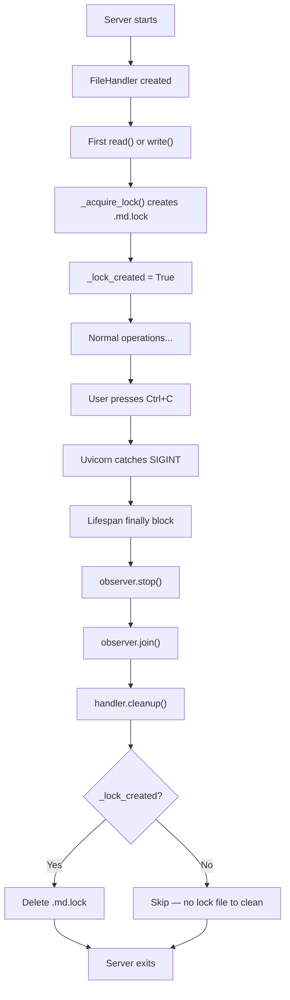

# Plan: Lock File Cleanup on Shutdown

## Overview

Add automatic cleanup of `.md.lock` files when the server shuts down, so lock files don't accumulate in the user's workspace.

**Includes**: `cleanup()` method on `FileHandler`, lock file tracking on `DirectoryHandler`, lifespan shutdown hook, tests

### Key Features
- **Automatic cleanup**: Lock files are removed when the server stops (Ctrl+C, SIGTERM, etc.)
- **Instance-scoped**: Only deletes lock files created by the current process, not by other tools
- **Best-effort**: Cleanup failures are silently ignored (same pattern as `_safe_remove`)
- **Both modes**: Works in single-file mode (`FileHandler`) and folder mode (`DirectoryHandler`)

---

## Current Behavior

1. User runs `markdown-os open notes.md`
2. Server starts, creates `FileHandler(notes.md)`
3. On first read or write, `_acquire_lock()` opens/creates `notes.md.lock` in the same directory
4. Lock file is used for `fcntl.flock()` coordination (shared for reads, exclusive for writes)
5. The lock is released after each operation, but **the lock file itself is never deleted**
6. User presses Ctrl+C → Uvicorn catches SIGINT → lifespan `finally` block runs → observer stops
7. `notes.md.lock` remains on disk indefinitely

**In folder mode**, the `DirectoryHandler` caches `FileHandler` instances in `self._file_handlers`. Each cached handler creates its own `.lock` file on first use. None are cleaned up.

## Proposed Behavior

1. `FileHandler` tracks whether it created a lock file (new `_lock_created` flag)
2. `FileHandler` exposes a `cleanup()` method that deletes the lock file if it was created by this instance
3. `DirectoryHandler` exposes a `cleanup()` method that calls `cleanup()` on all cached `FileHandler` instances
4. Server lifespan `finally` block calls `handler.cleanup()` after stopping the observer
5. Lock files are removed on graceful shutdown — the user's workspace stays clean

---

## User Story / Value Proposition

**Problem**: Every time a user opens a file, a `.md.lock` file appears next to it and never goes away. These accumulate over time, clutter the workspace, show up in `git status`, and confuse users who don't know what they are.

**User benefit**: Lock files disappear automatically when the editor closes. The workspace stays clean without manual intervention.

**Use cases**:
1. Developer opens `README.md`, edits, closes the editor — no `README.md.lock` left behind
2. User opens a folder of docs, edits several files, shuts down — all lock files cleaned up
3. Server crashes (ungraceful) — lock files remain (harmless) but don't accumulate from normal usage

---

## Implementation Plan

### 1. Add Lock File Tracking and Cleanup to FileHandler

**File**: `markdown_os/file_handler.py`

**Changes**:
- Add `_lock_created: bool` flag to `__init__`, initialized to `False`
- Set `_lock_created = True` inside `_acquire_lock()` when the lock file is first opened/created
- Add public `cleanup()` method that deletes the lock file if `_lock_created` is `True`

**Code Location**: `__init__` at line 24, `_acquire_lock` at line 122, new method after `get_metadata` (line ~120)

**Example Code**:

Addition to `__init__` (line 36, after `self._lock_path`):
```python
self._lock_created = False
```

Addition to `_acquire_lock` (line 135, after `self._lock_path.open(...)`):
```python
self._lock_created = True
```

New method after `get_metadata`:
```python
def cleanup(self) -> None:
    """
    Remove the lock file created by this handler instance.

    Args:
    - None (None): This method operates on the handler's tracked lock path.

    Returns:
    - None: Cleanup has best-effort semantics and never raises.
    """

    if not self._lock_created:
        return

    try:
        if self._lock_path.exists():
            self._lock_path.unlink()
    except OSError:
        return
```

**Rationale**:
- The `_lock_created` flag ensures we only delete lock files that *this* handler instance caused to exist. If the lock file was already present from another process or a previous crash, we don't touch it until we've actually used it (at which point we "own" it).
- The cleanup pattern mirrors the existing `_safe_remove()` method — best-effort, never raises, silently catches `OSError`.
- The flag is set inside `_acquire_lock()` right after the file is opened. This means if the handler is created but never reads or writes, no cleanup is attempted.

---

### 2. Add Cleanup to DirectoryHandler

**File**: `markdown_os/directory_handler.py`

**Changes**:
- Add a `cleanup()` method that iterates over all cached `FileHandler` instances and calls their `cleanup()`

**Code Location**: After `validate_file_path` (line ~152), new method

**Example Code**:
```python
def cleanup(self) -> None:
    """
    Clean up lock files for all cached file handlers.

    Args:
    - None (None): Iterates over all file handlers created during this session.

    Returns:
    - None: Cleanup has best-effort semantics and never raises.
    """

    for file_handler in self._file_handlers.values():
        file_handler.cleanup()
```

**Rationale**: In folder mode, the `DirectoryHandler` maintains a cache of `FileHandler` instances (one per file accessed). Each handler tracks its own lock file. Delegating to each handler keeps the cleanup logic centralized in `FileHandler`.

---

### 3. Call Cleanup in Server Lifespan Shutdown

**File**: `markdown_os/server.py`

**Changes**:
- Add `handler.cleanup()` call in the lifespan `finally` block, after the observer is stopped

**Code Location**: Line 307 (after `observer.join(timeout=3)`)

**Example Code**:
```python
try:
    yield
finally:
    observer.stop()
    observer.join(timeout=3)
    handler.cleanup()
```

**Rationale**:
- Cleanup runs after the observer stops, so there are no more file events that could trigger lock acquisition.
- The `handler` variable is already in scope (captured from `create_app`'s parameter). Both `FileHandler` and `DirectoryHandler` expose `cleanup()`, so no type check is needed.
- If cleanup fails (e.g., permission error), it's silently ignored — the server still exits cleanly.

---

### 4. Add Tests for Lock File Cleanup

**File**: `tests/test_file_handler.py`

**Changes**:
- Add test: `cleanup()` removes the lock file after a read/write operation
- Add test: `cleanup()` is a no-op when the handler never performed IO (lock file never created)
- Add test: `cleanup()` is safe to call multiple times

**Example Code**:
```python
def test_cleanup_removes_lock_file_after_read(tmp_path: Path) -> None:
    """Verify cleanup deletes the lock file created during read."""

    markdown_path = tmp_path / "document.md"
    markdown_path.write_text("content", encoding="utf-8")
    file_handler = FileHandler(markdown_path)
    lock_path = markdown_path.with_suffix(".md.lock")

    file_handler.read()
    assert lock_path.exists()

    file_handler.cleanup()
    assert not lock_path.exists()


def test_cleanup_removes_lock_file_after_write(tmp_path: Path) -> None:
    """Verify cleanup deletes the lock file created during write."""

    markdown_path = tmp_path / "document.md"
    markdown_path.write_text("old", encoding="utf-8")
    file_handler = FileHandler(markdown_path)
    lock_path = markdown_path.with_suffix(".md.lock")

    file_handler.write("new")
    assert lock_path.exists()

    file_handler.cleanup()
    assert not lock_path.exists()


def test_cleanup_noop_when_no_io_performed(tmp_path: Path) -> None:
    """Verify cleanup does nothing when the handler was never used."""

    markdown_path = tmp_path / "document.md"
    markdown_path.write_text("content", encoding="utf-8")
    file_handler = FileHandler(markdown_path)
    lock_path = markdown_path.with_suffix(".md.lock")

    file_handler.cleanup()
    assert not lock_path.exists()


def test_cleanup_safe_to_call_twice(tmp_path: Path) -> None:
    """Verify calling cleanup multiple times does not raise."""

    markdown_path = tmp_path / "document.md"
    markdown_path.write_text("content", encoding="utf-8")
    file_handler = FileHandler(markdown_path)

    file_handler.read()
    file_handler.cleanup()
    file_handler.cleanup()  # should not raise
```

**Rationale**: Tests cover the three important scenarios: normal cleanup after IO, no-op when handler was unused, and idempotent repeated calls. The test pattern matches the existing style (pytest + `tmp_path` fixture, direct filesystem assertions).

---

## Architecture / Flow Diagram



---

## Edge Cases to Handle

#### Case 1: Server crashes (SIGKILL, power loss)
- **Scenario**: Process is killed forcefully before lifespan shutdown runs
- **Expected behavior**: Lock file remains on disk
- **Implementation note**: This is unavoidable — `SIGKILL` cannot be caught. The leftover `.lock` file is harmless (empty, doesn't hold a lock). Next startup will reuse/overwrite it.

#### Case 2: Multiple server instances on the same file
- **Scenario**: User runs `markdown-os open notes.md` in two terminals
- **Expected behavior**: Each instance tracks its own `_lock_created` flag. When the first server shuts down, it deletes `notes.md.lock`. The second server's operations continue fine because `_acquire_lock()` recreates the file if needed.
- **Implementation note**: `fcntl.flock` operates on file descriptors, not file existence. Even if one process deletes the lock file, the other process's existing file descriptor remains valid. On next lock acquisition, the file is recreated via `open("a+")`.

#### Case 3: Lock file deleted externally during operation
- **Scenario**: User manually deletes `notes.md.lock` while the server is running
- **Expected behavior**: Next `_acquire_lock()` call recreates it. `cleanup()` on shutdown either deletes the recreated file or silently handles the missing file.
- **Implementation note**: `cleanup()` checks `lock_path.exists()` before calling `unlink()`, so a missing file is a no-op.

#### Case 4: Permission error on cleanup
- **Scenario**: Lock file has read-only permissions or directory is read-only
- **Expected behavior**: Cleanup silently fails, server exits normally
- **Implementation note**: The `except OSError: return` pattern in `cleanup()` swallows permission errors.

#### Case 5: Folder mode with many files accessed
- **Scenario**: User opens 50 different files during a session in folder mode
- **Expected behavior**: All 50 `.lock` files are cleaned up on shutdown
- **Implementation note**: `DirectoryHandler.cleanup()` iterates `self._file_handlers.values()` which contains exactly the handlers that were accessed during the session.

---

## Testing Considerations

**Manual Tests**:

**Basic Flow:**
1. Run `markdown-os open notes.md` → edit → Ctrl+C → `notes.md.lock` should not exist
2. Run `markdown-os open notes.md` → do NOT edit (just view preview) → Ctrl+C → `notes.md.lock` should not exist (read triggers lock creation)
3. Run `markdown-os open folder/` → open several files → Ctrl+C → no `.lock` files remain

**Edge Cases:**
4. Run `markdown-os open notes.md` → immediately Ctrl+C before any load completes → no `.lock` file left (handler may not have performed IO yet, so no lock file to clean)
5. Create `notes.md.lock` manually → run `markdown-os open notes.md` → read file → Ctrl+C → lock file is cleaned up (handler took ownership by using it)

**Automated Tests**:
- `test_cleanup_removes_lock_file_after_read` — lock file deleted after read + cleanup
- `test_cleanup_removes_lock_file_after_write` — lock file deleted after write + cleanup
- `test_cleanup_noop_when_no_io_performed` — no deletion if handler never used
- `test_cleanup_safe_to_call_twice` — idempotent behavior

---

## Files to Modify

| File | Changes |
|------|---------|
| `markdown_os/file_handler.py` | • Add `_lock_created` flag to `__init__`<br>• Set flag in `_acquire_lock()`<br>• Add `cleanup()` method |
| `markdown_os/directory_handler.py` | • Add `cleanup()` method that delegates to cached handlers |
| `markdown_os/server.py` | • Add `handler.cleanup()` call in lifespan `finally` block |
| `tests/test_file_handler.py` | • Add 4 tests for cleanup behavior |

---

## Decisions / Open Questions

### Q1: Should cleanup delete lock files it didn't create? ✅
**Options**:
- **Option A**: Only delete if `_lock_created` is True (conservative)
- **Option B**: Always delete the lock file path regardless (aggressive)

**Decision**: Option A — only clean up what we created. If a lock file exists from a previous crash, it gets "adopted" on first use (when `_lock_created` becomes True), then cleaned up normally. If the handler is never used, the stale file is left alone. This avoids interfering with other processes.

### Q2: Should we add `.md.lock` to a generated `.gitignore`? ✅
**Decision**: No — out of scope for this feature. Lock files will be cleaned up on shutdown, which solves the primary problem. Users who want to gitignore them can do so themselves. We could mention it in docs later.

### Q3: Where in the shutdown sequence should cleanup run? ✅
**Decision**: After `observer.stop()` and `observer.join()`. The observer must be fully stopped first so no new file events trigger lock acquisition during cleanup. The cleanup is the last operation before the process exits.

---

## Implementation Checklist

### Phase 1: Core Cleanup Logic
- [ ] Add `_lock_created = False` to `FileHandler.__init__`
- [ ] Set `self._lock_created = True` in `_acquire_lock()` after file open
- [ ] Add `cleanup()` method to `FileHandler`
- [ ] Add `cleanup()` method to `DirectoryHandler`
- [ ] Add `handler.cleanup()` to server lifespan `finally` block

### Phase 2: Tests
- [ ] Add `test_cleanup_removes_lock_file_after_read`
- [ ] Add `test_cleanup_removes_lock_file_after_write`
- [ ] Add `test_cleanup_noop_when_no_io_performed`
- [ ] Add `test_cleanup_safe_to_call_twice`
- [ ] Run full test suite (`uv run pytest`)

---

## Estimated Timeline

- **Phase 1**: ~15 minutes (small changes to 3 files)
- **Phase 2**: ~15 minutes (4 focused tests)

**Total**: ~30 minutes

---

## Success Criteria

### Core Functionality
✅ Lock file is removed when server shuts down gracefully (Ctrl+C)
✅ Lock file is removed in both file mode and folder mode
✅ No lock file is left behind for files that were read or written during the session
✅ Cleanup is a no-op for handlers that never performed IO

### Safety
✅ Cleanup never raises — server always exits cleanly
✅ Cleanup is idempotent (safe to call multiple times)
✅ Existing file locking behavior is unchanged during normal operation
✅ All existing tests continue to pass

### Code Quality
✅ `cleanup()` follows the project's `_safe_remove` best-effort pattern
✅ Methods have Google-style docstrings with Args/Returns sections
✅ New tests match existing test conventions (pytest + `tmp_path`)
