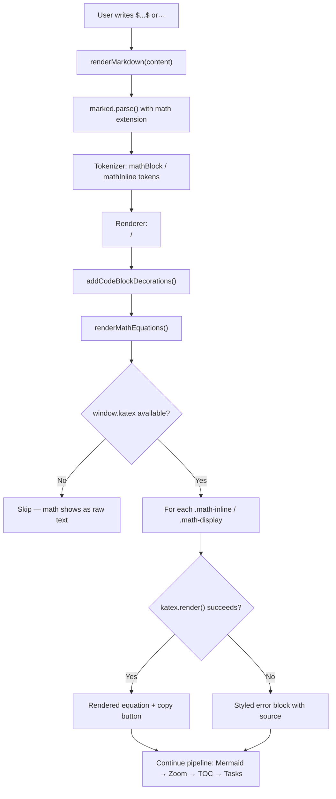

# Plan: Math Equations (KaTeX)

## Overview

Add LaTeX math equation rendering to the markdown editor using KaTeX, supporting both inline math (`$...$`) and display/block math (`$$...$$`).

**Includes**: KaTeX CDN integration, Marked.js tokenizer/renderer extension, theme-aware styling, error handling for invalid LaTeX, example template updates

### Key Features
- **Inline math**: Render `$E = mc^2$` as beautiful inline equations within text
- **Display math**: Render `$$...$$` blocks as centered, full-width equations
- **Theme-aware**: Colors adapt to light/dark theme via CSS variables
- **Error resilience**: Invalid LaTeX shows a styled error message instead of breaking the page
- **Copy source**: Display math blocks include a "Copy" button to copy the raw LaTeX source

---

## Current Behavior

1. User writes markdown in the editor textarea
2. On Preview tab switch, `renderMarkdown(content)` is called
3. `window.marked.parse(content)` converts raw markdown to HTML
4. Post-processing steps enhance the HTML: code block decorations, Mermaid diagrams, SVG zoom, TOC, task lists
5. Dollar-sign math notation (`$...$`, `$$...$$`) is **not recognized** — it renders as literal text with dollar signs

**Marked.js configuration** (in `markdown.js` lines 17-28):
- GFM mode enabled, no custom extensions registered
- No tokenizer or renderer overrides exist

**Relevant pattern**: Mermaid diagrams follow this flow: markdown code fence → `marked.parse()` produces `<pre><code class="language-mermaid">` → post-processing finds these elements → replaces with rendered diagram containers. KaTeX can follow a similar architecture.

## Proposed Behavior

1. User writes `$E = mc^2$` (inline) or `$$\int_0^1 x^2 dx$$` (block) in the editor
2. On Preview tab switch, `renderMarkdown(content)` is called
3. **New**: Before `marked.parse()`, a custom Marked.js extension tokenizes `$...$` and `$$...$$` delimiters into special tokens
4. **New**: The extension renderer outputs placeholder HTML: `<span class="math-inline">...</span>` and `<div class="math-display">...</div>`
5. Existing post-processing runs (code blocks, Mermaid, etc.)
6. **New**: `renderMathEquations()` finds all `.math-inline` and `.math-display` elements, calls `katex.render()` on each
7. Invalid LaTeX renders a styled error block (red border, shows source) similar to Mermaid error handling
8. Theme changes trigger KaTeX color updates via CSS variables (no re-render needed — KaTeX output is pure HTML/CSS)

---

## User Story / Value Proposition

**Problem**: Scientists, academics, students, and developers writing technical documentation cannot render math equations. They must use external tools or switch editors for any document containing formulas.

**User benefit**: Write `$\alpha + \beta = \gamma$` in markdown and see it rendered beautifully. No external tools, no copy-pasting images, no context switching.

**Use cases**:
1. A physics student writes lab reports with inline equations like `$F = ma$` and display equations for derivations
2. A data scientist documents ML models with loss functions like `$$L = -\sum y_i \log(\hat{y}_i)$$`
3. A developer writes API docs that include formula explanations for pricing algorithms
4. A math teacher creates course notes with theorem proofs and equations

---

## Implementation Plan

### 1. Add KaTeX CDN Resources to index.html

**File**: `markdown_os/static/index.html`

**Changes**:
- Add KaTeX CSS stylesheet (after `styles.css`, before highlight.js themes)
- Add KaTeX JavaScript (after Mermaid, before highlight.js)
- Add KaTeX auto-render extension for fallback/future use

**Code Location**: Lines 30-45 (CDN section)

**Example Code**:
```html
<!-- After line 40 (highlight-dark stylesheet) -->
<link
  rel="stylesheet"
  href="https://cdn.jsdelivr.net/npm/katex@0.16.21/dist/katex.min.css"
  crossorigin="anonymous"
/>

<!-- After line 45 (highlight.js script) -->
<script
  src="https://cdn.jsdelivr.net/npm/katex@0.16.21/dist/katex.min.js"
  crossorigin="anonymous"
></script>
```

**Rationale**: KaTeX CSS must load early to prevent flash of unstyled math. Pinning to `@0.16.21` ensures reproducible builds (same pattern could be applied to other CDN deps but is out of scope here). The auto-render extension is NOT used — we implement custom parsing via Marked.js extensions for tighter control over tokenization and error handling.

---

### 2. Create Marked.js Math Extension

**File**: `markdown_os/static/js/markdown.js`

**Changes**:
- Add a `markedMathExtension()` function that returns a Marked.js extension object
- The extension defines two custom tokens: `mathBlock` (block-level `$$...$$`) and `mathInline` (inline `$...$`)
- Register the extension in `configureMarked()`

**Code Location**: After `configureMarked()` (line 28), new function

**Example Code**:
```javascript
function createMathExtension() {
  const mathBlock = {
    name: "mathBlock",
    level: "block",
    start(src) {
      return src.match(/\$\$/)?.index;
    },
    tokenizer(src) {
      const match = src.match(/^\$\$([\s\S]+?)\$\$/);
      if (match) {
        return {
          type: "mathBlock",
          raw: match[0],
          text: match[1].trim(),
        };
      }
    },
    renderer(token) {
      const escaped = token.text
        .replace(/&/g, "&amp;")
        .replace(/</g, "&lt;")
        .replace(/>/g, "&gt;")
        .replace(/"/g, "&quot;");
      return `<div class="math-display" data-math-source="${escaped}">${escaped}</div>\n`;
    },
  };

  const mathInline = {
    name: "mathInline",
    level: "inline",
    start(src) {
      return src.match(/\$/)?.index;
    },
    tokenizer(src) {
      const match = src.match(/^\$([^\$\n]+?)\$/);
      if (match) {
        return {
          type: "mathInline",
          raw: match[0],
          text: match[1].trim(),
        };
      }
    },
    renderer(token) {
      const escaped = token.text
        .replace(/&/g, "&amp;")
        .replace(/</g, "&lt;")
        .replace(/>/g, "&gt;")
        .replace(/"/g, "&quot;");
      return `<span class="math-inline" data-math-source="${escaped}">${escaped}</span>`;
    },
  };

  return { extensions: [mathBlock, mathInline] };
}
```

**Updated `configureMarked()`**:
```javascript
function configureMarked() {
  if (!window.marked) {
    return;
  }

  window.marked.setOptions({
    gfm: true,
    breaks: true,
    mangle: false,
    headerIds: false,
  });

  window.marked.use(createMathExtension());
}
```

**Rationale**: Using Marked.js extensions (the `marked.use()` API) is the officially supported way to add custom syntax. This approach:
- Prevents dollar signs in math from being interpreted as markdown emphasis/formatting
- Keeps math source text intact through the parsing pipeline via `data-math-source`
- Outputs semantic HTML (`math-display`, `math-inline` classes) for post-processing
- Block-level tokenizer handles multi-line `$$...$$`, inline handles single-line `$...$`
- The inline regex `[^\$\n]+?` deliberately excludes newlines and empty matches to avoid false positives with currency (`$5`, `$10`) — a single `$` without a closing `$` on the same line is left as-is

**Key design decision**: The `start()` function returns the index of the first `$` character, which tells Marked where the extension *might* start. The `tokenizer()` then does the precise match. This two-step approach is Marked's standard extension pattern.

---

### 3. Add KaTeX Rendering Post-Processing Step

**File**: `markdown_os/static/js/markdown.js`

**Changes**:
- Add `renderMathEquations()` function that finds all `.math-inline` and `.math-display` elements and renders them with KaTeX
- Add `renderMathError()` helper for error display
- Insert into the `renderMarkdown()` pipeline after `addCodeBlockDecorations()` and before `renderMermaidDiagrams()`

**Code Location**: After `addCodeBlockDecorations()` function (line ~152), and update `renderMarkdown()` at line ~427

**Example Code**:
```javascript
function renderMathEquations() {
  if (!window.katex) {
    return;
  }

  const preview = document.getElementById("markdown-preview");
  if (!preview) {
    return;
  }

  // Render inline math
  preview.querySelectorAll(".math-inline").forEach((element) => {
    const source = element.getAttribute("data-math-source") || element.textContent || "";
    try {
      window.katex.render(source, element, {
        throwOnError: false,
        displayMode: false,
        output: "htmlAndMathml",
      });
    } catch (error) {
      console.error("KaTeX inline render error.", error);
      element.classList.add("math-error");
      element.title = `Invalid LaTeX: ${source}`;
    }
  });

  // Render display math
  preview.querySelectorAll(".math-display").forEach((element) => {
    const source = element.getAttribute("data-math-source") || element.textContent || "";
    try {
      window.katex.render(source, element, {
        throwOnError: false,
        displayMode: true,
        output: "htmlAndMathml",
      });
      element.setAttribute("data-math-rendered", "true");
    } catch (error) {
      console.error("KaTeX display render error.", error);
      element.innerHTML = "";
      const errorBlock = document.createElement("div");
      errorBlock.className = "math-error-block";
      errorBlock.textContent = `Invalid LaTeX:\n${source}`;
      element.appendChild(errorBlock);
    }
  });
}
```

**Updated `renderMarkdown()`**:
```javascript
async function renderMarkdown(content) {
  const preview = document.getElementById("markdown-preview");
  if (!preview || !window.marked) {
    return;
  }

  preview.innerHTML = window.marked.parse(content ?? "");
  addCodeBlockDecorations();
  renderMathEquations();          // NEW — after code blocks, before Mermaid
  await renderMermaidDiagrams();
  applyZoomToDiagrams();

  if (window.generateTOC) {
    window.generateTOC();
  }

  makeTaskListsInteractive();
}
```

**Rationale**:
- `renderMathEquations()` is synchronous (KaTeX renders synchronously, unlike Mermaid)
- Placed after `addCodeBlockDecorations()` so LaTeX inside code blocks is already handled (code blocks skip math)
- Placed before `renderMermaidDiagrams()` because there's no dependency, and math rendering is fast
- `throwOnError: false` tells KaTeX to render a red error message inline rather than throwing — this gracefully handles partial LaTeX
- `output: "htmlAndMathml"` provides accessibility via MathML for screen readers
- `data-math-source` preserves the original LaTeX for copy functionality and error messages
- `data-math-rendered` attribute on display blocks enables the copy button to know rendering succeeded

---

### 4. Add CSS Styles for Math Blocks

**File**: `markdown_os/static/css/styles.css`

**Changes**:
- Add CSS variables for math styling in both `:root` (light) and `[data-theme="dark"]` blocks
- Add styles for `.math-inline`, `.math-display`, `.math-error`, and `.math-error-block`

**Code Location**: Add variables after the mermaid variables (~line 34 and ~line 88). Add rule blocks after the mermaid section (~line 557).

**Example Code**:

CSS variables (light theme, after line 34):
```css
--math-display-bg: #fafcff;
--math-display-border: #dbeafe;
--math-error-text: #991b1b;
--math-error-bg: #fef2f2;
--math-error-border: #fecaca;
```

CSS variables (dark theme, after line 88):
```css
--math-display-bg: #162032;
--math-display-border: #1e3a5f;
--math-error-text: #fca5a5;
--math-error-bg: #450a0a;
--math-error-border: #7f1d1d;
```

Style rules:
```css
/* -- Math Equations (KaTeX) -- */

.math-inline {
  padding: 0 2px;
}

.math-inline .katex {
  font-size: 1.05em;
}

.math-display {
  border: 1px solid var(--math-display-border);
  border-radius: 10px;
  padding: 20px 24px;
  margin: 16px 0;
  overflow-x: auto;
  background: var(--math-display-bg);
  text-align: center;
}

.math-display .katex-display {
  margin: 0;
}

.math-inline.math-error {
  color: var(--math-error-text);
  border-bottom: 1px dashed var(--math-error-text);
  cursor: help;
}

.math-error-block {
  border: 1px solid var(--math-error-border);
  border-radius: 10px;
  padding: 10px;
  background: var(--math-error-bg);
  color: var(--math-error-text);
  white-space: pre-wrap;
  font-family: monospace;
  font-size: 0.85em;
}
```

**Rationale**:
- Display math uses the same `border-radius: 10px` and `margin: 16px 0` as code blocks and Mermaid containers for visual consistency
- Inline math gets minimal styling so it flows naturally within text
- Error styling mirrors the existing Mermaid error pattern (same color variables reused where applicable)
- `overflow-x: auto` on display blocks handles wide equations without breaking layout
- KaTeX already adapts to `color` inheritance from parent elements, so theme switching works automatically through CSS variables — no JavaScript re-render needed (unlike Mermaid SVGs)

---

### 5. Add Copy Button for Display Math Blocks

**File**: `markdown_os/static/js/markdown.js`

**Changes**:
- After KaTeX renders a display math block successfully, add a "Copy LaTeX" button (same pattern as code block copy buttons)
- Reuse the existing `copyToClipboard()` function

**Code Location**: Inside `renderMathEquations()`, after the successful `katex.render()` call for display blocks

**Example Code** (addition to the display math loop):
```javascript
// Inside the .math-display forEach, after successful render:
const copyButton = document.createElement("button");
copyButton.className = "copy-button math-copy-button";
copyButton.type = "button";
copyButton.textContent = "Copy LaTeX";
copyButton.addEventListener("click", async () => {
  try {
    await copyToClipboard(source);
    copyButton.textContent = "Copied";
    copyButton.classList.add("copied");
    window.setTimeout(() => {
      copyButton.textContent = "Copy LaTeX";
      copyButton.classList.remove("copied");
    }, 1200);
  } catch (err) {
    copyButton.textContent = "Copy failed";
    window.setTimeout(() => {
      copyButton.textContent = "Copy LaTeX";
    }, 1200);
  }
});
element.appendChild(copyButton);
```

**Additional CSS**:
```css
.math-copy-button {
  position: absolute;
  top: 6px;
  right: 6px;
  opacity: 0;
  transition: opacity 0.15s ease;
}

.math-display {
  position: relative;  /* Add to existing rule */
}

.math-display:hover .math-copy-button {
  opacity: 1;
}
```

**Rationale**: Display math equations often contain complex LaTeX that users want to reuse. Showing the button on hover keeps the UI clean while being discoverable. The copy button copies the raw LaTeX source (from `data-math-source`), not the rendered HTML.

---

### 6. Update Example Template with Math Examples

**File**: `markdown_os/templates/example_template.md`

**Changes**:
- Add a "Math Equations" section showcasing inline and display math
- Place it after the "Code Blocks" section and before "Mermaid Diagrams" (both are rendering-enhanced features)

**Example Content**:
```markdown
## Math Equations

Markdown-OS supports LaTeX math via KaTeX. Use single dollar signs for inline
math and double dollar signs for display equations.

### Inline Math

The quadratic formula $x = \frac{-b \pm \sqrt{b^2 - 4ac}}{2a}$ solves any
second-degree polynomial. Einstein's famous $E = mc^2$ relates energy and mass.
Greek letters like $\alpha$, $\beta$, and $\gamma$ render naturally.

### Display Equations

The Gaussian integral:

$$\int_{-\infty}^{\infty} e^{-x^2} dx = \sqrt{\pi}$$

Euler's identity:

$$e^{i\pi} + 1 = 0$$

A matrix example:

$$\begin{pmatrix} a & b \\ c & d \end{pmatrix} \begin{pmatrix} x \\ y \end{pmatrix} = \begin{pmatrix} ax + by \\ cx + dy \end{pmatrix}$$

The sum of a geometric series:

$$\sum_{n=0}^{\infty} ar^n = \frac{a}{1-r}, \quad |r| < 1$$
```

**Rationale**: The examples progress from simple (inline variables, Greek letters) to complex (integrals, matrices, series) to demonstrate the range of KaTeX support. Users running `markdown-os example --open` will immediately see math rendering in action.

---

## Architecture / Flow Diagram



---

## Edge Cases to Handle

#### Case 1: Dollar signs in non-math contexts
- **Scenario**: User writes `The price is $5` or `Costs $10-$20`
- **Expected behavior**: Should NOT be parsed as math (no closing delimiter on same word)
- **Implementation note**: The inline regex `^\$([^\$\n]+?)\$` requires content between the two `$` signs and no newlines. A lone `$5` won't match because there's no second `$` delimiter immediately after. `$10-$20` matches `$10-$` which would be invalid LaTeX — KaTeX's `throwOnError: false` renders it as red error text, signaling the user to escape: `\$10-\$20`. Document this in the example template.

#### Case 2: Dollar signs inside code blocks / inline code
- **Scenario**: User writes `` `$variable` `` or a code fence containing `$x = 5`
- **Expected behavior**: Dollar signs inside code should NOT trigger math rendering
- **Implementation note**: Marked.js processes code spans and code fences with higher priority than custom inline extensions. The tokenizer will never see content inside `` ` `` or ``` ``` ``` blocks because Marked consumes them first. No special handling needed.

#### Case 3: Nested or unbalanced dollar signs
- **Scenario**: User writes `$$x = $y$$` (nested) or `$incomplete`
- **Expected behavior**: The block tokenizer matches the outer `$$...$$`. A lone `$` with no match is left as literal text.
- **Implementation note**: The block regex `^\$\$([\s\S]+?)\$\$` uses non-greedy matching to find the nearest closing `$$`. Lone `$` without a pair passes through as text.

#### Case 4: Multi-line display equations
- **Scenario**: User writes an aligned environment spanning many lines
- **Expected behavior**: Renders correctly as a single display block
- **Implementation note**: The block tokenizer uses `[\s\S]+?` which matches across newlines. Multi-line content like `\begin{aligned}...\end{aligned}` is captured as a single token.

#### Case 5: KaTeX CDN fails to load
- **Scenario**: User is offline or CDN is blocked
- **Expected behavior**: Math source text remains visible as plain text (the `data-math-source` content in the placeholder elements)
- **Implementation note**: `renderMathEquations()` checks `if (!window.katex)` at the top and returns early. The placeholder elements already contain the source text as their text content, so users see the raw LaTeX rather than a blank space.

#### Case 6: Very long equations causing overflow
- **Scenario**: A wide equation exceeds the preview panel width
- **Expected behavior**: Horizontal scrollbar on the display math container
- **Implementation note**: `.math-display` has `overflow-x: auto` in CSS

#### Case 7: Theme switching with rendered math
- **Scenario**: User toggles dark/light theme with math equations visible
- **Expected behavior**: Math text color adapts immediately
- **Implementation note**: KaTeX renders as HTML elements that inherit `color` from their parent via CSS. Unlike Mermaid (which bakes colors into SVG), KaTeX requires no re-render on theme change. The CSS variable `--preview-text` cascades naturally.

---

## Testing Considerations

**Manual Tests**:

**Basic Flow:**
1. Write `$E = mc^2$` in the editor → switch to Preview → should render as formatted inline equation
2. Write `$$\int_0^1 x^2 dx = \frac{1}{3}$$` → switch to Preview → should render as centered display equation
3. Write invalid LaTeX `$$\invalidcommand$$` → should show styled error block with source text
4. Write `$\alpha + \beta$` inline within a paragraph → should render inline without breaking text flow

**Dollar Sign Disambiguation:**
5. Write `The price is $5` → should show literal `$5`, not attempt math rendering
6. Write `` `$variable` `` → should show as inline code, not math
7. Write `$x$ and $y$` → should render both as separate inline equations
8. Write a code block containing `$x = 5` → should show as code, not math

**Display Math Variations:**
9. Write multi-line display equation with `\begin{aligned}` → should render as single block
10. Write matrix notation → should render properly
11. Hover over display math block → "Copy LaTeX" button should appear
12. Click "Copy LaTeX" → clipboard should contain raw LaTeX source

**Theme & Resilience:**
13. Toggle theme with math visible → equation colors should adapt smoothly
14. Load page with no internet (KaTeX CDN unavailable) → raw LaTeX source should be visible as text
15. Write math then switch to Edit tab and back → math should re-render correctly

**Automated Tests**:
- No backend changes are needed, so no new Python tests are required
- The rendering is purely client-side; manual browser testing is the primary validation method
- Future: Could add Playwright/Cypress e2e tests if the project adopts browser testing

---

## Files to Modify

| File | Changes |
|------|---------|
| `markdown_os/static/index.html` | • Add KaTeX CSS `<link>` tag<br>• Add KaTeX JS `<script>` tag |
| `markdown_os/static/js/markdown.js` | • Add `createMathExtension()` — Marked.js tokenizer/renderer<br>• Register extension in `configureMarked()`<br>• Add `renderMathEquations()` post-processing function<br>• Add copy button logic for display math<br>• Insert `renderMathEquations()` call into `renderMarkdown()` pipeline |
| `markdown_os/static/css/styles.css` | • Add math CSS variables (light + dark themes)<br>• Add `.math-inline`, `.math-display`, `.math-error`, `.math-error-block`, `.math-copy-button` styles |
| `markdown_os/templates/example_template.md` | • Add "Math Equations" section with inline and display examples |

---

## Decisions / Open Questions

### Q1: KaTeX vs MathJax ✅
**Options**:
- **KaTeX**: Faster rendering (synchronous), smaller bundle (~280KB CSS+JS), subset of LaTeX
- **MathJax**: Slower (async rendering), larger bundle (~500KB+), fuller LaTeX/AMS support

**Decision**: KaTeX selected because:
- Synchronous rendering simplifies the pipeline (no async step needed)
- Faster perceived performance matches the project's "instant preview" feel
- Covers 95%+ of common math notation
- Smaller CDN payload means faster initial page load
- If users need obscure LaTeX commands, they can request MathJax as a future option

### Q2: How to handle `$` disambiguation (currency vs math) ✅
**Options**:
- **Option A**: Require `$...$` with content — lone `$` passes through
- **Option B**: Use alternative delimiters like `\(...\)` and `\[...\]`

**Decision**: Option A — standard `$...$` syntax with the inline regex requiring non-empty content between delimiters (`[^\$\n]+?`). This is what users expect from LaTeX/markdown tools (Obsidian, Typora, GitHub). Currency like `$5` won't match because there's no closing `$`. For edge cases where `$...$` incorrectly triggers, users can escape: `\$...\$`.

### Q3: Should KaTeX re-render on theme change? ✅
**Decision**: No re-render needed. KaTeX outputs HTML elements that inherit `color` from CSS. Unlike Mermaid (which bakes colors into SVG attributes), KaTeX's output responds to CSS variable changes automatically. This simplifies implementation — no theme change listener needed for math.

---

## Implementation Checklist

### Phase 1: Core KaTeX Integration
- [ ] Add KaTeX CSS and JS CDN links to `index.html`
- [ ] Implement `createMathExtension()` in `markdown.js`
  - [ ] Block-level tokenizer/renderer for `$$...$$`
  - [ ] Inline-level tokenizer/renderer for `$...$`
- [ ] Register extension via `marked.use()` in `configureMarked()`
- [ ] Implement `renderMathEquations()` post-processing function
- [ ] Add `renderMathEquations()` call to `renderMarkdown()` pipeline

### Phase 2: Styling & Polish
- [ ] Add CSS variables for math (light + dark themes)
- [ ] Add `.math-inline` styles
- [ ] Add `.math-display` container styles (border, padding, centered)
- [ ] Add `.math-error` / `.math-error-block` error styles
- [ ] Add "Copy LaTeX" button for display math blocks
- [ ] Add `.math-copy-button` hover-reveal styles

### Phase 3: Documentation & Testing
- [ ] Add "Math Equations" section to example template
- [ ] Run all manual test scenarios (inline, display, errors, theme, code blocks)
- [ ] Test dollar sign disambiguation (currency, code spans, code fences)
- [ ] Test with KaTeX CDN unavailable (graceful fallback)
- [ ] Update CLAUDE.md if architecture section needs changes

---

## Estimated Timeline

- **Phase 1**: ~1 hour (CDN setup + Marked extension + rendering function)
- **Phase 2**: ~30 minutes (CSS variables + styles + copy button)
- **Phase 3**: ~30 minutes (template updates + manual testing)

**Total**: ~2 hours

---

## Success Criteria

### Core Functionality
✅ Inline math `$...$` renders correctly within text flow
✅ Display math `$$...$$` renders as centered block equations
✅ Multi-line display equations (aligned, matrices) render correctly
✅ Invalid LaTeX shows styled error with source text visible
✅ KaTeX CDN failure degrades gracefully (raw source visible)

### Dollar Sign Safety
✅ `$5`, `$10` (lone dollar signs) are NOT parsed as math
✅ Dollar signs inside inline code and code fences are NOT parsed as math
✅ Escaped `\$` renders as literal dollar sign

### Theme & UX
✅ Math equations adapt to light/dark theme without re-render
✅ Display math blocks have "Copy LaTeX" button on hover
✅ Display math blocks scroll horizontally for wide equations
✅ Visual style (borders, radius, spacing) matches existing code block and Mermaid styling

### Performance
✅ No noticeable rendering delay (KaTeX is synchronous)
✅ No regression in existing markdown rendering
✅ Page load increase is minimal (~280KB cached CDN resources)

---

## Rollout Considerations

**Breaking Changes**:
- Users who currently use `$...$` as literal dollar signs in their documents may see unexpected math rendering. Mitigation: escape as `\$` or use backtick-wrapped code.

**Migration Notes**:
- No data migration needed. Existing documents without math syntax are unaffected.
- Documents from other editors (Obsidian, Typora) that use `$...$` syntax will "just work."

**Documentation Updates**:
- Update example template with math examples (included in this plan)
- CLAUDE.md architecture section may need a note about KaTeX in the rendering pipeline
