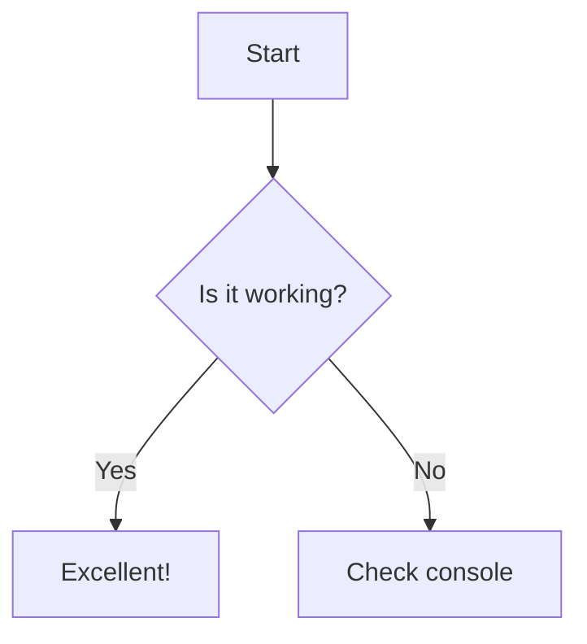

# Plan: Showcase Example Command

## Overview

Add a `markdown-os example` CLI command that generates a comprehensive example.md file showcasing all editor features and supported markdown syntax. This provides instant onboarding for new users and serves as a living reference document.

**Includes**: CLI subcommand, comprehensive example markdown file generation, feature discovery documentation, syntax reference

### Key Features
- **CLI command**: `markdown-os example [output-path]` generates the showcase file
- **Comprehensive coverage**: Examples of all supported markdown syntax and editor features
- **Interactive**: Users can immediately edit the generated file to explore functionality
- **Reference template**: Serves as a copy-paste source for common patterns

---

## Current Behavior

1. **No onboarding mechanism**: New users must discover features through trial-and-error or reading documentation
2. **No example content**: The README and CLAUDE.md document features, but there's no interactive example to explore
3. **CLI has one command**: Currently only `markdown-os open <filepath>` exists (defined in `cli.py:117`)
4. **Feature documentation scattered**: Mermaid support, syntax highlighting, code block decorations, TOC generation are implemented but not showcased together

**Files involved**:
- `markdown_os/cli.py`: Typer CLI with `open` command
- `markdown_os/static/js/markdown.js`: Markdown rendering with Mermaid, syntax highlighting, code decorations
- `markdown_os/static/js/toc.js`: Table of contents generation
- `README.md` and `CLAUDE.md`: Text documentation only

---

## Proposed Behavior

1. **Running the command**:
   ```bash
   # Generate example.md in current directory
   uv run markdown-os example

   # Generate at specific path
   uv run markdown-os example ./docs/showcase.md

   # Auto-open after generation
   uv run markdown-os example --open
   ```

2. **Command execution flow**:
   - Validate output path (create parent directories if needed)
   - Check if file already exists (prompt to overwrite or exit)
   - Generate comprehensive example.md with all feature demonstrations
   - Output success message with next steps
   - Optionally open the file in the editor automatically

3. **Generated file contents** (example.md structure):
   - **Header**: Welcome message explaining this is a showcase
   - **Table of contents**: Demonstrates TOC auto-generation from headings
   - **Text formatting**: Bold, italic, strikethrough, inline code
   - **Headings**: All levels (H1-H6)
   - **Lists**: Ordered, unordered, nested, task lists
   - **Links and images**: External links, relative links, image syntax
   - **Tables**: Various column configurations, alignment
   - **Blockquotes**: Single and nested
   - **Code blocks**: Multiple languages with syntax highlighting examples
   - **Mermaid diagrams**: Flowchart, sequence diagram, state diagram examples
   - **Horizontal rules**: Section separators
   - **Footnotes and escaping**: Advanced syntax

---

## User Story / Value Proposition

**Problem**: New users don't know what features exist or how to use them. Reading documentation is passive and doesn't showcase the live preview, syntax highlighting, Mermaid rendering, and interactive features like code copying.

**User benefit**:
- **Instant feature discovery**: See all capabilities in one place
- **Learning by example**: Edit the showcase file to understand markdown syntax
- **Quick reference**: Copy-paste syntax patterns for common needs
- **Validation**: Confirms the editor is working correctly with complex content

**Use cases**:
1. **New user onboarding**: Developer installs markdown-os, runs `example`, immediately sees what it can do
2. **Feature reference**: User forgets Mermaid syntax, opens example.md to see working examples
3. **Demo/presentation**: Showcase markdown-os capabilities to team without creating content from scratch
4. **Testing**: Verify editor rendering after making changes to the codebase

---

## Implementation Plan

### 1. Create Example Template Content

**File**: `markdown_os/templates/example_template.md` (new file)

**Changes**:
- Create a new `markdown_os/templates/` directory
- Write comprehensive markdown file showcasing all features

**Example Structure**:
```markdown
# Markdown-OS Showcase

Welcome to **Markdown-OS**! This file demonstrates all supported features...

## Table of Contents
[Note: TOC auto-generates in the sidebar from your headings]

## Text Formatting
**Bold text**, *italic text*, ~~strikethrough~~, `inline code`

## Headings

### Level 3 Heading
#### Level 4 Heading
...

## Code Blocks

```python
def hello_world():
    """Example Python code with syntax highlighting."""
    print("Hello, world!")
```

```javascript
// JavaScript with code block decorations
const greet = (name) => {
  console.log(`Hello, ${name}!`);
};
```

## Mermaid Diagrams



... (continue with all features)
```

**Rationale**: Separating the template from code keeps `cli.py` clean and makes the example content easy to update without touching Python code.

---

### 2. Add `example` CLI Command

**File**: `markdown_os/cli.py`

**Changes**:
- Import `Path.write_text()` and template loading utilities
- Add new `@app.command("example")` function after the `open` command
- Implement file existence checking and overwrite confirmation
- Load template content and write to output path
- Add `--open` flag to automatically launch editor after generation

**Code Location**: After line ~147 (after `open_markdown_file` function)

**Example Implementation**:
```python
@app.command("example")
def generate_example(
    output: Path = typer.Argument(
        Path("example.md"),
        help="Output path for the example file.",
    ),
    open_after: bool = typer.Option(
        False,
        "--open",
        help="Open the example file in the editor after generation.",
    ),
    force: bool = typer.Option(
        False,
        "--force",
        "-f",
        help="Overwrite existing file without prompting.",
    ),
) -> None:
    """
    Generate a comprehensive example.md file showcasing all editor features.

    Args:
    - output (Path): Path where example file will be created.
    - open_after (bool): Whether to launch editor after creating file.
    - force (bool): Overwrite existing file without confirmation.

    Returns:
    - None: Writes file to disk and optionally launches editor.
    """

    resolved_output = output.expanduser().resolve()

    # Check for existing file
    if resolved_output.exists() and not force:
        overwrite = typer.confirm(
            f"File {resolved_output} already exists. Overwrite?",
            default=False,
        )
        if not overwrite:
            typer.echo("Cancelled.")
            raise typer.Exit(0)

    # Ensure parent directory exists
    resolved_output.parent.mkdir(parents=True, exist_ok=True)

    # Load template content
    template_path = Path(__file__).parent / "templates" / "example_template.md"
    if not template_path.exists():
        typer.secho(
            f"Template file not found: {template_path}",
            fg=typer.colors.RED,
        )
        raise typer.Exit(1)

    template_content = template_path.read_text(encoding="utf-8")

    # Write example file
    try:
        resolved_output.write_text(template_content, encoding="utf-8")
        typer.secho(
            f"✅ Created example file: {resolved_output}",
            fg=typer.colors.GREEN,
        )
        typer.echo(f"\nNext steps:")
        typer.echo(f"  markdown-os open {resolved_output}")
    except OSError as e:
        typer.secho(
            f"Failed to write file: {e}",
            fg=typer.colors.RED,
        )
        raise typer.Exit(1)

    # Optionally open in editor
    if open_after:
        typer.echo("\nOpening in editor...\n")
        # Call the open command programmatically
        open_markdown_file(filepath=resolved_output)
```

**Rationale**:
- Using Typer's `Argument` with default value makes output path optional
- `--open` flag provides convenience without forcing auto-open behavior
- `--force` flag enables scripting/automation use cases
- Validation ensures parent directories exist before writing
- Clear success messages guide users on next steps

---

### 3. Create Template Directory and File

**File**: `markdown_os/templates/example_template.md` (new)

**Changes**:
- Create `markdown_os/templates/` directory
- Write comprehensive example markdown content
- Include 1-2 examples of each feature category
- Add helpful comments explaining what each section demonstrates

**Content Sections** (detailed outline):

1. **Header and Welcome** (lines 1-10)
   - Title, brief intro
   - Explanation of auto-save, TOC, tabs

2. **Text Formatting** (lines 12-20)
   - Bold, italic, strikethrough, inline code
   - Combinations (bold+italic)

3. **Headings** (lines 22-35)
   - All 6 levels with descriptive text

4. **Lists** (lines 37-60)
   - Unordered with `-`, `*`, `+`
   - Ordered with numbers
   - Nested lists (mixed types)
   - Task lists with `[ ]` and `[x]`

5. **Links** (lines 62-70)
   - External: `[Link text](https://example.com)`
   - Reference-style links
   - Auto-links: `<https://example.com>`

6. **Tables** (lines 72-90)
   - Simple table with headers
   - Column alignment (left, center, right)

7. **Blockquotes** (lines 92-100)
   - Single-level quote
   - Nested blockquote

8. **Code Blocks** (lines 102-160)
   - Python example (8-10 lines with functions, comments)
   - JavaScript example (arrow functions, template literals)
   - Bash/shell example (common commands)
   - Note about copy button and syntax highlighting

9. **Mermaid Diagrams** (lines 162-220)
   - Flowchart example
   - Sequence diagram example
   - State diagram example
   - Note about pan/zoom functionality

10. **Horizontal Rules** (lines 222-228)
    - Examples: `---`, `***`, `___`

11. **Advanced Syntax** (lines 230-250)
    - Escaping characters
    - HTML in markdown (limited support)
    - Inline HTML examples

12. **Tips and Next Steps** (lines 252-270)
    - Reminder about auto-save
    - Tips on using the editor
    - Where to find documentation

**Rationale**: Comprehensive coverage ensures users discover all features. Organizing by category makes it easy to find specific examples. Target length of ~250-270 lines provides thorough coverage while remaining scannable for new users.

---

### 4. Update Package Manifest

**File**: `pyproject.toml`

**Changes**:
- Add template files to package data (if using packaging)

**Code Location**: Line ~34-35 (in `[tool.hatch.build.targets.wheel]`)

**Example Addition**:
```toml
[tool.hatch.build.targets.wheel]
packages = ["markdown_os"]

[tool.hatch.build.targets.wheel.force-include]
"markdown_os/templates" = "markdown_os/templates"
```

**Rationale**: Ensures template files are included when markdown-os is distributed as a package (pip install, etc.). Without this, `example` command would fail in installed versions.

---

### 5. Add Tests for Example Command

**File**: `tests/test_cli.py` (existing)

**Changes**:
- Add test for successful example generation
- Test output path validation
- Test overwrite confirmation behavior
- Test `--force` flag
- Test `--open` flag (mock the open_markdown_file call)
- Test error handling (invalid path, permission denied)

**Example Test**:
```python
def test_generate_example_creates_file(tmp_path):
    """Test that example command creates file at specified path."""
    output_file = tmp_path / "test_example.md"

    result = runner.invoke(app, ["example", str(output_file)])

    assert result.exit_code == 0
    assert output_file.exists()
    assert "✅ Created example file" in result.stdout

    content = output_file.read_text()
    assert "Markdown-OS Showcase" in content
    assert "```python" in content
    assert "```mermaid" in content

def test_generate_example_refuses_overwrite_without_force(tmp_path):
    """Test that example command prompts before overwriting."""
    output_file = tmp_path / "existing.md"
    output_file.write_text("existing content")

    # Simulate user declining overwrite
    result = runner.invoke(app, ["example", str(output_file)], input="n\n")

    assert result.exit_code == 0
    assert "already exists" in result.stdout
    assert output_file.read_text() == "existing content"

def test_generate_example_with_force_flag(tmp_path):
    """Test that --force overwrites without prompting."""
    output_file = tmp_path / "existing.md"
    output_file.write_text("old content")

    result = runner.invoke(app, ["example", str(output_file), "--force"])

    assert result.exit_code == 0
    assert "Markdown-OS Showcase" in output_file.read_text()
```

**Rationale**: Tests ensure the command works correctly in all scenarios and prevents regressions as the codebase evolves.

---

## Edge Cases to Handle

#### Case 1: Output path is a directory, not a file
- **Scenario**: User runs `markdown-os example ./my-dir/` (trailing slash)
- **Expected behavior**: If path is a directory, auto-append `example.md` to create `./my-dir/example.md`
- **Implementation note**: Check `resolved_output.is_dir()` after resolution, then append filename

#### Case 2: Parent directory doesn't exist
- **Scenario**: User runs `markdown-os example ./deeply/nested/path/example.md`
- **Expected behavior**: Create all parent directories automatically (like `mkdir -p`)
- **Implementation note**: Already handled with `resolved_output.parent.mkdir(parents=True, exist_ok=True)`

#### Case 3: Template file is missing or corrupted
- **Scenario**: Template file deleted or modified incorrectly during development
- **Expected behavior**: Show clear error message indicating template is missing
- **Implementation note**: Check `template_path.exists()` before reading, show helpful error with path

#### Case 4: File permission denied on output path
- **Scenario**: User tries to write to protected directory (e.g., `/etc/example.md`)
- **Expected behavior**: Catch OSError, show user-friendly message
- **Implementation note**: Wrap `write_text()` in try/except, display permission error clearly

#### Case 5: Invalid characters in output path
- **Scenario**: User provides path with invalid characters for filesystem
- **Expected behavior**: Let OS raise error, catch and display clearly
- **Implementation note**: Typer's Path handling + try/except covers this

#### Case 6: Using `--open` when port is occupied
- **Scenario**: User runs `markdown-os example --open` but port 8000-8005 are all occupied
- **Expected behavior**: Port auto-increment logic finds available port and opens
- **Implementation note**: Reusing existing `open_markdown_file()` function handles this automatically

---

## Testing Considerations

**Manual Tests**:

**Basic Flow:**
1. Run `uv run markdown-os example` → should create `example.md` in current directory
2. Run `uv run markdown-os example ./test/showcase.md` → should create file at specified path
3. Open created file with `uv run markdown-os open example.md` → should render all features correctly

**Overwrite Protection:**
4. Run `example` command twice on same path → should prompt for overwrite
5. Decline overwrite → should exit without modifying file
6. Accept overwrite → should replace file with fresh template
7. Run with `--force` flag on existing file → should overwrite without prompt

**--open Flag:**
8. Run `uv run markdown-os example --open` → should create file and open in browser

**Error Handling:**
9. Run with protected path (e.g., `/root/example.md`) → should show permission error
10. Delete template file, run command → should show template missing error

**Content Validation:**
11. Verify code blocks have syntax highlighting in preview
12. Verify Mermaid diagrams render correctly
13. Verify TOC generates from headings
14. Verify copy button appears on code blocks
15. Test code block language labels display correctly

**Automated Tests:**
- Unit tests for `generate_example()` function (see section 5 above)
- Integration test that verifies template file is included in package
- Test that generated file is valid markdown and doesn't crash renderer

---

## Files to Modify

| File | Changes |
|------|---------|
| `markdown_os/cli.py` | • Add `generate_example()` command function<br>• Import template loading utilities<br>• Add file existence and overwrite logic |
| `markdown_os/templates/example_template.md` | • **NEW FILE**: Comprehensive example markdown content<br>• 250-300 lines showcasing all features |
| `pyproject.toml` | • Add template directory to package data inclusion |
| `tests/test_cli.py` | • Add tests for `example` command<br>• Test file creation, overwrite logic, flags<br>• Test error scenarios |
| `README.md` (optional) | • Add mention of `markdown-os example` command in quickstart |
| `CLAUDE.md` (optional) | • Document `example` command in "Common Commands" section |

---

## Decisions / Open Questions

### Design Decisions ✅

All architectural decisions have been finalized:

**1. CLI Behavior - No auto-open by default**
- **Decision**: Create file and exit by default, provide `--open` flag for convenience
- **Reasoning**: Follows Unix philosophy of "do one thing". Users can easily chain commands (`markdown-os example && markdown-os open example.md`) or use the `--open` flag when desired. More predictable for scripting scenarios.

**2. File Editability - Fully editable**
- **Decision**: Generated file is a normal editable markdown file
- **Reasoning**: Users should be able to modify the example to experiment and learn. If they want a fresh copy, they can regenerate with `--force`.

**3. Programming Languages - Minimal set**
- **Decision**: Include Python, JavaScript, and Bash only
- **Reasoning**: Keeps the file focused and scannable. Demonstrates syntax highlighting without overwhelming new users. Can expand based on user feedback without breaking changes.

**4. Images and External Assets - Syntax demonstration only**
- **Decision**: Do not include example images or external assets
- **Reasoning**: Avoids asset management complexity. The focus is on markdown syntax and editor features, not content hosting. Future enhancement can add placeholder images if requested.

**5. Template Customization - Single bundled template**
- **Decision**: Ship with one bundled template, no user customization
- **Reasoning**: Simpler implementation and maintenance. Reduces documentation overhead. If users request customization, can add config directory support in a future iteration.

---

## Implementation Checklist

### Phase 1: Core Implementation
- [ ] Create `markdown_os/templates/` directory
- [ ] Write comprehensive `example_template.md` with all feature demonstrations
  - [ ] Text formatting and headings
  - [ ] Lists (ordered, unordered, nested, tasks)
  - [ ] Links and tables
  - [ ] Blockquotes
  - [ ] Code blocks (Python, JavaScript, Bash)
  - [ ] Mermaid diagrams (flowchart, sequence, state)
  - [ ] Horizontal rules and advanced syntax
  - [ ] Tips and next steps section
- [ ] Implement `generate_example()` command in `cli.py`
  - [ ] Add command decorator and function signature
  - [ ] Implement output path validation
  - [ ] Add file existence check and overwrite prompt
  - [ ] Add `--force` and `--open` flags
  - [ ] Load and write template content
  - [ ] Add success messages and error handling
- [ ] Update `pyproject.toml` to include templates in package

### Phase 2: Testing
- [ ] Write unit tests for `generate_example()` command
  - [ ] Test successful file creation
  - [ ] Test overwrite prompt behavior
  - [ ] Test `--force` flag
  - [ ] Test `--open` flag (mock server start)
  - [ ] Test error cases (permission denied, invalid path)
- [ ] Manual testing of generated example.md
  - [ ] Verify all markdown syntax renders correctly
  - [ ] Test Mermaid diagram rendering
  - [ ] Test code block syntax highlighting
  - [ ] Test TOC generation
  - [ ] Test code copy buttons
- [ ] Run full test suite: `uv run pytest`

### Phase 3: Documentation & Polish
- [ ] Update `README.md` to mention `example` command in quickstart
- [ ] Update `CLAUDE.md` "Common Commands" section with example usage
- [ ] Add docstring to `generate_example()` function (already in plan)
- [ ] Verify error messages are clear and helpful
- [ ] Test on clean install to ensure templates are packaged

### Phase 4: Future Enhancements (Optional)
- [ ] Add more programming language examples based on user feedback (TypeScript, JSON, YAML, Go, Rust)
- [ ] Include image syntax demonstrations with placeholder assets
- [ ] Add `--template` flag for custom template paths
- [ ] Support user template customization via `~/.config/markdown-os/templates/`
- [ ] Create additional templates (blog post, project docs, meeting notes)

---

## Success Criteria

### Core Functionality
✅ `markdown-os example` creates example.md file with comprehensive feature showcase
✅ Command validates output paths and creates parent directories as needed
✅ Overwrite protection works (prompt user, respect `--force` flag)
✅ `--open` flag successfully generates and opens file in editor
✅ Generated file includes working examples of all supported features

### Content Quality
✅ Example.md demonstrates: text formatting, headings, lists, links, tables, blockquotes
✅ Code blocks include Python, JavaScript, and Bash with correct syntax highlighting
✅ Mermaid diagrams render correctly (flowchart, sequence, state)
✅ TOC auto-generates from heading structure
✅ Copy buttons appear on all code blocks
✅ File is scannable and educational (~250-270 lines, focused content)

### Error Handling
✅ Clear error message when template file is missing
✅ Clear error message when output path has permission issues
✅ Graceful handling of invalid output paths

### Testing
✅ All unit tests pass for `generate_example()` command
✅ Manual testing confirms all features render correctly
✅ Template file is properly packaged and accessible in installed version

### Documentation
✅ README.md updated with `example` command in quickstart
✅ CLAUDE.md updated with command in "Common Commands" section
✅ Command has comprehensive docstring with Args/Returns

### UX / Polish
✅ Command is intuitive: `markdown-os example` works out of the box
✅ Success message guides users on next steps
✅ Generated file is immediately usable and educational
✅ Command completes in under 100ms (instant feedback)
