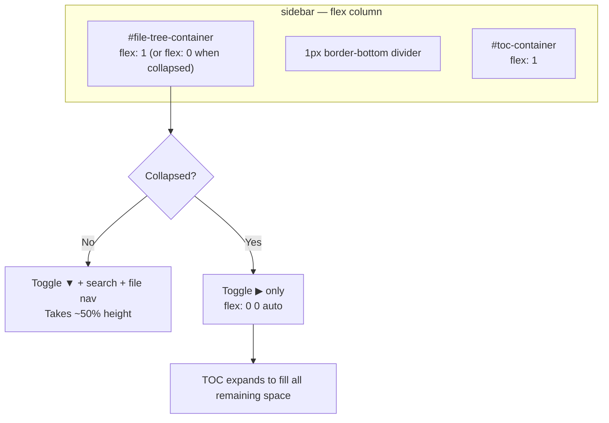

# Plan: Sidebar & Tab Navigation Redesign

## Overview

Two UI improvements: (1) show both file tree and table of contents in directory mode with a collapsible file tree section, and (2) replace the Edit/Preview tab buttons with a segmented pill toggle using icons — pencil + "Edit" and book + "Read".

**Includes**: Collapsible sidebar sections, dual-panel sidebar in folder mode, segmented tab toggle component, icon integration, persistence of collapse state

### Key Features
- **Dual sidebar in folder mode**: File tree and TOC both visible, stacked vertically with a divider
- **Collapsible file tree**: Click the "Files" header to collapse/expand; TOC expands to fill space
- **Segmented toggle**: Edit/Read tabs rendered as a pill-shaped toggle with icons (pencil/book)
- **"Read" label**: Preview renamed to "Read" to match the read-first philosophy
- **Collapse persistence**: File tree collapse state saved in localStorage

---

## Current Behavior

**Sidebar**:
1. In **file mode**: Only the TOC (`#toc-container`) is visible in the sidebar
2. In **folder mode**: `setFolderModeUI()` in `file-tree.js` (line 10-14) removes `hidden` from `#file-tree-container` and **adds** `hidden` to `#toc-container` — making them mutually exclusive
3. Users in folder mode lose the table of contents entirely

**Tab navigation**:
1. Two separate `<button>` elements with class `.tab-button` inside `.tab-group`
2. Text-only labels: "Edit" and "Preview"
3. Styled as individual rounded rectangles with 8px gap between them
4. Active state: blue border + blue text + soft blue background (`var(--accent)`, `var(--accent-soft)`)

## Proposed Behavior

**Sidebar**:
1. In **file mode**: No change — TOC is the only section visible
2. In **folder mode**: Both file tree and TOC are visible, stacked vertically
3. File tree section has a clickable header that collapses/expands the file tree content
4. When file tree is collapsed, only the "Files ▶" header shows; TOC gets all remaining space
5. When expanded, file tree takes up to 50% of sidebar height; TOC takes the rest
6. Collapse state persisted in `localStorage`

**Tab navigation**:
1. Edit and Read buttons are wrapped in a single pill-shaped container (segmented control)
2. Each segment has an SVG icon + text label: pencil + "Edit" and book + "Read"
3. The active segment has a white/light background that slides or snaps to indicate selection
4. The inactive segment is transparent with muted text
5. The pill container has a subtle border and background matching the tab nav bar

---

## User Story / Value Proposition

**Problem 1**: Users opening a folder of docs lose the table of contents. They can navigate files but can't see the structure of the current document. This is a regression from file mode UX.

**Problem 2**: The Edit/Preview buttons look disconnected — two separate rectangles. Modern editors use a cohesive segmented toggle that visually communicates "pick one of these two modes."

**User benefit**: Folder mode becomes fully featured with both navigation tools. The tab toggle looks polished and communicates the app's read-first philosophy with the "Read" label and book icon.

**Use cases**:
1. User opens a docs folder → sees file tree to navigate, TOC to jump within the current doc
2. User collapses the file tree to maximize TOC space while editing a long document
3. User glances at the tab toggle and immediately understands they're in Read or Edit mode

---

## Implementation Plan

### 1. Restructure Sidebar HTML for Dual Sections

**File**: `markdown_os/static/index.html`

**Changes**:
- Add a collapse toggle button to the file tree header
- Keep both containers visible in folder mode (JS change handles this)
- Add a visual divider between sections

**Code Location**: Lines 50-68 (sidebar)

**Current HTML**:
```html
<aside id="sidebar">
  <div id="file-tree-container" class="hidden">
    <div class="sidebar-header">
      <h3>Files</h3>
      <input ... />
    </div>
    <nav id="file-tree" role="tree"></nav>
  </div>

  <div id="toc-container">
    <h3>Contents</h3>
    <nav id="toc" role="navigation"></nav>
  </div>
</aside>
```

**New HTML**:
```html
<aside id="sidebar">
  <div id="file-tree-container" class="hidden">
    <button id="file-tree-toggle" class="sidebar-section-toggle" type="button" aria-expanded="true">
      <svg class="toggle-chevron" width="12" height="12" viewBox="0 0 12 12" fill="none" stroke="currentColor" stroke-width="2" stroke-linecap="round" stroke-linejoin="round">
        <polyline points="4 2 8 6 4 10"></polyline>
      </svg>
      <span>Files</span>
    </button>
    <div id="file-tree-collapsible" class="sidebar-collapsible">
      <div class="sidebar-header">
        <input
          type="text"
          id="file-tree-search"
          placeholder="Search files..."
          class="file-tree-search"
          aria-label="Search files"
        />
      </div>
      <nav id="file-tree" role="tree"></nav>
    </div>
  </div>

  <div id="toc-container">
    <h3>Contents</h3>
    <nav id="toc" role="navigation"></nav>
  </div>
</aside>
```

**Key changes**:
- "Files" heading replaced with a `<button>` toggle (`#file-tree-toggle`) containing a chevron SVG and label
- Search input and file tree nav wrapped in `#file-tree-collapsible` — this is what collapses/expands
- `<h3>Files</h3>` removed; the toggle button serves as the section header

**Rationale**: Using a `<button>` for the toggle is semantically correct and accessible (keyboard-focusable, screen readers announce it as a button with `aria-expanded`). The collapsible wrapper makes it easy to show/hide the contents without affecting the toggle header.

---

### 2. Replace Tab Buttons with Segmented Toggle

**File**: `markdown_os/static/index.html`

**Changes**:
- Replace `.tab-group` content with a segmented control container
- Each segment includes an SVG icon and text label
- "Preview" renamed to "Read"

**Code Location**: Lines 72-76 (tab-group)

**Current HTML**:
```html
<div class="tab-group">
  <button id="edit-tab" class="tab-button" type="button">Edit</button>
  <button id="preview-tab" class="tab-button active" type="button">Preview</button>
</div>
```

**New HTML**:
```html
<div class="tab-group">
  <div class="tab-toggle">
    <button id="edit-tab" class="tab-toggle-button" type="button">
      <svg width="14" height="14" viewBox="0 0 24 24" fill="none" stroke="currentColor" stroke-width="2" stroke-linecap="round" stroke-linejoin="round">
        <path d="M17 3a2.828 2.828 0 1 1 4 4L7.5 20.5 2 22l1.5-5.5L17 3z"></path>
      </svg>
      <span>Edit</span>
    </button>
    <button id="preview-tab" class="tab-toggle-button active" type="button">
      <svg width="14" height="14" viewBox="0 0 24 24" fill="none" stroke="currentColor" stroke-width="2" stroke-linecap="round" stroke-linejoin="round">
        <path d="M2 3h6a4 4 0 0 1 4 4v14a3 3 0 0 0-3-3H2z"></path>
        <path d="M22 3h-6a4 4 0 0 0-4 4v14a3 3 0 0 1 3-3h7z"></path>
      </svg>
      <span>Read</span>
    </button>
  </div>
</div>
```

**SVG choices**:
- **Edit**: Pencil icon (Feather `edit-2`) — a simple pencil at 45°
- **Read**: Open book icon (Feather `book-open`) — two open pages

**Rationale**: The icons are from the Feather icon set (same family as existing theme toggle icons). "Read" instead of "Preview" matches the project's read-first workflow philosophy and the user's mockup. The `.tab-toggle` wrapper provides the pill container for shared styling.

---

### 3. Style the Segmented Toggle

**File**: `markdown_os/static/css/styles.css`

**Changes**:
- Add new CSS variables for the toggle background
- Replace `.tab-group` / `.tab-button` styles with `.tab-toggle` / `.tab-toggle-button` styles
- The toggle has a pill-shaped container with a subtle background; the active button gets an elevated white/dark background

**Code Location**: Replace styles at lines 358-408

**New CSS variables** (add to `:root` after line 20):
```css
--tab-toggle-bg: #e8ecf2;
--tab-toggle-active-bg: #ffffff;
--tab-toggle-active-shadow: 0 1px 3px rgba(0, 0, 0, 0.08);
```

**Dark theme** (add after line 70):
```css
--tab-toggle-bg: #1e293b;
--tab-toggle-active-bg: #334155;
--tab-toggle-active-shadow: 0 1px 3px rgba(0, 0, 0, 0.3);
```

**New styles** (replacing `.tab-group` and `.tab-button` rules):
```css
.tab-toggle {
  display: inline-flex;
  background: var(--tab-toggle-bg);
  border-radius: 8px;
  padding: 3px;
  gap: 2px;
}

.tab-toggle-button {
  display: inline-flex;
  align-items: center;
  gap: 5px;
  border: none;
  color: var(--text-muted);
  background: transparent;
  border-radius: 6px;
  font-size: 13px;
  padding: 6px 12px;
  cursor: pointer;
  transition:
    color 0.15s ease,
    background-color 0.15s ease,
    box-shadow 0.15s ease;
}

.tab-toggle-button:hover {
  color: var(--text);
}

.tab-toggle-button.active {
  color: var(--text);
  background: var(--tab-toggle-active-bg);
  box-shadow: var(--tab-toggle-active-shadow);
  font-weight: 500;
}

.tab-toggle-button svg {
  flex-shrink: 0;
  opacity: 0.6;
}

.tab-toggle-button.active svg {
  opacity: 1;
}
```

**Rationale**: This matches the reference image — a pill-shaped gray container with the active segment popping out as a white card with a subtle shadow. The design is intentionally neutral (not accent-colored) so it doesn't compete with the content. `font-weight: 500` on active gives a subtle visual emphasis. Icon opacity dims on inactive to reduce visual noise.

---

### 4. Style the Collapsible Sidebar Sections

**File**: `markdown_os/static/css/styles.css`

**Changes**:
- Add styles for `.sidebar-section-toggle`, `.sidebar-collapsible`, and chevron rotation
- Adjust `#file-tree-container` and `#toc-container` flex behavior for coexistence
- Add a divider between sections

**New CSS** (add after `#file-tree-container` rules, ~line 230):
```css
.sidebar-section-toggle {
  display: flex;
  align-items: center;
  gap: 6px;
  width: 100%;
  border: none;
  background: none;
  padding: 4px 2px;
  margin-bottom: 8px;
  font-size: 14px;
  font-weight: 500;
  color: var(--text-muted);
  letter-spacing: 0.02em;
  cursor: pointer;
  border-radius: 4px;
  transition: color 0.15s ease;
}

.sidebar-section-toggle:hover {
  color: var(--text);
}

.toggle-chevron {
  transition: transform 0.2s ease;
  flex-shrink: 0;
}

.sidebar-section-toggle[aria-expanded="true"] .toggle-chevron {
  transform: rotate(90deg);
}

.sidebar-collapsible {
  display: flex;
  flex-direction: column;
  flex: 1;
  min-height: 0;
  overflow: hidden;
}

.sidebar-collapsible.collapsed {
  display: none;
}

#file-tree-container.collapsed {
  flex: 0 0 auto;
}
```

**Modify existing `#file-tree-container`** (line 225-230) — add border-bottom divider:
```css
#file-tree-container {
  min-height: 0;
  display: flex;
  flex-direction: column;
  flex: 1;
  border-bottom: 1px solid var(--border);
  padding-bottom: 12px;
  margin-bottom: 12px;
}
```

**Rationale**: When both sections are visible, the file tree section gets `flex: 1` and TOC gets `flex: 1` — splitting the sidebar roughly 50/50. When file tree is collapsed, it shrinks to just the toggle header (`flex: 0 0 auto`) and TOC takes all remaining space. The chevron rotation (▶ → ▼) is a familiar collapse indicator. The `border-bottom` divider only appears in folder mode since `#file-tree-container` is hidden in file mode.

---

### 5. Add File Tree Collapse Logic

**File**: `markdown_os/static/js/file-tree.js`

**Changes**:
- Update `setFolderModeUI()` to show BOTH file tree and TOC (remove the line that hides TOC)
- Add collapse/expand/toggle functions for `#file-tree-toggle`
- Persist collapse state in `localStorage`
- Restore collapse state on load

**Code Location**: `setFolderModeUI()` at line 10-14, new functions after

**Updated `setFolderModeUI()`**:
```javascript
function setFolderModeUI() {
  document.getElementById("file-tree-container")?.classList.remove("hidden");
  // REMOVED: document.getElementById("toc-container")?.classList.add("hidden");
  document.getElementById("current-file-path")?.classList.remove("hidden");
  restoreFileTreeCollapseState();
}
```

**New functions**:
```javascript
const COLLAPSE_KEY = "markdown-os-file-tree-collapsed";

function restoreFileTreeCollapseState() {
  let collapsed = false;
  try {
    collapsed = window.localStorage.getItem(COLLAPSE_KEY) === "true";
  } catch (_error) {
    collapsed = false;
  }

  if (collapsed) {
    collapseFileTree();
  }
}

function collapseFileTree() {
  const toggle = document.getElementById("file-tree-toggle");
  const collapsible = document.getElementById("file-tree-collapsible");
  const container = document.getElementById("file-tree-container");
  if (!toggle || !collapsible || !container) return;

  toggle.setAttribute("aria-expanded", "false");
  collapsible.classList.add("collapsed");
  container.classList.add("collapsed");
}

function expandFileTree() {
  const toggle = document.getElementById("file-tree-toggle");
  const collapsible = document.getElementById("file-tree-collapsible");
  const container = document.getElementById("file-tree-container");
  if (!toggle || !collapsible || !container) return;

  toggle.setAttribute("aria-expanded", "true");
  collapsible.classList.remove("collapsed");
  container.classList.remove("collapsed");
}

function toggleFileTreeCollapse() {
  const toggle = document.getElementById("file-tree-toggle");
  if (!toggle) return;

  const isExpanded = toggle.getAttribute("aria-expanded") === "true";
  if (isExpanded) {
    collapseFileTree();
  } else {
    expandFileTree();
  }

  try {
    window.localStorage.setItem(COLLAPSE_KEY, String(!isExpanded));
  } catch (_error) {
    // Ignore storage errors
  }
}
```

**Event binding** (add in the initialization section):
```javascript
document.getElementById("file-tree-toggle")?.addEventListener("click", toggleFileTreeCollapse);
```

**Rationale**: The pattern mirrors the existing theme persistence approach — `localStorage` with try/catch for safety. The collapse state uses `aria-expanded` for accessibility and CSS class toggling for visual state. Three separate functions (collapse/expand/toggle) keep logic clear and testable.

---

### 6. No Changes to Tab Switching Logic

**File**: `markdown_os/static/js/editor.js`

**Changes**: None required.

The `switchToTab()` function references `editTab` and `previewTab` by element ID — those IDs stay the same (`#edit-tab`, `#preview-tab`). The function only adds/removes the `active` class, which works regardless of the element's base class (`tab-button` → `tab-toggle-button`). Event listeners are bound by ID reference, not by class selector.

**Rationale**: The tab switching logic is fully decoupled from visual styling. Zero JS changes in editor.js.

---

## Architecture / Flow Diagram

### Sidebar Layout in Folder Mode



### Tab Toggle Visual

```
Pill container (gray background, rounded):
┌──────────────────────────────────────┐
│  ┌────────────┐ ┌─────────────────┐  │
│  │ ✏️ Edit    │ │ 📖 Read  ▓▓▓▓  │  │
│  └────────────┘ └─────────────────┘  │
└──────────────────────────────────────┘
     muted text     active: white bg
                    + shadow + bold
```

---

## Edge Cases to Handle

#### Case 1: File mode — sidebar has no file tree
- **Scenario**: User opens a single file with `markdown-os open notes.md`
- **Expected behavior**: Sidebar shows only TOC. No file tree toggle, divider, or collapsible section visible.
- **Implementation note**: `#file-tree-container` stays `hidden` in file mode. The `border-bottom` on it is not visible when the element is hidden via `display: none`.

#### Case 2: Folder mode with no headings in the current file
- **Scenario**: User opens a file that has no headings (no TOC content)
- **Expected behavior**: TOC section shows "Contents" header with empty nav. File tree still works above.
- **Implementation note**: No special handling needed — TOC already handles empty heading lists gracefully.

#### Case 3: Very long file tree + long TOC
- **Scenario**: 50+ files in directory, document has 20+ headings
- **Expected behavior**: Both sections are independently scrollable within their flex containers
- **Implementation note**: Both `#file-tree` and `#toc` already have `overflow: auto` — each scrolls independently.

#### Case 4: Collapse state restoration on page reload
- **Scenario**: User collapses file tree, refreshes page
- **Expected behavior**: File tree stays collapsed (restored from localStorage)
- **Implementation note**: `restoreFileTreeCollapseState()` runs inside `setFolderModeUI()` which is called during initialization.

#### Case 5: Responsive layout (< 980px viewport)
- **Scenario**: Small viewport stacks sidebar above main content
- **Expected behavior**: Sidebar stacks with max-height 30vh. Both file tree and TOC visible but space-constrained. Collapsing the file tree is especially useful here.
- **Implementation note**: Existing media query handles sidebar stacking. No additional responsive changes needed.

#### Case 6: Keyboard accessibility
- **Scenario**: User navigates with Tab key, presses Enter/Space on file tree toggle or tab buttons
- **Expected behavior**: All interactive elements work with keyboard
- **Implementation note**: `<button>` elements are natively keyboard-focusable. `aria-expanded` communicates collapse state to screen readers.

---

## Testing Considerations

**Manual Tests**:

**Sidebar — File Mode:**
1. Open a single file → sidebar shows only TOC, no file tree section or divider

**Sidebar — Folder Mode:**
2. Open a directory → sidebar shows file tree on top, divider, TOC on bottom
3. Click a file in tree → TOC updates with that file's headings
4. Click TOC heading → preview scrolls to that section
5. Click "Files" toggle → file tree collapses, chevron rotates to ▶, TOC expands to full height
6. Click again → file tree expands, chevron rotates to ▼, layout returns to 50/50
7. Collapse file tree → refresh page → file tree stays collapsed
8. Expand file tree → refresh page → file tree stays expanded

**Tab Toggle:**
9. Page loads → "Read" tab is active (white background, bold, book icon visible)
10. Click "Edit" → pencil icon + "Edit" becomes active, "Read" becomes muted
11. Click "Read" → book icon + "Read" becomes active, save/conflict flow works as before
12. Toggle dark mode → tab toggle adapts colors correctly
13. Verify tab toggle works with keyboard (Tab to focus, Enter to activate)

**Responsive:**
14. Resize to < 980px → sidebar stacks above content, both sections still visible

---

## Files to Modify

| File | Changes |
|------|---------|
| `markdown_os/static/index.html` | • Restructure sidebar with `#file-tree-toggle` button and `#file-tree-collapsible` wrapper<br>• Replace tab buttons with `.tab-toggle` segmented control + SVG icons<br>• Rename "Preview" to "Read" |
| `markdown_os/static/css/styles.css` | • Add CSS variables for toggle bg/shadow (light + dark)<br>• Add `.tab-toggle` / `.tab-toggle-button` styles<br>• Add `.sidebar-section-toggle` / `.sidebar-collapsible` / `.collapsed` styles<br>• Update `#file-tree-container` with `border-bottom` divider<br>• Remove old `.tab-button` styles |
| `markdown_os/static/js/file-tree.js` | • Remove TOC-hiding line from `setFolderModeUI()`<br>• Add `collapseFileTree()` / `expandFileTree()` / `toggleFileTreeCollapse()` functions<br>• Add localStorage persistence (`markdown-os-file-tree-collapsed`)<br>• Add `restoreFileTreeCollapseState()` call in `setFolderModeUI()`<br>• Bind click handler on `#file-tree-toggle` |
| `markdown_os/static/js/editor.js` | • No changes needed (element IDs and `active` class toggle unchanged) |

---

## Decisions / Open Questions

### Q1: Should the TOC also be collapsible? ✅
**Options**:
- **Option A**: Only file tree is collapsible
- **Option B**: Both file tree and TOC are collapsible

**Decision**: Option A — only the file tree collapses. The TOC is always visible because it's the primary navigation tool (read-first workflow). Users can collapse the file tree to give TOC more room. Making both collapsible adds complexity and risks the sidebar being fully collapsed (useless).

### Q2: What split ratio for file tree vs TOC? ✅
**Options**:
- **Option A**: 50/50 split (both `flex: 1`)
- **Option B**: File tree gets more space (60/40)
- **Option C**: File tree has a max-height, TOC gets the rest

**Decision**: Option A — equal 50/50 split via `flex: 1` on both. This is the simplest approach and works well for typical doc projects. Users who need more TOC space can collapse the file tree.

### Q3: Tab toggle — accent colored or neutral? ✅
**Options**:
- **Option A**: Neutral (gray container, white active bg) — matches reference image
- **Option B**: Accent colored (blue active bg) — matches current tab style

**Decision**: Option A — neutral design matching the reference images. The active segment uses a white (light) / `#334155` (dark) background with a subtle shadow to pop out of the gray container. This is less distracting than the current accent-blue active state and matches segmented control conventions.

### Q4: What happens to the old `.tab-button` class? ✅
**Decision**: Remove it entirely and replace with `.tab-toggle-button`. No other elements use `.tab-button`.

---

## Implementation Checklist

### Phase 1: Segmented Tab Toggle
- [ ] Add CSS variables for toggle bg/shadow (light + dark themes)
- [ ] Replace `.tab-group` inner HTML with `.tab-toggle` segmented control
- [ ] Add pencil SVG icon to Edit button
- [ ] Add book-open SVG icon to Read button
- [ ] Rename "Preview" to "Read" in HTML
- [ ] Add `.tab-toggle` and `.tab-toggle-button` CSS styles
- [ ] Remove old `.tab-button` CSS styles
- [ ] Verify tab switching still works (no JS changes expected)

### Phase 2: Collapsible Sidebar Sections
- [ ] Restructure sidebar HTML: add `#file-tree-toggle` button, `#file-tree-collapsible` wrapper
- [ ] Add chevron SVG to toggle button
- [ ] Add `.sidebar-section-toggle`, `.sidebar-collapsible`, `.collapsed` CSS styles
- [ ] Add `border-bottom` divider to `#file-tree-container`
- [ ] Add `#file-tree-container.collapsed` style (`flex: 0 0 auto`)
- [ ] Remove `toc-container` hiding from `setFolderModeUI()` in `file-tree.js`
- [ ] Add `collapseFileTree()`, `expandFileTree()`, `toggleFileTreeCollapse()` to `file-tree.js`
- [ ] Add localStorage persistence (`markdown-os-file-tree-collapsed`)
- [ ] Add `restoreFileTreeCollapseState()` call in `setFolderModeUI()`
- [ ] Bind click handler on `#file-tree-toggle`

### Phase 3: Testing
- [ ] Test file mode — only TOC visible, no divider
- [ ] Test folder mode — both sections visible with divider
- [ ] Test collapse/expand file tree + chevron rotation
- [ ] Test localStorage persistence across reloads
- [ ] Test tab toggle switching (Edit ↔ Read)
- [ ] Test dark mode for both components
- [ ] Test keyboard accessibility (Tab + Enter on toggle and tabs)
- [ ] Test responsive layout (< 980px)

---

## Estimated Timeline

- **Phase 1**: ~30 minutes (HTML + CSS for tab toggle)
- **Phase 2**: ~45 minutes (HTML restructure + CSS + JS collapse logic)
- **Phase 3**: ~15 minutes (manual testing across modes and themes)

**Total**: ~1.5 hours

---

## Success Criteria

### Sidebar
✅ Folder mode shows both file tree and TOC simultaneously
✅ File tree collapses/expands on header click with chevron indicator
✅ Collapse state persists across page reloads via localStorage
✅ TOC expands to fill available space when file tree is collapsed
✅ File mode is unchanged — only TOC visible, no file tree section
✅ Both sections scroll independently when content overflows

### Tab Toggle
✅ Segmented pill toggle with pencil + "Edit" and book + "Read"
✅ Active segment has elevated background with subtle shadow
✅ Inactive segment has transparent background with muted text
✅ Tab switching logic unchanged — save/conflict flow still works
✅ "Preview" renamed to "Read" in the UI

### Visual Quality
✅ Toggle and sidebar match the reference designs provided
✅ Smooth transitions on collapse and tab switch (0.15-0.2s)
✅ Both light and dark themes render correctly
✅ Responsive layout works at < 980px viewport
✅ Keyboard navigation works for both toggle and sidebar collapse

---

## Rollout Considerations

**Breaking Changes**:
- CSS class `.tab-button` is removed — replaced with `.tab-toggle-button`. Internal-only change, no user impact expected.
- "Preview" text replaced with "Read" — users will see the label change immediately.

**Migration Notes**:
- No data migration needed.
- localStorage adds one new key: `markdown-os-file-tree-collapsed`.

**Documentation Updates**:
- CLAUDE.md should update the "Frontend" section to note the segmented toggle and collapsible sidebar.
- The "Auto-save and Mode Behavior" section references to "Preview" should be updated to "Read".
