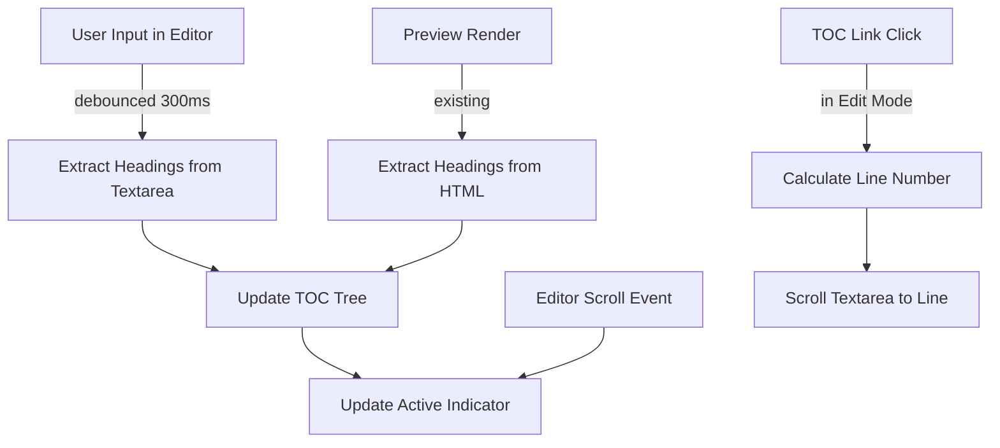

# Feature Plan: Unified TOC Navigation

## Overview

Enable the table of contents to work seamlessly in both Edit and Preview modes. Currently, TOC only functions when viewing the Preview tab. This feature will add real-time heading extraction from the editor textarea, synchronize TOC highlighting with scroll position in edit mode, and allow TOC clicks to jump to the corresponding line number in the editor.

**Key Features:**
- Real-time heading extraction from editor textarea content
- TOC navigation works in both Edit and Preview modes
- TOC links jump to corresponding line numbers in editor
- Scroll synchronization shows which heading is currently visible
- Consistent active indicator behavior across both modes

## Current Behavior

### TOC in Preview Mode
- `toc.js` extracts headings from rendered HTML (`#markdown-preview h1, h2, h3, h4, h5, h6`)
- Builds a nested tree structure with proper heading hierarchy
- Generates unique IDs using `slugifyHeading()` function
- Scroll events on `#preview-container` update the active TOC link
- TOC links use smooth scroll to headings

### TOC in Edit Mode
- **Currently not functional**
- Heading content is plain text in the editor textarea, not rendered HTML
- No heading extraction or parsing happens in edit mode
- TOC doesn't update when editor content changes
- TOC links have no target to scroll to

### Key Components
- **toc.js** (lines 1-156): Contains all TOC logic
  - `generateTOC()`: Main entry point called from `markdown.js` after rendering
  - `addHeadingIds()`: Assigns unique IDs to heading elements
  - `createTOCTree()`: Builds hierarchical UL/LI structure
  - `bindTOCLinkHandlers()`: Binds click handlers to TOC links
  - `updateActiveTOCItem()`: Updates `.active` class based on scroll position
  - `ensureScrollBinding()`: Attaches scroll listener once

- **markdown.js** (line 575): Calls `window.generateTOC()` after rendering markdown
- **editor.js** (line 348-363): Watches editor for input changes but doesn't trigger TOC updates

## User Story / Value Proposition

### Problem
Users working in Edit mode lose navigation context. The TOC sidebar becomes a non-interactive list, forcing users to manually search for sections. This creates friction when working with larger documents or switching between edit and preview modes frequently.

### User Benefit
Unified TOC navigation provides consistent discoverability across modes. Users can:
- Navigate large documents in edit mode without switching to preview
- Click TOC links to jump to sections while editing
- See which section they're currently editing highlighted in the sidebar
- Maintain context and orientation during extended editing sessions

### Use Cases
1. **Large Document Navigation**: User editing a 100-section specification wants to jump to section 45 without scrolling through 40+ sections
2. **Cross-section Editing**: User comparing content between distant sections switches between them using TOC clicks
3. **Structure Verification**: User ensures heading hierarchy is correct by watching TOC update as they type
4. **Mode-Agnostic Workflow**: User switches between edit and preview modes without losing their place, TOC always shows context

## Proposed Behavior

### Edit Mode Behavior
**When user is in Edit mode (`#editor-container` is active):**
- TOC updates in real-time as the user types (debounced, ~300ms after last keystroke)
- Clicking a TOC link scrolls the textarea to that heading's line number
- As the user scrolls in the textarea, the TOC active indicator follows their scroll position
- TOC shows all headings present in the editor content (including unsaved changes)

**Active Indicator Behavior:**
- The TOC link corresponding to the heading at the top of the viewport is marked `.active`
- As user scrolls past headings, the active indicator updates smoothly
- Threshold: A heading is considered "in view" if its line is within ~100 pixels from textarea top

### Preview Mode Behavior
**No change to existing behavior:**
- Current TOC functionality remains unchanged
- Headings extracted from rendered HTML
- Scroll synchronization works as before

### Mode Transition Behavior
**When switching from Edit → Preview:**
- Existing save/conflict logic applies
- TOC remains visible and functional
- If same content, TOC will show the same headings (just extracted from rendered HTML instead of raw markdown)

**When switching from Preview → Edit:**
- TOC updates to show headings from current editor content
- TOC remains visible and functional

## Proposed Solution

### Architecture Overview



### Implementation Plan

### 1. Add Edit Mode Heading Extraction

**File**: `markdown_os/static/js/toc.js`

**Changes**:
- Add function to extract headings from raw markdown text (editor content)
- Parse markdown heading syntax (`^#+\s+`) using regex
- Build heading list with: text content, level, and line number
- Handle edge cases: setext headings (underline style), headings in code blocks

**Code Location**: After `slugifyHeading()` function (~line 15)

**Example Code**:
```javascript
function extractHeadingsFromMarkdown(content) {
  if (!content) return [];

  const lines = content.split('\n');
  const headings = [];
  let inCodeBlock = false;

  lines.forEach((line, lineNumber) => {
    // Track code block state
    if (line.match(/^```/)) {
      inCodeBlock = !inCodeBlock;
      return;
    }

    if (inCodeBlock) return;

    // ATX-style headings: # Heading
    const match = line.match(/^(#+)\s+(.+)$/);
    if (match) {
      const level = match[1].length;
      const text = match[2].trim();
      headings.push({
        text,
        level,
        lineNumber,
        type: 'atx'
      });
    }
  });

  return headings;
}
```

**Rationale**:
- Regex matching is simple and fast for markdown parsing
- Line numbers are stored directly for textarea scrolling
- Code block detection prevents false positives from markdown in code blocks
- Setext-style headings are less common; MVP can start with ATX-style only

#### Q1: Should we support setext-style headings (underline with = or -)? ✅

**Options**:
- **Option A** (MVP): Only support ATX-style (`# Heading`). Simpler implementation, covers 95%+ of use cases.
- **Option B**: Support both ATX and setext. More complete but adds complexity to line-by-line parsing.

**Decision**: Option A - Only support ATX-style headings for MVP. Setext-style headings are rarely used and can be added later if needed.

---

### 2. Extend `generateTOC()` for Edit Mode

**File**: `markdown_os/static/js/toc.js`

**Changes**:
- Detect which mode is currently active
- Branch logic: use `extractHeadingsFromMarkdown()` for edit, existing HTML extraction for preview
- Update `tocState` with mode and source information
- Call same TOC rendering pipeline regardless of source

**Code Location**: `generateTOC()` function (~line 128)

**Example Code**:
```javascript
function generateTOC() {
  const preview = document.getElementById("markdown-preview");
  const toc = document.getElementById("toc");
  if (!toc) return;

  const editorContainer = document.getElementById("editor-container");
  const previewContainer = document.getElementById("preview-container");
  const isEditMode = editorContainer?.classList.contains("active");

  let headings = [];

  if (isEditMode) {
    const editor = document.getElementById("markdown-editor");
    headings = extractHeadingsFromMarkdown(editor?.value || "");
    tocState.mode = 'edit';
  } else if (preview) {
    headings = Array.from(preview.querySelectorAll("h1, h2, h3, h4, h5, h6"));
    tocState.mode = 'preview';
  }

  if (headings.length === 0) {
    toc.innerHTML = "<p>No headings</p>";
    tocState.headings = [];
    return;
  }

  // Rest of existing logic...
  addHeadingIds(headings);
  tocState.headings = headings;
  const tocTree = createTOCTree(headings);
  // ... etc
}
```

**Rationale**:
- Single function handles both modes, reducing duplication
- Mode tracking in `tocState` enables mode-specific scroll binding later
- Reuses existing TOC rendering and ID generation

---

### 3. Update `createTOCTree()` to Handle Markdown Headings

**File**: `markdown_os/static/js/toc.js`

**Changes**:
- Modify to work with both heading elements (objects with `id` property) and markdown heading objects (with `text`, `level`, `lineNumber`)
- Extract heading level and text in a mode-agnostic way
- Store `lineNumber` in link data attribute for edit mode scrolling

**Code Location**: `createTOCTree()` function (~line 29)

**Example Code**:
```javascript
function createTOCTree(headings) {
  const rootList = document.createElement("ul");
  rootList.className = "root-list";

  const listStack = [rootList];
  let currentLevel = 1;
  let lastItem = null;

  headings.forEach((heading) => {
    // Handle both DOM elements and markdown heading objects
    const level = heading.level !== undefined
      ? heading.level
      : Number(heading.tagName.replace("H", "")) || 1;

    const text = heading.text !== undefined
      ? heading.text
      : (heading.textContent || heading.id || "");

    const id = heading.id || slugifyHeading(text);
    const lineNumber = heading.lineNumber;

    // ... existing level navigation logic ...

    const item = document.createElement("li");
    const link = document.createElement("a");
    link.href = `#${id}`;
    link.dataset.targetId = id;
    link.textContent = text;

    if (lineNumber !== undefined) {
      link.dataset.lineNumber = lineNumber;
    }

    item.appendChild(link);
    listStack[listStack.length - 1].appendChild(item);
    lastItem = item;
    currentLevel = level;
  });

  return rootList;
}
```

**Rationale**:
- Polymorphic design handles both heading sources without branching
- Line numbers stored in data attribute for edit mode handler retrieval
- Maintains backwards compatibility with preview mode

---

### 4. Add Edit Mode Scroll Handler

**File**: `markdown_os/static/js/toc.js`

**Changes**:
- Add `updateActiveTOCItemForEdit()` function for textarea scroll events
- Calculate which heading is visible by checking line numbers against scroll position
- Use textarea's line height and scroll offset to determine visible region
- Update `.active` class on corresponding TOC link

**Code Location**: After `updateActiveTOCItem()` function (~line 110)

**Example Code**:
```javascript
function updateActiveTOCItemForEdit() {
  const editor = document.getElementById("markdown-editor");
  if (!editor || tocState.headings.length === 0) return;

  // Get the scroll position in terms of line number
  const scrollTop = editor.scrollTop;
  const lineHeight = parseInt(window.getComputedStyle(editor).lineHeight, 10);

  // Estimate which line is at the top of the viewport
  // This is approximate; a more accurate method would use textarea's internal layout
  const visibleTopLine = Math.floor(scrollTop / lineHeight);

  // Find the last heading before or at the visible line
  let activeHeadingId = null;
  tocState.headings.forEach((heading) => {
    if (heading.lineNumber <= visibleTopLine + 5) {
      // +5 threshold: consider heading active while within ~5 lines of top
      activeHeadingId = heading.id;
    }
  });

  // Update active indicator
  document.querySelectorAll("#toc a[data-target-id]").forEach((link) => {
    if (link.dataset.targetId === activeHeadingId) {
      link.classList.add("active");
    } else {
      link.classList.remove("active");
    }
  });
}
```

**Rationale**:
- Textarea scroll events are cheaper than DOM queries
- Line-based calculation (not pixel-based) works reliably with variable font sizes
- Threshold (+5 lines) prevents jerky active indicator as user scrolls
- Separate from preview handler to avoid branching in hot path

#### Q2: How to accurately map textarea scroll position to line number? ✅

**Options**:
- **Option A** (Current): Use `lineHeight × (scrollTop / lineHeight)` approximation. Fast, mostly accurate, may jitter on wrapped content.
- **Option B**: Parse textarea selection properties and calculate line count. More accurate but slower.
- **Option C**: Use `textareaElement.value.substring(0, selectionStart).split('\n').length`. Only works for cursor position, not scroll.

**Decision**: Option A - Use the fast approximation. It's good enough for typical documents and can be optimized later if jitter issues arise.

---

### 5. Add Edit Mode TOC Link Handler

**File**: `markdown_os/static/js/toc.js`

**Changes**:
- Modify `bindTOCLinkHandlers()` to detect mode and branch behavior
- For edit mode: scroll textarea to heading's line number instead of smooth-scrolling to element
- Use `textarea.setSelectionRange()` or manual scroll calculation

**Code Location**: `bindTOCLinkHandlers()` function (~line 66)

**Example Code**:
```javascript
function bindTOCLinkHandlers() {
  const links = document.querySelectorAll("#toc a[data-target-id]");
  links.forEach((link) => {
    link.addEventListener("click", (event) => {
      event.preventDefault();

      const isEditMode = tocState.mode === 'edit';
      const targetId = link.dataset.targetId;
      const lineNumber = parseInt(link.dataset.lineNumber || "-1", 10);

      if (isEditMode && lineNumber >= 0) {
        // Edit mode: scroll textarea to line
        const editor = document.getElementById("markdown-editor");
        if (!editor) return;

        const lines = editor.value.split('\n');
        let charOffset = 0;
        for (let i = 0; i < lineNumber && i < lines.length; i++) {
          charOffset += lines[i].length + 1; // +1 for newline
        }

        editor.focus();
        editor.setSelectionRange(charOffset, charOffset);
        scrollTextareaToLine(editor, lineNumber);
      } else {
        // Preview mode: scroll to heading element
        const heading = document.getElementById(targetId);
        if (!heading) return;

        heading.scrollIntoView({
          behavior: "smooth",
          block: "start",
        });
      }
    });
  });
}

function scrollTextareaToLine(textarea, lineNumber) {
  const lineHeight = parseInt(window.getComputedStyle(textarea).lineHeight, 10);
  const scrollTop = lineNumber * lineHeight;
  textarea.scrollTop = scrollTop;
}
```

**Rationale**:
- `setSelectionRange()` places cursor at heading line for visual clarity
- Manual scroll calculation ensures heading is in viewport
- Branching is minimal and clear

---

### 6. Wire Up Editor Input Events

**File**: `markdown_os/static/js/editor.js`

**Changes**:
- Modify `onEditorInput()` function to trigger TOC update
- Debounce TOC generation (~300ms) to avoid excessive recalculation
- Reuse existing debounce mechanism from autosave logic

**Code Location**: `onEditorInput()` function (~line 348)

**Example Code**:
```javascript
// Add at module level near editorState definition
const tocUpdateState = {
  timeout: null,
};

function queueTOCUpdate() {
  if (tocUpdateState.timeout) {
    window.clearTimeout(tocUpdateState.timeout);
  }

  tocUpdateState.timeout = window.setTimeout(() => {
    if (typeof window.generateTOC === 'function') {
      window.generateTOC();
    }
  }, 300);
}

// In onEditorInput() function
function onEditorInput() {
  const editor = document.getElementById("markdown-editor");
  if (!editor) return;

  // Existing logic...
  if (editorState.mode === "folder" && !editorState.currentFilePath) {
    setSaveStatus("Select a file", "error");
    return;
  }

  if (editor.value !== editorState.lastSavedContent) {
    setSaveStatus("Unsaved changes");
    queueAutosave();
    queueTOCUpdate();  // <- NEW
  }
}
```

**Rationale**:
- Debouncing prevents TOC update on every keystroke (expensive DOM operations)
- 300ms delay is imperceptible to user but groups rapid edits
- Integrates naturally with existing autosave pattern
- Reuses module state management pattern

---

### 7. Update Scroll Event Binding for Edit Mode

**File**: `markdown_os/static/js/toc.js`

**Changes**:
- Modify `ensureScrollBinding()` to bind editor scroll events when in edit mode
- Store separate flags for preview and edit scroll binding
- Bind only the appropriate handler based on current mode

**Code Location**: `ensureScrollBinding()` function (~line 112)

**Example Code**:
```javascript
function ensureScrollBinding() {
  const editorContainer = document.getElementById("editor-container");
  const previewContainer = document.getElementById("preview-container");
  const isEditMode = editorContainer?.classList.contains("active");

  if (isEditMode) {
    const editor = document.getElementById("markdown-editor");
    if (!editor || tocState.editScrollBound) return;

    editor.addEventListener("scroll", updateActiveTOCItemForEdit, {
      passive: true,
    });
    tocState.editScrollBound = true;
  } else {
    if (!previewContainer || tocState.previewScrollBound) return;

    previewContainer.addEventListener("scroll", updateActiveTOCItem, {
      passive: true,
    });
    tocState.previewScrollBound = true;
  }
}
```

**Rationale**:
- Scroll listeners can accumulate if not tracked carefully
- Separate flags prevent duplicate event listeners
- Passive event listeners improve scroll performance

---

### 8. Trigger TOC Update on Tab Switch

**File**: `markdown_os/static/js/editor.js`

**Changes**:
- Call `window.generateTOC()` after tab switch completes
- Ensures TOC is fresh when switching to edit mode
- Let existing markdown render update it for preview mode

**Code Location**: `switchToTab()` function (~line 230)

**Example Code**:
```javascript
async function switchToTab(tabName) {
  const editTab = document.getElementById("edit-tab");
  const previewTab = document.getElementById("preview-tab");
  const editorContainer = document.getElementById("editor-container");
  const previewContainer = document.getElementById("preview-container");
  const editor = document.getElementById("markdown-editor");

  if (!editTab || !previewTab || !editorContainer || !previewContainer || !editor) {
    return;
  }

  if (tabName === "edit") {
    editTab.classList.add("active");
    previewTab.classList.remove("active");
    editorContainer.classList.add("active");
    previewContainer.classList.remove("active");
    editorState.isEditMode = true;

    // Update TOC for edit mode
    if (typeof window.generateTOC === 'function') {
      window.generateTOC();
    }
    return;
  }

  // ... rest of preview tab logic ...

  editTab.classList.remove("active");
  previewTab.classList.add("active");
  editorContainer.classList.remove("active");
  previewContainer.classList.add("active");
  editorState.isEditMode = false;

  // NEW: Scroll preview to match editor's current position
  await window.renderMarkdown(editor.value);
  if (typeof window.syncPreviewScroll === 'function') {
    window.syncPreviewScroll();
  }
  // renderMarkdown already calls generateTOC
}
```

**Rationale**:
- Ensures TOC is current when entering edit mode
- Preview mode's existing `renderMarkdown()` call handles it
- Minimal change to existing flow
- Scroll sync is called after rendering to ensure headings exist in DOM

---

### 9. Implement Scroll Synchronization

**File**: `markdown_os/static/js/toc.js`

**Changes**:
- Add `syncPreviewScroll()` function to synchronize preview scroll position with editor position
- Calculate which heading is visible in editor using line number
- Find corresponding heading element in preview and scroll to it
- Expose function globally for editor.js to call

**Code Location**: After `bindTOCLinkHandlers()` function (~line 87)

**Example Code**:
```javascript
function syncPreviewScroll() {
  const editor = document.getElementById("markdown-editor");
  const previewContainer = document.getElementById("preview-container");

  if (!editor || !previewContainer || tocState.headings.length === 0) {
    return;
  }

  // Calculate current visible line in editor
  const lineHeight = parseInt(window.getComputedStyle(editor).lineHeight, 10);
  const scrollTop = editor.scrollTop;
  const visibleTopLine = Math.floor(scrollTop / lineHeight);

  // Find the last heading before or at the visible line
  let targetHeading = null;
  tocState.headings.forEach((heading) => {
    if (heading.lineNumber <= visibleTopLine + 5) {
      targetHeading = heading;
    }
  });

  if (!targetHeading) {
    return;
  }

  // Scroll preview to the target heading
  const headingElement = document.getElementById(targetHeading.id);
  if (headingElement) {
    headingElement.scrollIntoView({
      behavior: "auto", // use "auto" for instant sync
      block: "start",
    });
  }
}

window.syncPreviewScroll = syncPreviewScroll;
```

**Rationale**:
- Reuses existing heading tracking from `tocState`
- Uses same line number calculation as scroll indicator (consistent behavior)
- `behavior: "auto"` provides instant sync without animation (cleaner UX for mode switches)
- Exposed globally so editor.js can call it after rendering

#### Q4: Should scroll sync use smooth or instant scrolling? ✅

**Options**:
- **Option A**: `behavior: "smooth"` - Animated scroll transition, feels polished
- **Option B**: `behavior: "auto"` - Instant jump, faster and cleaner for mode switches

**Decision**: Option B - Use instant scroll for mode switches. The user expects to land at the same position they were editing, not to animate there.

---

### Edge Cases & Handling

#### Case 1: Empty Document
- **Scenario**: User opens empty file or clears all content
- **Expected behavior**: TOC shows "No headings" message
- **Implementation note**: Existing `generateTOC()` already handles this at line 138-141

#### Case 2: Heading Changes Rapidly (Typing)
- **Scenario**: User types a new heading very quickly
- **Expected behavior**: TOC updates smoothly without jank (300ms debounce)
- **Implementation note**: Debouncing ensures max 3-4 updates per second

#### Case 3: Markdown in Code Blocks
- **Scenario**: `# Heading` appears inside a ` ```markdown ``` ` code block
- **Expected behavior**: Should not be treated as a real heading
- **Implementation note**: `extractHeadingsFromMarkdown()` checks for code block state

#### Case 4: Heading with Special Characters
- **Scenario**: `## Hello @ World!`
- **Expected behavior**: Creates valid ID via `slugifyHeading()`
- **Implementation note**: Already tested in preview mode, works identically for edit mode

#### Case 5: Very Large Document (10,000+ lines)
- **Scenario**: User opens a huge markdown file
- **Expected behavior**: TOC generation and scroll detection remain responsive
- **Implementation note**:
  - Regex matching (heading extraction) is O(n) but very fast (single pass)
  - TOC tree building is O(m) where m = heading count (typically <100)
  - Scroll handler is O(m) per scroll event, throttled by browser
  - No performance regression expected

#### Case 6: Unsaved Changes Include New Headings
- **Scenario**: User types new heading; hasn't saved yet
- **Expected behavior**: New heading appears in TOC immediately
- **Implementation note**: Edit mode TOC uses editor value directly, not saved content

#### Case 7: External File Changes While in Edit Mode
- **Scenario**: Another process modifies the file while user is editing
- **Expected behavior**: WebSocket notifies user; if user chooses to reload, TOC updates
- **Implementation note**: `handleExternalChange()` in editor.js calls `window.renderMarkdown()` which triggers `generateTOC()`

#### Case 8: File Tree Search Interaction
- **Scenario**: TOC visible, file tree search narrows results
- **Expected behavior**: TOC unaffected, continues to work
- **Implementation note**: File tree and TOC are independent UI elements in sidebar

---

## Files to Modify

| File | Changes |
|------|---------|
| `markdown_os/static/js/toc.js` | • Add `extractHeadingsFromMarkdown()` for markdown parsing<br>• Update `generateTOC()` to detect mode and branch<br>• Update `createTOCTree()` to handle markdown heading objects<br>• Add `updateActiveTOCItemForEdit()` for textarea scroll<br>• Add `scrollTextareaToLine()` for textarea positioning<br>• Update `bindTOCLinkHandlers()` to handle edit mode linking<br>• Update `ensureScrollBinding()` to bind edit mode scroll events<br>• Add `syncPreviewScroll()` for scroll synchronization<br>• Extend `tocState` with `mode`, `editScrollBound`, `previewScrollBound` flags |
| `markdown_os/static/js/editor.js` | • Add `tocUpdateState` module state<br>• Add `queueTOCUpdate()` function<br>• Call `queueTOCUpdate()` in `onEditorInput()`<br>• Call `window.generateTOC()` after switching to edit tab<br>• Call `window.generateTOC()` after loading content<br>• Call `window.syncPreviewScroll()` after switching to preview tab |

---

## Testing Strategy

### Manual Tests

**Edit Mode Navigation**
1. Open a document with multiple headings (H1-H3)
2. Switch to Edit tab
3. Verify TOC shows all headings from editor content ✓
4. Click a heading in TOC
5. Verify textarea scrolls to that heading's line ✓
6. Scroll the textarea up/down
7. Verify active TOC indicator follows scroll position ✓

**Real-time Updates**
1. In Edit mode, position cursor at end of document
2. Type: `## New Section`
3. Verify TOC updates within ~500ms ✓
4. Verify TOC link jumps to the new heading when clicked ✓

**Mode Switching**
1. In Edit mode, add a new heading, don't save
2. Switch to Preview tab
3. Verify heading appears in TOC (rendered) ✓
4. Switch back to Edit tab
5. Verify TOC shows same headings, active indicator at scroll position ✓

**Unsaved Changes**
1. Edit mode, add 2 new headings, don't save
2. TOC shows new headings immediately ✓
3. Switch to Preview tab → conflicts dialog appears
4. Choose "Discard My Changes"
5. Verify TOC reverts to pre-edit headings ✓

**Large Documents**
1. Open a 1000-line markdown file
2. Switch to Edit tab
3. Verify TOC appears instantly (no hang) ✓
4. Scroll rapidly in editor
5. Verify active indicator updates smoothly ✓

**Empty/Minimal Content**
1. Clear all editor content
2. Verify TOC shows "No headings" ✓
3. Type: `# First Heading`
4. Verify TOC updates to show heading ✓

**Special Characters in Headings**
1. Create heading: `## Heading @ 2024!`
2. Verify TOC generates valid link and ID ✓
3. Click TOC link
4. Verify textarea scrolls correctly ✓

**Scroll Synchronization on Mode Switch**
1. Open document with 5+ headings
2. Switch to Edit tab
3. Scroll to middle of document (e.g., 3rd heading visible)
4. Switch to Preview tab
5. Verify preview scrolls to approximately same location (3rd heading visible) ✓
6. Scroll preview manually to a different heading
7. Switch back to Edit tab
8. Scroll to yet another heading in edit mode
9. Switch to Preview again
10. Verify it scrolls to the heading you were editing ✓

**Scroll Sync with Unsaved Changes**
1. Edit mode, scroll to 2nd heading
2. Make changes (add new heading, don't save)
3. Switch to Preview tab
4. Verify preview scrolls to 2nd heading position ✓
5. Verify new unsaved heading appears in preview at correct position ✓
6. Switch back to Edit
7. Verify at 2nd heading position ✓

---

## Implementation Checklist

### Phase 1: Core Edit Mode Functionality
- [ ] Implement `extractHeadingsFromMarkdown()` function
  - [ ] Parse ATX-style headings (`# Heading`)
  - [ ] Skip headings in code blocks
  - [ ] Return heading objects with text, level, lineNumber
- [ ] Update `generateTOC()` to detect mode
  - [ ] Check if edit or preview mode is active
  - [ ] Branch to appropriate heading extraction method
  - [ ] Update `tocState.mode`
- [ ] Update `createTOCTree()` for markdown headings
  - [ ] Handle both DOM elements and markdown heading objects
  - [ ] Store line numbers in link data attributes

### Phase 2: Edit Mode Navigation
- [ ] Implement `updateActiveTOCItemForEdit()` for scroll position tracking
  - [ ] Calculate visible line from textarea scroll position
  - [ ] Update active indicator based on line number
- [ ] Implement `scrollTextareaToLine()` to position textarea
- [ ] Update `bindTOCLinkHandlers()` to handle edit mode clicks
  - [ ] Branch behavior based on `tocState.mode`
  - [ ] Scroll textarea to line number for edit mode

### Phase 3: Integration
- [ ] Add `tocUpdateState` to module state in editor.js
- [ ] Add `queueTOCUpdate()` function in editor.js
- [ ] Update `onEditorInput()` to call `queueTOCUpdate()`
- [ ] Update `switchToTab()` to regenerate TOC when entering edit mode
- [ ] Update `loadContent()` to regenerate TOC after loading

### Phase 4: Scroll Event Management
- [ ] Update `ensureScrollBinding()` to bind edit mode scroll events
- [ ] Add `editScrollBound` flag to `tocState`
- [ ] Prevent duplicate event listeners for both modes

### Phase 5: Scroll Synchronization
- [ ] Implement `syncPreviewScroll()` function in toc.js
  - [ ] Calculate visible line in editor
  - [ ] Find corresponding heading in preview
  - [ ] Scroll preview to heading
  - [ ] Expose function globally
- [ ] Update `switchToTab()` in editor.js
  - [ ] Call `window.syncPreviewScroll()` after rendering preview
  - [ ] Ensure scroll sync happens after DOM is ready

### Phase 6: Testing & Polish
- [ ] Test all manual test scenarios below
- [ ] Test edge cases (empty content, special characters, large files)
- [ ] Test scroll sync: Edit → Preview mode transition
- [ ] Test scroll sync: Multiple rapid mode switches
- [ ] Verify no performance regression with real documents
- [ ] Cross-browser testing (Chrome, Firefox, Safari)
- [ ] Test on mobile/tablet (if applicable)

---

## Success Criteria

### Core Functionality ✅
- TOC functions in both Edit and Preview modes
- TOC links navigate correctly in both modes (smooth scroll in preview, textarea scroll in edit)
- Active indicator tracks scroll position in both modes
- Real-time updates in edit mode with ~300ms debounce
- Scroll position synchronized when switching between Edit and Preview modes

### User Experience ✅
- Consistent TOC behavior across mode transitions
- No visual jank or performance issues during navigation
- Clear visual feedback (active indicator, smooth scrolling)
- Intuitive: clicking TOC links always takes you to the heading

### Edge Cases ✅
- Empty documents show "No headings" message
- Special characters in headings handled correctly
- Code block content doesn't create false headings
- Rapid edits don't cause jank (debouncing works)
- Large documents (10k+ lines) remain responsive

### Code Quality ✅
- No duplicate event listeners
- Proper cleanup of event handlers
- Follows existing code patterns and conventions
- Well-commented for future maintainers

### Performance ✅
- No noticeable lag when toggling tabs
- Edit mode scroll tracking is smooth (60fps)
- TOC generation is fast (< 50ms for typical documents)
- Memory usage doesn't increase over time

---

## Decisions / Open Questions

### Q1: Should we support setext-style headings? ✅
**Decision**: Option A - Only ATX-style (`# Heading`). Simpler implementation, covers 95%+ of use cases.

### Q2: Line number calculation accuracy ✅
**Decision**: Option A - Use `lineHeight × scroll` approximation. It's fast and mostly accurate; can optimize if issues arise.

### Q3: Should TOC updates be even faster than 300ms? ✅
**Decision**: 300ms debounce is appropriate. Provides good balance between responsiveness and performance.

### Q4: Should scroll sync use smooth or instant scrolling? ✅
**Decision**: Option B - Use instant scroll (`behavior: "auto"`). User expects to land at the same position, not animate there.

---

## Future Considerations

**Not in MVP scope, but worth noting:**

1. **Setext-style heading support**: If needed, add second regex pass for setext headings (underline with `===` or `---`)

2. **Outline mode in edit**: Display rendered markdown preview in a tooltip as user hovers over TOC links

3. **Keyboard navigation**: Make TOC focusable and navigable with arrow keys

4. **Heading depth filter**: Allow users to toggle display of H4-H6 to reduce clutter for large outlines

5. **Live scroll sync during editing**: Automatically scroll preview to corresponding position when user scrolls editor (similar to VS Code's split editor sync). MVP only syncs on mode switch; this would add continuous synchronization.

6. **Copy heading link**: Context menu on TOC to copy markdown anchor link `[Link](#heading-id)`

7. **Smoother line number tracking**: Replace linear approximation with character-offset calculation for pixel-perfect accuracy

---

## References

- **Current TOC code**: `markdown_os/static/js/toc.js`
- **Editor integration**: `markdown_os/static/js/editor.js`
- **Markdown rendering**: `markdown_os/static/js/markdown.js`
- **Roadmap**: `docs/roadmap.md` (lines 51-55)
