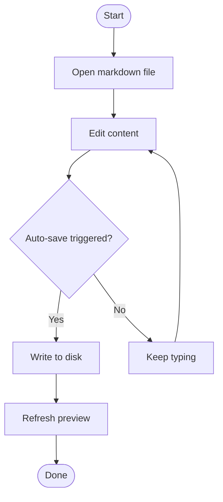
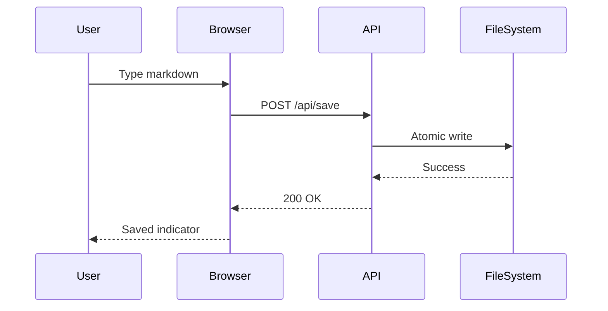
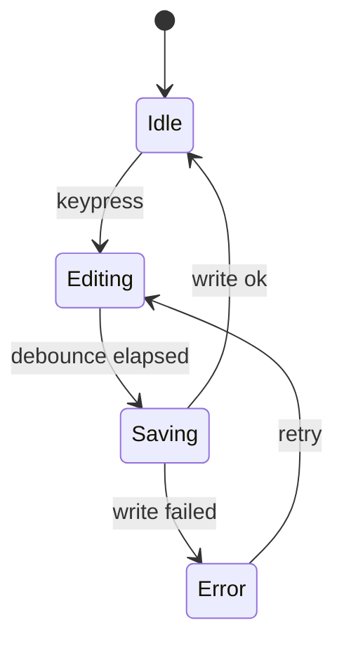

# Markdown-OS Showcase

Welcome to **Markdown-OS**. This file demonstrates editor capabilities and common markdown syntax in one place.

Use this file to:

- Verify preview rendering.
- Inspect syntax highlighting for code blocks.
- See Mermaid diagrams render inline.
- See math equations (inline and display) when KaTeX is enabled.
- Explore heading structure in the table of contents sidebar.
- Edit content and observe auto-save behavior.

---

## Quick Start

1. Switch between **Edit** and **Preview** tabs.
2. Change some text in Edit mode.
3. Wait one second and observe save status updates.
4. Open the browser console if you are validating rendering behavior.

### Notes

- The sidebar table of contents is generated from headings.
- Code blocks include language labels and copy actions.
- Mermaid blocks can be pan/zoom enabled in the preview.

---

## Text Formatting

Regular text can be mixed with:

- **Bold text**
- *Italic text*
- ***Bold italic text***
- ~~Strikethrough text~~
- `inline code`

You can also combine styles:

- **Bold with `inline code`**
- *Italic with [a link](https://example.com)*
- ~~Crossed out with **bold** details~~

### Paragraph Wrapping

Long paragraphs are useful for checking readability and line spacing in the preview area. This sentence exists to provide enough line length for visual inspection while remaining simple and easy to scan.

Another paragraph can include abbreviations like API, CLI, and URL to ensure fonts and spacing remain consistent across mixed character widths.

---

## Headings

## Level 2 Heading

### Level 3 Heading

#### Level 4 Heading

##### Level 5 Heading

###### Level 6 Heading

Heading depth influences:

- TOC indentation and navigation.
- Visual hierarchy in documentation.
- Anchor linking behavior.

---

## Lists

### Unordered Lists

- Dash item one
- Dash item two
  - Nested dash child A
  - Nested dash child B
- Dash item three

* Star item one
* Star item two
  * Nested star child

+ Plus item one
+ Plus item two
  + Nested plus child

### Ordered Lists

1. First step
2. Second step
3. Third step
   1. Nested ordered step A
   2. Nested ordered step B
4. Fourth step

### Mixed Nested Lists

1. Build release checklist
   - Confirm tests pass
   - Confirm lint passes
   - Confirm version notes
2. Publish artifacts
   - Upload package
   - Announce release

### Task Lists

- [x] Create markdown file
- [x] Open file in editor
- [ ] Add project-specific notes
- [ ] Share with team

---

## Links and References

Inline link to the project page: [Markdown Guide](https://www.markdownguide.org).

Autolink style URL: <https://example.org/docs>.

Email autolink: <devnull@example.org>.

Reference-style link usage:

- Read the [project README][project-readme].
- Check [FastAPI docs][fastapi-docs] for backend details.

[project-readme]: https://github.com/example/repo#readme
[fastapi-docs]: https://fastapi.tiangolo.com/

Relative link example: [Local notes](./notes.md)

---

## Images

Basic image syntax:


Image with title attribute:


If images do not load, syntax still demonstrates expected markdown structure.

---

## Tables

### Simple Table

| Feature | Status | Notes |
| --- | --- | --- |
| Live preview | Enabled | Updates while typing |
| Auto-save | Enabled | Debounced to reduce write volume |
| Mermaid | Enabled | Rendered in preview |

### Alignment Table

| Left | Center | Right |
| :--- | :----: | ----: |
| apple | banana | carrot |
| delta | echo | foxtrot |
| gamma | helix | ion |

### Table with Inline Formatting

| Pattern | Example | Meaning |
| --- | --- | --- |
| Bold | `**value**` | Strong emphasis |
| Italic | `*value*` | Soft emphasis |
| Inline code | `` `value` `` | Command or symbol |
| Link | `[label](url)` | External or local reference |

---

## Blockquotes

> Single-level quote for highlighting an important note.

> Multi-line quote can span several lines and remain in the same block.
> This is useful for callouts and commentary.

> Nested quote example:
>
> > Level two quote text.
> >
> > - Quoted bullet point
> > - Another quoted bullet point

---

## Code Blocks

### Python

```python
from pathlib import Path


def summarize_markdown(path: Path) -> dict[str, int]:
    """Return quick counters for markdown diagnostics."""
    text = path.read_text(encoding="utf-8")
    lines = text.splitlines()
    heading_count = sum(1 for line in lines if line.startswith("#"))
    code_fence_count = sum(1 for line in lines if line.strip().startswith("```"))
    return {
        "line_count": len(lines),
        "heading_count": heading_count,
        "code_fence_count": code_fence_count // 2,
    }


if __name__ == "__main__":
    result = summarize_markdown(Path("example.md"))
    print(result)
```

### JavaScript

```javascript
const tasks = [
  { id: 1, title: "Write docs", done: true },
  { id: 2, title: "Ship release", done: false },
  { id: 3, title: "Collect feedback", done: false },
];

const formatTask = (task) => {
  const status = task.done ? "done" : "pending";
  return `${task.id}. ${task.title} [${status}]`;
};

const renderTasks = (items) => {
  return items.map(formatTask).join("\n");
};

console.log(renderTasks(tasks));
```

### Bash

```bash
#!/usr/bin/env bash
set -euo pipefail

echo "Install dependencies"
uv sync

echo "Generate showcase file"
uv run markdown-os example ./sandbox/example.md --force

echo "Run tests"
uv run pytest -q
```

### Plain Text

```text
Code blocks can be used for logs, output snippets, and structured text.
No syntax highlighting is expected for plain text blocks.
```

---

## Mermaid Diagrams

### Flowchart



### Sequence Diagram



### State Diagram



---

## Math Equations

LaTeX-style math can be written with single dollars for inline math and double dollars for display equations. If the editor has KaTeX enabled, these will render; otherwise you see the raw syntax.

### Inline Math

- Einstein’s mass–energy equivalence: $E = mc^2$
- Greek letters: $\alpha$, $\beta$, $\gamma$, $\omega$
- Pythagorean identity: $x^2 + y^2 = z^2$

### Display Equations

Quadratic formula:

$$
x = \frac{-b \pm \sqrt{b^2 - 4ac}}{2a}
$$

Definite integral:

$$
\int_0^1 x^2 \, dx = \frac{1}{3}
$$

Matrix example:

$$
\begin{pmatrix}
a & b \\
c & d
\end{pmatrix}
\begin{pmatrix}
x \\
y
\end{pmatrix}
=
\begin{pmatrix}
ax + by \\
cx + dy
\end{pmatrix}
$$

Geometric series (for $|r| < 1$):

$$
\sum_{n=0}^{\infty} r^n = \frac{1}{1 - r}
$$

---

## Horizontal Rules

Three equivalent syntaxes:

---

***

___

---

## Advanced Syntax

Escaping markdown characters:

- A literal asterisk: \*
- A literal backtick: \`
- A literal bracket: \[

Inline HTML examples:

<kbd>Ctrl</kbd> + <kbd>S</kbd> can be represented with HTML tags.

<details>
  <summary>Expandable details block</summary>
  This block uses inline HTML and may render depending on markdown engine settings.
</details>

Footnote example:

Markdown-OS focuses on interactive editing.[^interactive-note]

[^interactive-note]: You can modify this file and immediately observe preview changes.

Definition-like structure (plain markdown style):

Term
: Definition text can be simulated for documentation readability.

---

## Troubleshooting Checks

Use this section when validating the editor after changes:

- Confirm syntax highlighting appears for Python, JavaScript, and Bash.
- Confirm Mermaid diagrams render without console errors.
- Confirm math equations render (if KaTeX is loaded) or show as raw LaTeX.
- Confirm TOC includes major sections and nested headings.
- Confirm auto-save status changes from saving to saved.
- Confirm code block copy buttons appear.

If something fails:

1. Reload the page once.
2. Check browser developer tools console.
3. Verify `uv run markdown-os open <file>` started without backend errors.

---

## Practice Area

Write your own markdown below and test live behavior:

- Add headings and confirm TOC updates.
- Add another code block and confirm copy button behavior.
- Paste a Mermaid diagram and confirm rendering.

````markdown
## My Notes

- Item A
- Item B

```python
print("Try your own example")
```
````

---

## Next Steps

- Use this file as a quick syntax reference.
- Duplicate it for team documentation templates.
- Regenerate a fresh copy anytime with:

```bash
uv run markdown-os example --force
```

Happy writing.
