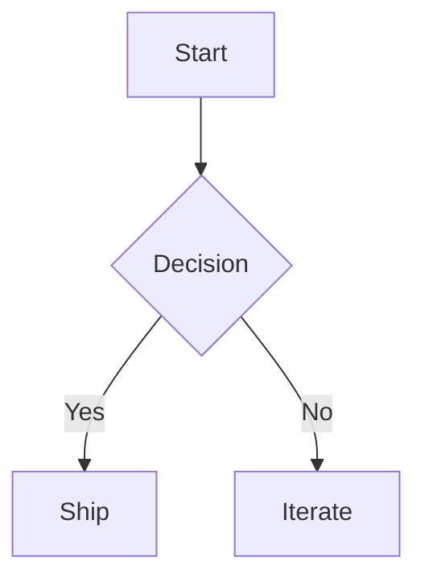

# Round-trip Fixture

This file validates markdown parse/serialize behavior.

## Text formatting

**Bold**, *italic*, ~~strike~~, and `inline code`.

> A blockquote with a [link](https://example.com).

---

## Lists

- Bullet 1
- Bullet 2
  - Nested bullet

1. Ordered one
2. Ordered two

- [ ] Todo open
- [x] Todo done

## Code blocks

```python
def hello(name: str) -> str:
    return f"Hello {name}"
```



## Math

Inline math: $E = mc^2$.

Display math:

$$
\int_0^1 x^2 dx = \frac{1}{3}
$$

## Table

| Name | Value |
| ---- | ----- |
| Alpha | 1 |
| Beta | 2 |

## Image


